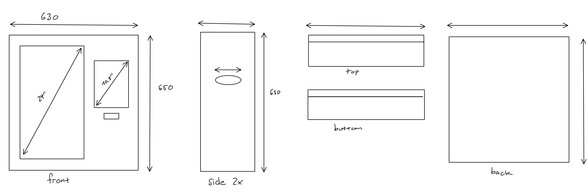
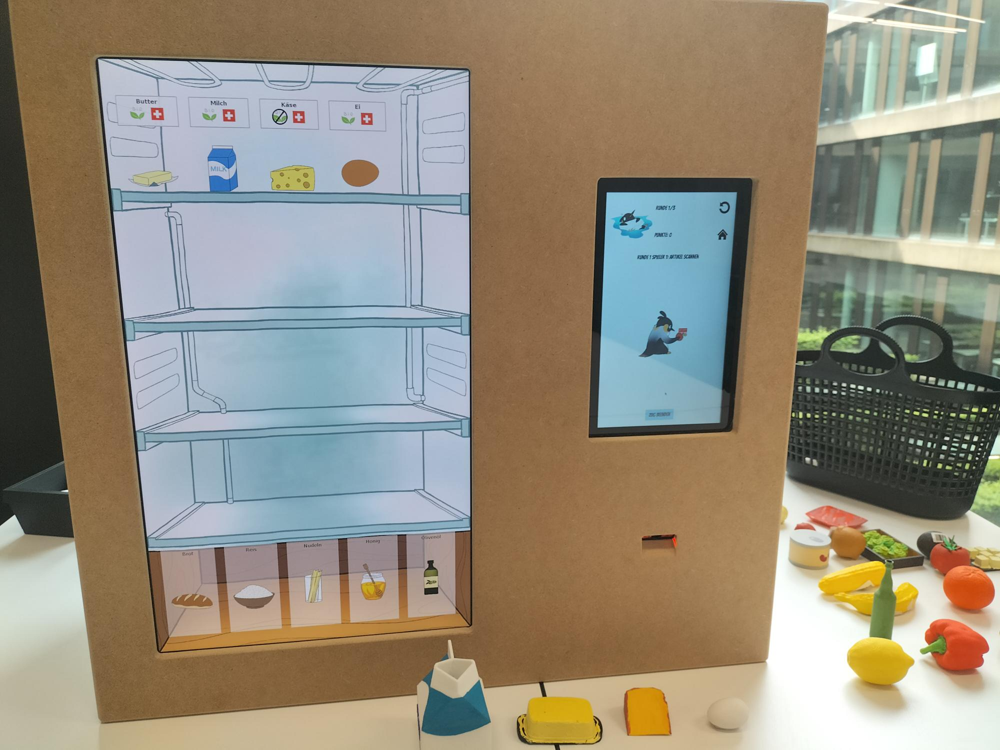

{ width=25% align=right }

# Hardware

## Materialliste

| Name | Bezeichnung | Beschaffungsort |
|---|---|---|
| Grosser Display für Lageranzeige | 24 Zoll Samsung Office | Privatverkauf |
| Touch-Display für Bedienung | Universal High Resolution 10,1 Display mit HDMI / VGA / Composite Eingang & kapazitivem Touchscreen | [Berrybase](https://www.berrybase.ch/universal-high-resolution-10-1-display-mit-hdmi-vga-composite-eingang-kapazitivem-touchscreen) |
| Barcode-Scanner | Barcode Scanner Modul liest 1D / 2D Codes, UART / USB Ausgang | [Berrybase](https://www.berrybase.ch/barcode-leser-scanner-modul-ccd-kamera-usb-interface) |
| Steckdosenleiste | Steffen Power Easy | [Digitec](https://www.digitec.ch/de/s1/product/steffen-power-easy-6-x-typ-13-150-m-steckdosenleiste-46187237) |
| HDMI-Mico-HDMI Kabel | Raspberry Pi Official cable Micro-HDMI to HDMI Black, 1m | [Digitec](https://www.digitec.ch/de/s1/product/raspberry-pi-official-cable-micro-hdmi-to-hdmi-black-1m-entwicklungsboard-zubehoer-24227733) |

## Verwendete Bautteile

| Name | Benötigt für |
|---|---|
| MDF Holz (19mm) | Gehäuse von Fridgely |
| Schrauben | Befestigung der Bildschirme |
| Lamelos | Zusammenbau des Gehäuses |
| Holzleim | Befestigung des Gehäuses |

## Bauplan

## Zusammengebaute Hardware

