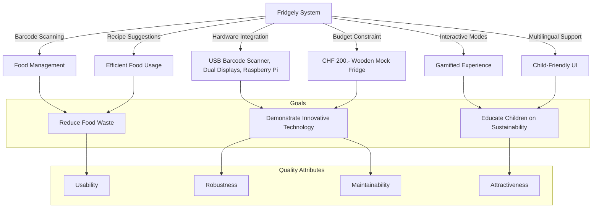

# 1. Einführung und Ziele

Dieses Dokument beschreibt die wesentlichen Anforderungen und treibenden Kräfte, die bei der Umsetzung der Softwarearchitektur und Entwicklung des Fridgely-Systems berücksichtigt werden müssen. 

Fridgely ist ein Smart-Fridge-System, das interaktiv und spielerisch Kinder (7–13 Jahre) für einen bewussten Umgang mit Lebensmitteln sensibilisiert und Lebensmittelverschwendung reduziert. 

Das System kombiniert Hard- und Softwarekomponenten, darunter Barcode-Scanner (über USB angeschlossen), Dual-Displays (ein Display mit 1024x600 Auflösung für die Bedienung und ein zweites Display mit 1920x1080 Auflösung für die Lageranzeige, und läuft auf einem Raspberry Pi unter Verwendung von Java mit Swing als UI-Framework und Spring Boot für Dependency Injection und Datenverwaltung. Es unterstützt u.a. die automatische Produkterkennung durch Barcode-Scanning (Produkte werden in einer eingebetteten SQLite-Datenbank mit JPA gespeichert), interaktive Spielmodi (Einzelspieler und Mehrspieler), mehrsprachige Benutzerführung (Deutsch, Englisch, Französisch) und eine kinderfreundliche Benutzeroberfläche mit einem animierten Pinguin-Maskottchen, das verschiedene Gesichtsausdrücke zeigen und seinen Gesundheitszustand in sechs Stufen (EXCELLENT, GOOD, OKAY, STRUGGLING, CRITICAL und DEAD) mit entsprechenden Sprites darstellen kann.

Dazu zählen insbesondere:

* **Geschäftsziele:** Sensibilisierung der jungen Zielgruppe für Nachhaltigkeit und Reduktion von Lebensmittelverschwendung, Unterstützung von Bildungsmassnahmen und Demonstration innovativer, nachhaltiger Technologien.
* **Wesentliche Aufgabenstellungen:** Realisierung eines interaktiven, gamifizierten Kühlschranks, der den Zustand von Lebensmitteln erfasst, Warnmeldungen bei unökologischen Produkten aussendet und Rezeptvorschläge unterbreitet.
    - [HOCH] Barcode-basiertes Foodmanagement zur Erfassung und Inventarisierung von Produkten
    - [HOCH] Gamifizierte Nutzererfahrung durch Einzelspieler- und Mehrspielermodi (wobei der Mehrspielermodus vollständig implementiert ist mit einem Spieler für das Scannen von Produkten und einem zweiten Spieler für die Rezeptauswahl)
    - [MITTEL] Empfehlung passender Rezepte basierend auf verfügbaren Zutaten
    - [HOCH] Überwachung des Gesundheitszustands des Pinguin-Maskottchens in Abhängigkeit vom Umgang mit Lebensmitteln
    - [MITTEL] Mehrsprachigkeit (DE, EN, FR) für eine intuitive, kindgerechte Bedienung
    - [NIEDRIG] Automatische Erkennung und Anpassung an verschiedene Bildschirmkonfigurationen
* **Qualitätsziele für die Architektur:** Hohe Usability, Robustheit, Wartbarkeit, Modifizierbarkeit und Attraktivität durch eine ansprechende, visuelle Gestaltung (inklusive Maskottchen) sowie eine klare, intuitive Interaktion.
* **Relevante Stakeholder:** Kinder als primäre Nutzer, Mitarbeiter von Primeo, Lehrkräfte und Eltern als sekundäre Nutzer, der Product Owner sowie weitere Projektbeteiligte und -beauftragte.

## Aufgabenstellung

Fridgely ist ein interaktiver Mock-Smart-Kühlschrank, der speziell entwickelt wurde, um Kinder auf spielerische Weise für den nachhaltigen Umgang mit Lebensmitteln zu sensibilisieren und Lebensmittelverschwendung zu reduzieren. Das System erfasst automatisch Produkte über Barcode-Scanning, überwacht deren Haltbarkeit und bietet proaktive Rezeptvorschläge, sodass Kinder lernen, Lebensmittel effizient zu verwalten. Die fachliche Aufgabenstellung umfasst die Umsetzung einer robusten, benutzerfreundlichen und interaktiven Lösung, die mit einem begrenzten Budget (CHF 200.- für die Kühlschrankattrappe aus Holz) realisiert werden muss.

Der Beweggrund für die Entwicklung von Fridgely liegt in der Notwendigkeit, jungen Menschen ein Bewusstsein für Lebensmittelverschwendung und nachhaltigen Konsum zu vermitteln. Durch eine interaktive Lernumgebung, in der Hardware und Software kombiniert werden, wird ein praktischer und spielerischer Zugang zu diesen Themen ermöglicht.

Die Architektur und das Design sind darauf ausgerichtet, eine intuitive Bedienung über den Touch-Display und dem Barcode-Scanner zu gewährleisten, wobei die modulare Anbindung von Hardwarekomponenten (USB-Barcode-Scanner, Dual-Displays mit unterschiedlichen Auflösungen: 1024x600 und 1920x1080) zentrale Anforderungen darstellt. Die Anwendungsarchitektur folgt dem MVC-Pattern mit klarer Trennung von Model (Produkte, Rezepte, Lagerbestand, Pinguin-Zustände), View (Swing-basierte UI-Komponenten) und Controller (Spiellogik, Benutzerinteraktion). Der Observer-Pattern wird für die Kommunikation zwischen Komponenten verwendet, insbesondere für die Lokalisierung und Statusaktualisierungen.

Technisch wird die Anwendung mit Spring Boot realisiert, wobei folgende Komponenten zum Einsatz kommen:

- Component-basierte Dependency Injection für Serviceklassen und Controller
- JPA mit Repository-Pattern für die Datenpersistenz (SQLite-Datenbank)
- Swing für die UI-Komponenten mit MVC-Pattern 
- PropertyChangeSupport für Observer-Pattern-Implementierung
- Mehrschichtige Architektur mit Service-Layern und Repository-Interfaces
- Vollständige Implementierung des Mehrspielermodus mit spezialisierten Launchern, Controllern und Views für die beiden Spielerrollen (MultiplayerPlayer1Controller für den Scanvorgang und MultiplayerPlayer2Controller für die Rezeptauswahl)
- Implementierung eines State-Pattern im MultiplayerGameStateModel für die Verwaltung der Spielphasen und Zustandsübergänge

## Qualitätsziele

Die Top-Qualitätsanforderungen für die Architektur von Fridgely sind:

* **Usability:** Das System muss intuitiv und selbsterklärend bedienbar sein, um Kindern ohne ausführliche Erklärungen einen einfachen Zugang zu bieten.
* **Robustheit und Zuverlässigkeit:** Der Kühlschrank soll auch bei intensiver Nutzung durch Kinder stabil arbeiten, ohne Verzögerungen oder Systemausfälle. Dies beinhaltet auch die automatische Erkennung und Anpassung an verschiedene Display-Konfigurationen, mit Fallback-Optionen für Single-Display-Setups.
* **Wartbarkeit und Modifizierbarkeit:** Die Architektur muss eine einfache Fehlersuche und Wartung (z.B. über SSH-Zugriff auf den Raspberry Pi) ermöglichen sowie zukünftige Erweiterungen (z.B. zusätzliche Sensoren oder Funktionalitäten) unterstützen.
* **Attraktivität:** Eine ansprechende, kinderfreundliche Benutzeroberfläche mit visuellen Elementen (z. B. unserem Pinguin-Maskottchen mit verschiedenen Emotionen) fördert die Motivation und Interaktion.

Die Einhaltung dieser Qualitätsziele ist massgeblich, um die Akzeptanz und Effektivität des Systems bei den jungen Nutzern sowie bei den betreuenden Lehrkräften und Eltern sicherzustellen.

| Qualitätsziel | Szenario / Massnahme |
|---------------|----------------------|
| Usability | Intuitive Bedienung über Touch-Display, klare visuelle Rückmeldungen (z. B. Maskottchen) |
| Robustheit | Stabiler Betrieb auch bei hoher Interaktionsfrequenz, zuverlässige Barcode-Erfassung und Echtzeitverarbeitung, automatische Erkennung und Anpassung an die verfügbaren Displays (ein Display mit 1024x600 Auflösung für die Bedienung und ein zweites Display mit 1920x1080 Auflösung für die Lageranzeige) über die GraphicsEnvironment und GraphicsDevice API von Java mit integrierter Fallback-Logik für Single-Display-Setups |
| Wartbarkeit | Einfache Debugging-Möglichkeiten und modularer Aufbau mit Spring Boot Dependency Injection, klar getrennte MVC-Architektur und Observer-Pattern (PropertyChangeSupport) für die Kommunikation zwischen Komponenten, um Wartungsarbeiten und zukünftige Erweiterungen zu erleichtern |
| Attractiveness | Ansprechendes, kindgerechtes Design mit animiertem Pinguin-Maskottchen, das verschiedene Gesichtsausdrücke zeigen und seinen Gesundheitszustand anzeigen kann (sechs definierte Zustände: EXCELLENT, GOOD, OKAY, STRUGGLING, CRITICAL und DEAD mit passenden Sprites wie Pinguin auf grossem Eisblock, Pinguin auf schrumpfendem Eis, schwimmender Pinguin, brennender Pinguin und verstorbener Pinguin), was Lernmotivation und nachhaltiges Verhalten visuell unterstützt |

## Stakeholder

Die folgenden Stakeholder sind für die Architektur und Entwicklung von Fridgely relevant:

| Rolle | Kontakt | Erwartungshaltung | Einfluss und Relevanz |
|-------|---------|-------------------|----------------------|
| Kinder (Primäre Nutzer) | - | Eine intuitive, spielerische und interaktive Bedienung, die das Lernen über Lebensmittelmanagement unterstützt. | **Hoch**: Als primäre Zielgruppe bestimmen ihre Bedürfnisse und Fähigkeiten massgeblich die Usability-Anforderungen und das Interaktionsdesign. |
| Lehrkräfte / Eltern (Sekundäre Nutzer) | - | Ein System, das den Kindern nachhaltigen Umgang mit Lebensmitteln vermittelt und dabei einfach zu bedienen ist. | **Mittel**: Unterstützen die Nutzung und müssen das System verstehen, um es zu erklären; beeinflussen pädagogische Aspekte. |
| Product Owner | Elif Gürcinar | Umsetzung eines innovativen, edukativen Produkts, das den ökologischen und pädagogischen Anforderungen entspricht. | **Hoch**: Trifft zentrale Produktentscheidungen und ist verantwortlich für die Erfüllung der übergeordneten Projektziele. |
| Primeo Energie AG (Auftraggeber) | Eugen Leu | Entwicklung eines robusten und ansprechenden Demonstrationsobjekts, das Nachhaltigkeit und Energieeffizienz vermittelt. | **Hoch**: Als Finanzier des Projekts haben ihre strategischen Ziele hohen Einfluss auf die Ausrichtung und Priorisierung der Funktionalitäten. |
| FHNW (Projektbegleitung) | Prof. Stefan Vetter | Sicherstellung akademischer Standards und didaktischer Qualität. | **Mittel**: Bietet fachliche Beratung und stellt Ressourcen bereit; beeinflusst methodischen Ansatz. |
| Entwicklungsteam | Team Fridgely | Technisch realisierbare, wartbare und testbare Umsetzung der Anforderungen innerhalb der gegebenen Rahmenbedingungen. | **Hoch**: Direkt verantwortlich für die technische Umsetzung und Qualität des Produkts. |

## Treibende Faktoren

Die Entwicklung von Fridgely wird durch folgende zentrale Faktoren angetrieben:

1. **Gesellschaftliche Relevanz**: Lebensmittelverschwendung ist ein globales Problem mit erheblichen ökologischen und wirtschaftlichen Folgen. Durch frühe Bewusstseinsbildung bei Kindern kann langfristig ein nachhaltigerer Umgang mit Lebensmitteln gefördert werden.

2. **Pädagogischer Nutzen**: Die spielerische Vermittlung wichtiger Nachhaltigkeitskonzepte durch interaktive Technologie entspricht modernen pädagogischen Ansätzen und fördert nachhaltiges Handeln durch positive Verstärkung anstatt durch reine Wissensvermittlung.

3. **Technologische Innovation**: Die Kombination von Hardware (Barcode-Scanner, Dual-Display-Setup) und Software (intelligente Rezeptvorschläge, Gamification) schafft ein einzigartiges Lerngerät, das sowohl technisch anspruchsvoll als auch benutzerfreundlich ist.

4. **Wirtschaftliche Faktoren**: Mit einem begrenzten Budget (CHF 200.- für die Kühlschrankattrappe) muss eine robuste, attraktive Lösung entwickelt werden, die sowohl technisch funktional als auch optisch ansprechend ist.

Die Qualitätsziele wurden direkt aus diesen treibenden Faktoren abgeleitet, um sicherzustellen, dass das System seinen pädagogischen Zweck erfüllt und gleichzeitig technisch robust und attraktiv für die junge Zielgruppe ist.