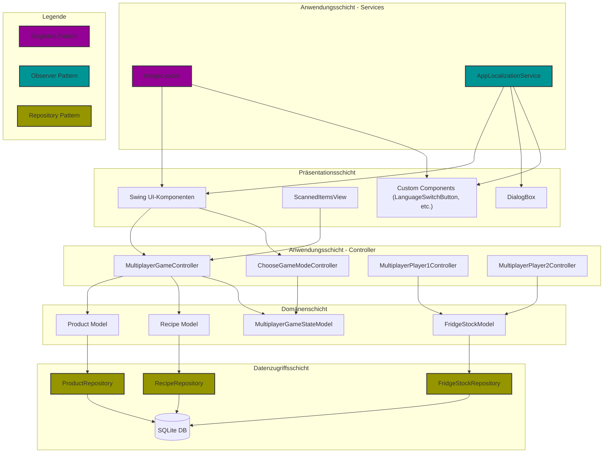

# 4. Lösungsstrategie

Die Lösungsstrategie für Fridgely basiert auf einer modularen, komponentenbasierten Architektur, die speziell für ein interaktives Lerngerät (Mock-Smart-Kühlschrank) entwickelt wurde. Die zentralen Entscheidungen orientieren sich an den funktionalen Anforderungen, Qualitätszielen und den technischen sowie organisatorischen Randbedingungen.

## Technologieentscheidungen

| Komponente | Technologie / Version | Beschreibung |
|---|---|---|
| **Programmiersprache** | Java 21 | Hauptsprache für die gesamte Anwendung|
| **Framework**| Spring Boot 3.1.x | Application Framework mit Dependency Injection|
| **UI**| Java Swing | Benutzeroberfläche (Desktop UI)|
| **ORM**| Hibernate/JPA mit SQLite-Dialekt| Objekt-Relationales Mapping|
| **Datenbank**| SQLite| Eingebettete, lokale Datenbank|
| **Tests**| JUnit 5| Framework für automatisierte Tests|
| **Build / Deployment** | Maven | Build-Management, Abhängigkeiten, Deployment|

## Entscheidungskriterien

Bei der Auswahl der Technologien und Architekturmuster waren folgende Kriterien ausschlaggebend:

- **Zielgruppe und Benutzerfreundlichkeit**: Die Anforderungen der Zielgruppe (Kinder 7-13 Jahre) mit Fokus auf intuitive Benutzeroberfläche und kindgerechte Interaktion
- **Hardware-Beschränkungen**: Optimierung für die Ausführung auf einem Raspberry Pi 5 mit begrenzten Ressourcen
- **Wartbarkeit und Erweiterbarkeit**: Strukturierung für einfache Erweiterungen und Anpassungen durch zukünftige Entwicklerteams
- **Offline-Betrieb**: Notwendigkeit eines autarken Betriebs ohne permanente Internetverbindung
- **Entwicklungseffizienz**: Nutzung etablierter Patterns und Frameworks zur Beschleunigung der Entwicklung

## Architekturmuster und Systemzerlegung

- **Spring Boot Architektur:** Einsatz des Spring Boot Frameworks für eine einfache Konfiguration, Dependency Injection und Anwendungsmanagement.
- **MVC Pattern:** Strikte Trennung von Modellen (Entity-Klassen), Views (Swing UI) und Controllern (Spring Components) für verbesserte Wartbarkeit und Testbarkeit.
- **Repository Pattern:** Implementierung des Repository-Patterns mit Spring Data JPA für einen einheitlichen und abstrahierten Datenzugriff. Jedes Repository ist als Interface (z.B. `ProductRepository`) und entsprechende JPA-Implementierung (z.B. `ProductJpaRepository`) umgesetzt.
- **Layered Architecture:** Eine klassische Schichtenarchitektur mit:
    * Präsentationsschicht (Swing UI-Komponenten)
    * Anwendungsschicht (Controller-Klassen und Services)
    * Domänenschicht (Model-Klassen)
    * Datenzugriffsschicht (Repository-Interfaces und -Implementierungen)
- **Observer Pattern:** Für Mehrsprachigkeitsunterstützung (`AppLocalizationService` mit `LocalizationObserver`-Implementierungen) und UI-Update-Mechanismen über PropertyChangeSupport/PropertyChangeListener
- **Singleton Pattern:** Für zentral verwaltete Services (`ImageLoader`, `AppLocalizationService`) zur Ressourcenoptimierung
- **Factory Pattern:** Für die Erstellung komplexer Objekte (z.B. die Game-Launcher-Komponenten wie `MultiplayerGameLauncher`, die für die Initialisierung und das Starten von Spielmodi verantwortlich sind)
- **PropertyChangeListener Pattern:** Für den Datenaustausch zwischen Modellen und Views (z.B. `FridgeStockModel` mit `PropertyChangeSupport`)
- **Hardware-Integration:** Barcode-Scanner-Anbindung über standardisierte Schnittstellen und Dual-Display-Management für optimale Benutzerführung

## Erreichung der Qualitätsanforderungen

- **Usability:** Eine intuitive, kindgerechte Benutzeroberfläche wird durch Swing und das ImageLoader-System realisiert, das optimierte grafische Komponenten vorab lädt, um eine flüssige Darstellung zu gewährleisten.
- **Robustheit und Wartbarkeit:** Der modulare Aufbau mit Spring Boot's Dependency Injection, das Repository-Pattern und die Verwendung standardisierter Schnittstellen ermöglichen eine einfache Wartung und Erweiterbarkeit. Die einheitliche Fehlerbehandlung erfolgt über eine zentrale DialogBox-Klasse, die benutzerfreundliche Fehlermeldungen präsentiert.
- **Datenpersistenz:** Einsatz von Hibernate/JPA mit SQLite für eine zuverlässige und performante lokale Datenspeicherung bei gleichzeitig geringem Ressourcenverbrauch.
- **Mehrsprachigkeit:** Implementierung eines Observer-basierten Lokalisierungssystems (`AppLocalizationService`), das dynamisches Umschalten zwischen Sprachen ohne Neustart ermöglicht.
- **Performance:** Optimierung für den Betrieb auf einem Raspberry Pi 5 mit den vorgegebenen Hardware-Ressourcen, unter anderem durch Vorladung von Bildern mit dem `ImageLoader` und effiziente JPA-Repository-Implementierungen.
- **Dual-Display-Konzept:** Implementierung der `ScannedItemsView` mit `PropertyChangeListener`-Pattern für die nahtlose Koordination zwischen Hauptdisplay und Kühlschrankansicht. Das System erkennt automatisch verfügbare Displays beim Start und konfiguriert die beiden Ansichten für die spezifischen Bildschirmgrössen (1024x600 für die Hauptanwendung und 1920x1080 für die Kühlschrankansicht).
- **Hardware-Integration:** Anbindung von Barcode-Scannern über eine abstrakte Schnittstelle, die eine einfache Integration ermöglicht und die Austauschbarkeit der Hardware gewährleistet.

## Ausrichtung an Geschäftszielen

Die Lösungsstrategie von Fridgely unterstützt folgende übergeordnete Geschäfts- und Bildungsziele:

- **Edukativer Mehrwert**: Die spielerische Vermittlung von Wissen über gesunde Ernährung und nachhaltige Lebensmittel wird durch die intuitive Bedienung und das interaktive Spielkonzept unterstützt.
- **Nachhaltigkeit**: Durch Verwendung quelloffener Technologien und Standardkomponenten wird eine langfristige Wartbarkeit und Erweiterbarkeit gewährleistet.

## Organisatorische Entscheidungen

- **Entwicklungsprozess:** Agiler Entwicklungsansatz mit kurzen Feedback-Zyklen und kontinuierlicher Integration (CI/CD) über GitLab-Pipeline.
- **Deployment-Strategie:** Automatisierte Bereitstellung auf dem Zielsystem (Raspberry Pi) über SSH mit spezifischen Start- und Restart-Skripten.
- **Tooling:** Einsatz moderner Entwicklungswerkzeuge wie Maven für Build-Management, GitLab für Versionskontrolle und JUnit für Tests.
- **Rollenverteilung:** Klare Definition der Verantwortlichkeiten im Team (Projektmanager, Requirements Engineer, UX, Software Architekt, Developer, Testmanager) für einen reibungslosen Projektablauf.
- **Projektdokumentation:** Nutzung des arc42-Templates für eine strukturierte und umfassende Architekturdokumentation.

## Qualitätssicherungsmassnahmen

| Qualitätsziel | Szenario | Lösungsansatz | Link zu Details |
|---------------|----------|---------------|----------------|
| Usability | Kindgerechte, intuitive Bedienung | Swing UI mit vorgeladenen Bildern über ImageLoader und einfache Navigation | [ADR 1](09_architecture_decisions.md#adr-1-verwendung-von-java-swing-statt-javafx) |
| Robustheit | Stabiler Betrieb bei intensiver Nutzung | Spring Boot mit klarer Fehlerbehandlung und Dependency Injection für lose Kopplung | [ADR 8](09_architecture_decisions.md#adr-8-einsatz-von-spring-boot-als-anwendungsframework) |
| Wartbarkeit | Einfache Erweiterung und Fehlerbehebung | Repository-Pattern und MVC-Architektur für modulare Komponenten | [ADR 2](09_architecture_decisions.md#adr-2-implementierung-des-mvc-architekturmusters), [ADR 3](09_architecture_decisions.md#adr-3-einsatz-des-repository-patterns-für-datenzugriff) |
| Datenpersistenz | Zuverlässige lokale Datenspeicherung | SQLite mit JPA/Hibernate für eine einfache Datenpersistenz | [ADR 5](09_architecture_decisions.md#adr-5-verwendung-von-sqlite-als-eingebettete-datenbank) |
| Mehrsprachigkeit | Dynamische Sprachumschaltung | Observer-Pattern mit zentralem AppLocalizationService | [ADR 4](09_architecture_decisions.md#adr-4-mehrsprachigkeitskonzept-über-zentrale-lokalisierungsservices) |
| Dual-Monitor | Kühlschrankansicht auf separatem Display | PropertyChangeListener-Pattern mit ScannedItemsView | [ADR 6](09_architecture_decisions.md#adr-6-dual-display-management-für-smart-fridge-erlebnis), [ADR 9](09_architecture_decisions.md#adr-9-observer-pattern-für-ui-aktualisierungen) |
| Fehlerbehandlung | Einheitliche Fehlerbehandlung | DialogBox-Klasse für benutzerfreundliche Fehlermeldungen | [ADR 7](09_architecture_decisions.md#adr-7-zentrale-ressourcenverwaltung-via-singleton-services) |
| Testabdeckung | Umfassende automatisierte Tests | JUnit-Tests für Repository-Klassen und Geschäftslogik | [ADR 3](09_architecture_decisions.md#adr-3-einsatz-des-repository-patterns-für-datenzugriff) |
| Hardware-Integration | Barcode-Scanner für Produkterfassung | Hardware-abstrakte Implementierung für einfache Handhabung und Austauschbarkeit | [ADR 10](09_architecture_decisions.md#adr-10-barcode-scanner-integration) |

Die Technologieentscheidungen und Architekturmuster wurden sorgfältig auf Basis der Projektziele, der Zielgruppe (Kinder 7-13 Jahre) und den Hardware-Randbedingungen (Raspberry Pi 5) ausgewählt. Der Einsatz bewährter Frameworks wie Spring Boot in Kombination mit einer klaren Architektur ermöglicht eine robuste und wartbare Implementierung, während die Optimierung für die spezifischen Hardware-Gegebenheiten die Performance sicherstellt.
