# 8. Querschnittliche Konzepte

Dieser Abschnitt beschreibt die übergreifenden Konzepte und Ansätze, die in mehreren Bereichen des Fridgely-Systems Anwendung finden. Diese querschnittlichen Konzepte bilden das Fundament für ein konsistentes Systemdesign und gewährleisten die konzeptionelle Integrität der Architektur.

---

## 8.1 Fachliche Konzepte

### 8.1.1 Domain-Modell und Fachliche Entitäten

Fridgely nutzt ein kohärentes Domain-Modell, das die wichtigsten fachlichen Konzepte und deren Beziehungen abbildet. Die Kernentitäten dieses Modells sind:

```mermaid
classDiagram
    class Product {
        +String barcode
        +String name
        +String imageUrl
        +Boolean perishable
        +getProperties()
    }
    
    class Recipe {
        +String name
        +String description
        +List~Ingredient~ ingredients
        +String difficulty
        +getRequiredIngredients()
    }
    
    class FridgeStock {
        +Product product
        +Integer quantity
        +Date expiryDate
        +isExpired()
    }
    
    class GameSession {
        +String sessionId
        +GameMode mode
        +Integer score
        +Date timestamp
        +calculateResult()
    }
    
    class PenguinModel {
        +String name
        +Integer happiness
        +updateHappiness()
    }
    
    Product "1" -- "0..*" FridgeStock
    Recipe "1" -- "0..*" Product
    GameSession "1" -- "0..*" FridgeStock
    GameSession "1" -- "1" PenguinModel

    classDef layerStyle fill:#1a202c,stroke:#4a5568,stroke-width:2px;
    classDef componentStyle fill:#2b3d4f,stroke:#83a598,stroke-width:1px;
    classDef interfaceStyle fill:#3c3836,stroke:#fabd2f,stroke-width:1px;
    classDef dbStyle fill:#2d3b2d,stroke:#8ec07c,stroke-width:1px;
```

### 8.1.2 Mehrsprachigkeitskonzept

Fridgely unterstützt mehrere Sprachen (Deutsch, Englisch, Französisch) durch ein zentralisiertes Lokalisierungskonzept:

```mermaid
graph TD
    ALS[AppLocalizationService] --> DE[DE: languages_de.properties]
    ALS --> EN[EN: languages_en.properties]
    ALS --> FR[FR: languages_fr.properties]
    ALS --> LO[LocalizationObserver Interface]
    
    LO --> V1[Views]
    LO --> C1[Controllers]
    LO --> M1[Models mit UI-Text]
    
    subgraph Änderungsmechanismus
        LS[Sprachauswahl] --> ALS
        ALS --> NT[Benachrichtigung an Observer]
        NT --> UT[UI-Text aktualisieren]
    end

    classDef layerStyle fill:#1a202c,stroke:#4a5568,stroke-width:2px;
    classDef componentStyle fill:#2b3d4f,stroke:#83a598,stroke-width:1px;
    classDef interfaceStyle fill:#3c3836,stroke:#fabd2f,stroke-width:1px;
    classDef dbStyle fill:#2d3b2d,stroke:#8ec07c,stroke-width:1px;
```

Die Mehrsprachigkeitsunterstützung basiert auf folgenden Kernkonzepten:

1. **Properties-Dateien im Resources-Verzeichnis**

    - `languages_de.properties` für Deutsch
    - `languages_en.properties` für Englisch
    - `languages_fr.properties` für Französisch

2. **Schlüssel-Wert-System**: Jeder UI-Text wird über einen Schlüssel referenziert:
   
    Beispiel aus languages_de.properties
    ```properties
    home.button.lang=Deutsch
    gamemode.title=Spielmodus wählen
    gamemode.singleplayer=Einzelspieler
    ```

3. **Observer-Pattern für dynamische Updates**: UI-Komponenten registrieren sich als Observer und werden bei Sprachänderungen automatisch aktualisiert.

Diese Implementierung ermöglicht eine nahtlose Sprachänderung zur Laufzeit ohne Neustart der Anwendung und unterstützt die mehrsprachige Zielgruppe des Fridgely-Systems.

### 8.1.3 Datenmodell und Persistenzkonzept

Das Persistenzmodell von Fridgely basiert auf einem relationalen Datenbankschema, das über JPA und den Repository-Layer zugänglich ist:

```mermaid
erDiagram
    PRODUCT {
        string barcode PK
        string name
        string imageUrl
        boolean perishable
    }
    
    RECIPE {
        int id PK
        string name
        string description
        string difficulty
    }
    
    FRIDGE_STOCK {
        int id PK
        string product_barcode FK
        int quantity
        date expiry_date
    }
    
    RECIPE_INGREDIENT {
        int recipe_id FK
        string product_barcode FK
        int required_quantity
    }
    
    GAME_SESSION {
        string id PK
        string mode
        int score
        timestamp created_at
    }
    
    PRODUCT ||--o{ FRIDGE_STOCK : "stored_as"
    PRODUCT ||--o{ RECIPE_INGREDIENT : "used_in"
    RECIPE ||--o{ RECIPE_INGREDIENT : "contains"
    GAME_SESSION ||--o{ FRIDGE_STOCK : "interacts_with"

    classDef layerStyle fill:#1a202c,stroke:#4a5568,stroke-width:2px;
    classDef componentStyle fill:#2b3d4f,stroke:#83a598,stroke-width:1px;
    classDef interfaceStyle fill:#3c3836,stroke:#fabd2f,stroke-width:1px;
    classDef dbStyle fill:#2d3b2d,stroke:#8ec07c,stroke-width:1px;
```

## 8.2 User Experience (UX)

### 8.2.1 Einheitliches UI-Designkonzept

Fridgely implementiert ein konsistentes, kindgerechtes UI-Design basierend auf folgenden Prinzipien:

1. **Farbschema und visuelle Identität**

    * Hauptfarbe: Soft-Blue (RGB: 248, 248, 255) - definiert in `Constants.BACKGROUND_COLOR`
    * Akzentfarben: Grün für positive Aktionen, Rot für Warnungen
    * Einheitliche Schriftart und Schriftgrössen für optimale Lesbarkeit

    ```java
    // Auszug aus Constants.java
    public static final Color BACKGROUND_COLOR = new Color(248, 248, 255);
    ```

    Die Konstanten-Klasse ist als Utility-Klasse implementiert, die ausschliesslich statische Konstanten  enthält und nicht instanziiert werden kann:

    ```java
    private Constants() {
        throw new UnsupportedOperationException("Utility class");
    }
    ```

2. **Navigationsprinzipien**
   * Flache Navigationsstruktur mit maximal 2 Ebenen
   * Konsistente Platzierung von Navigation und Aktionsschaltflächen
   * Direkte Manipulation durch Touch-Interaktion

```mermaid
graph TD
    HP[Startseite] --> GM[Spielmodus-Auswahl]
    GM --> SP[Einzelspieler]
    GM --> MP[Mehrspieler]
    
    SP --> SPG[Einzelspieler Spiel]
    MP --> MPG[Mehrspieler Spiel]
    
    SPG --> SR[Spielergebnis]
    MPG --> MR[Mehrspieler Ergebnis]
    
    SR --> GM
    MR --> GM
    
    style HP fill:#1a202c,stroke:#4a5568
    style GM fill:#2b3d4f,stroke:#83a598
    style SP fill:#3c3836,stroke:#fabd2f
    style MP fill:#2d3b2d,stroke:#8ec07c
```

Die zentrale Definition von UI-Konstanten in `Constants.java` gewährleistet eine konsistente visuelle Sprache in der gesamten Anwendung und erleichtert spätere Anpassungen des Farbschemas.

### 8.2.2 Barrierefreie Bedienung und Kindgerechte Interaktion

Fridgely setzt ein durchdachtes Interaktionsdesign für Kinder um:

| Interaktionsprinzip         | Umsetzung                                                                   |
| --------------------------- | --------------------------------------------------------------------------- |
| **Einfache Sprache**        | Altersentsprechende Formulierungen, kurze Sätze, positives Feedback         |
| **Grosse Schaltflächen**     | Touch-optimierte UI-Elemente (min. 48x48 px)                                |
| **Visuelle Hinweise**       | Deutliche Hervorhebung aktiver Elemente, konsistente Farbcodierung          |
| **Fehlertoleranz**          | Bestätigungsdialoge für kritische Aktionen, einfache Korrekturmöglichkeiten |
| **Multimodale Interaktion** | Kombination aus Touch-Bedienung und Barcode-Scanning                        |

### 8.2.3 Dual-Display-Konzept

Das Dual-Display-Konzept verbessert das Nutzererlebnis und verstärkt den Lerneffekt:

```mermaid
graph LR
    subgraph Hauptdisplay
        TUI[Touch-UI für Benutzerinteraktion]
        GM[Spielmodi]
        SE[Spielerlebnis]
    end
    
    subgraph Kühlschrankdisplay
        SIV[ScannedItemsView]
    end
    
    MGC[MultiplayerGameController] --> SIV
    SC[SpielController] --> MGC
    
    TUI --> SC
    GM --> SC
    SC --> SE

    classDef layerStyle fill:#1a202c,stroke:#4a5568,stroke-width:2px;
    classDef componentStyle fill:#2b3d4f,stroke:#83a598,stroke-width:1px;
    classDef interfaceStyle fill:#3c3836,stroke:#fabd2f,stroke-width:1px;
    classDef dbStyle fill:#2d3b2d,stroke:#8ec07c,stroke-width:1px;
```

## 8.3 Architektur- und Entwurfsmuster

### 8.3.1 MVC-Architekturmuster

Fridgely implementiert das Model-View-Controller Pattern durchgängig:

```mermaid
graph TB
    subgraph V[Views]
        MPGV[MultiplayerGameView]
        MP1V[MultiplayerPlayer1View]
        MP2V[MultiplayerPlayer2View]
        SIV[ScannedItemsView]
    end
    
    subgraph C[Controller]
        MGC[MultiplayerGameController]
        MP1C[MultiplayerPlayer1Controller]
        MP2C[MultiplayerPlayer2Controller]
    end
    
    subgraph M[Models]
        MGSM[MultiplayerGameStateModel]
        FSM[FridgeStockModel]
        PM[PenguinModel]
    end
    
    C --> V
    C --> M
    M --> C

    classDef layerStyle fill:#1a202c,stroke:#4a5568,stroke-width:2px;
    classDef componentStyle fill:#2b3d4f,stroke:#83a598,stroke-width:1px;
    classDef interfaceStyle fill:#3c3836,stroke:#fabd2f,stroke-width:1px;
    classDef dbStyle fill:#2d3b2d,stroke:#8ec07c,stroke-width:1px;
```

**Vorteile des MVC-Musters im Fridgely-Kontext:**

* Klare Trennung von Verantwortlichkeiten fördert Wartbarkeit
* Unabhängige Testbarkeit der einzelnen Komponenten
* Flexible Weiterentwicklung einzelner Schichten

### 8.3.2 Repository-Pattern

Das Repository-Pattern abstrahiert die Datenzugriffsschicht:

```mermaid
graph TB
    C[Controller] --> R[Repository-Interfaces]
    R --> IMPL[Repository-Implementierungen]
    IMPL --> JPA[JPA Repositories]
    JPA --> DB[SQLite Datenbank]
    
    subgraph "Repository-Interfaces"
        PR[ProductRepository]
        RR[RecipeRepository]  
        FSR[FridgeStockRepository]
    end
    
    subgraph "JPA-Repositories"
        JPAPR[ProductJpaRepository]
        JPARR[RecipeJpaRepository]
        JPAFSR[FridgeStockJpaRepository]
    end

    classDef layerStyle fill:#1a202c,stroke:#4a5568,stroke-width:2px;
    classDef componentStyle fill:#2b3d4f,stroke:#83a598,stroke-width:1px;
    classDef interfaceStyle fill:#3c3836,stroke:#fabd2f,stroke-width:1px;
    classDef dbStyle fill:#2d3b2d,stroke:#8ec07c,stroke-width:1px;
```

### 8.3.3 Observer-Pattern

Das Observer-Pattern wird für folgende Zwecke eingesetzt:

1. **Lokalisierung**: `LocalizationObserver` Interface benachrichtigt UI-Komponenten bei Sprachänderungen
2. **Model-View-Synchronisation**: `PropertyChangeSupport` aktualisiert Views bei Änderungen am Model

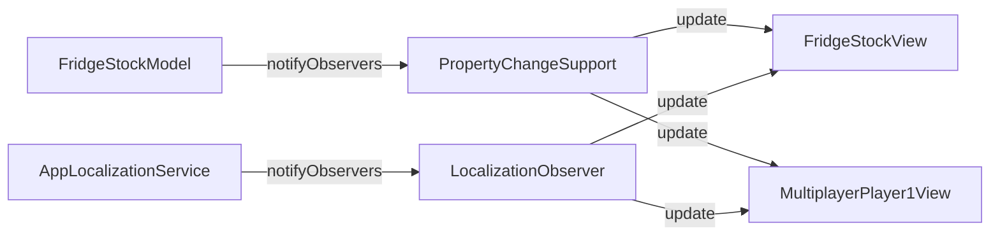

### 8.3.4 Singleton-Pattern

Singletons werden für gemeinsam genutzte Dienste eingesetzt:

| Singleton                  | Verantwortlichkeit                      |
| -------------------------- | --------------------------------------- |
| **ImageLoader**            | Zentrales Laden und Caching von Bildern |
| **AppLocalizationService** | Verwaltung der Mehrsprachigkeit         |

## 8.4 Unter-der-Haube

### 8.4.1 Konfigurationsmanagement

Fridgely implementiert ein mehrstufiges Konfigurationsmanagement:

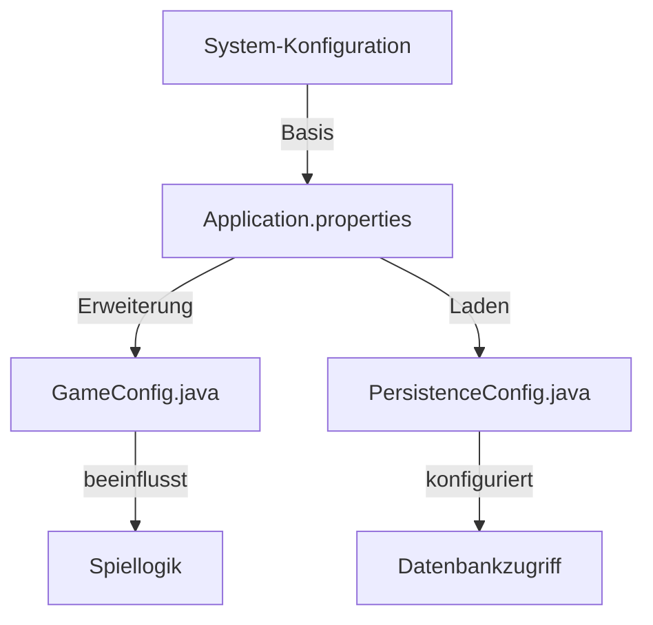

### 8.4.2 Fehlerbehandlung

Die Fehlerbehandlung in Fridgely folgt einem einheitlichen Konzept:

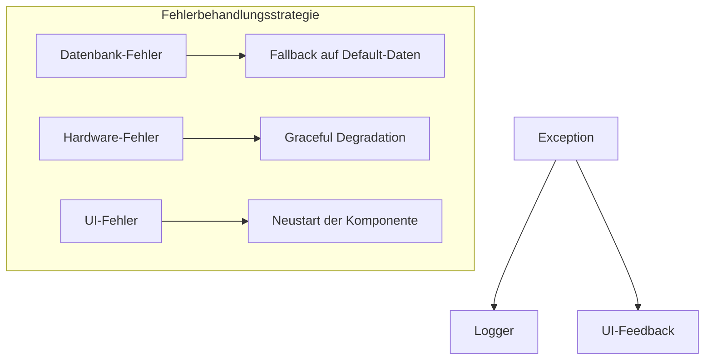

**Zentrale Prinzipien:**

* Fehler werden zentral geloggt (Java Logger)
* Kindgerechte, nicht-technische Fehlermeldungen
* Automatische Wiederherstellung wenn möglich

### 8.4.3 Ressourcenmanagement

Ressourcen werden in Fridgely systematisch verwaltet:

| Ressourcentyp             | Managementansatz                               |
| ------------------------- | ---------------------------------------------- |
| **Bilder**                | Zentrales Laden und Caching über `ImageLoader` |
| **Lokalisierungstexte**   | Properties-Dateien pro Sprache                 |
| **Datenbankverbindungen** | Connection-Pooling über Spring Data            |
| **UI-Komponenten**        | Standardisierte Erstellung und Entsorgung      |

### 8.4.4 Dual-Display Management

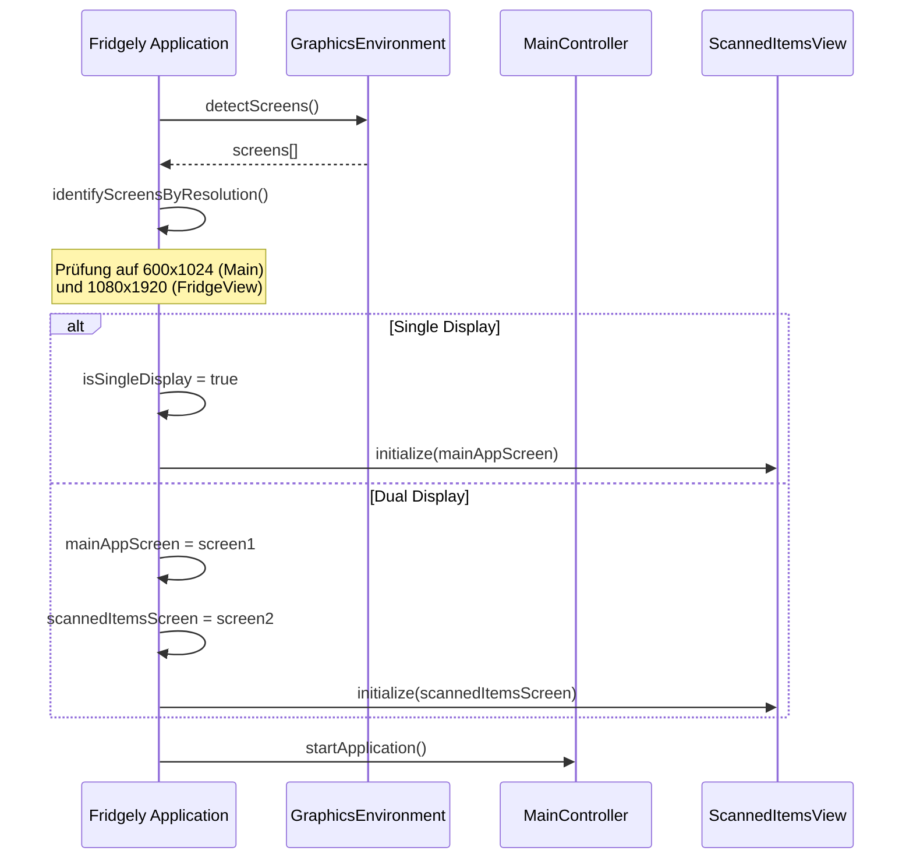

Die Dual-Display-Erkennung erfolgt automatisch beim Start der Anwendung durch die `detectScreens()`-Methode in der `Fridgely`-Hauptklasse. Diese Methode durchsucht die verfügbaren Bildschirme nach spezifischen Auflösungen:

- **Hauptbildschirm (Main App Screen)**: 600x1024 Pixel
- **Kühlschrankbildschirm (Scanned Items Screen)**: 1080x1920 Pixel

Für den Fall, dass die spezifischen Zielauflösungen nicht gefunden werden, implementiert das System eine Fallback-Strategie:

1. Wenn kein Hauptbildschirm gefunden wird, wird der Standardbildschirm verwendet
2. Wenn kein Kühlschrankbildschirm gefunden wird, aber mehrere Bildschirme vorhanden sind, wird ein anderer Bildschirm gewählt
3. Wenn nur ein Bildschirm verfügbar ist, wird der isSingleDisplay-Modus aktiviert, und der Hauptbildschirm wird für beide Ansichten verwendet

Die `ScannedItemsView` implementiert sowohl das `PropertyChangeListener`-Interface, um auf Änderungen im `FridgeStockModel` zu reagieren, als auch das `LocalizationObserver`-Interface für die Mehrsprachigkeitsunterstützung. Die Kommunikation erfolgt über das Observer-Pattern, wobei die View automatisch aktualisiert wird, wenn sich der Inhalt des Kühlschranks ändert.

Diese flexible Approach ermöglicht es Fridgely, sowohl in der Zielumgebung (Raspberry Pi mit Dual-Display-Setup) als auch in Entwicklungs- und Testumgebungen zu funktionieren.

## 8.5 Entwicklungskonzepte

### 8.5.1 Build-Prozess und Dependency-Management

Fridgely nutzt Maven als Build-Tool mit folgendem Ansatz:

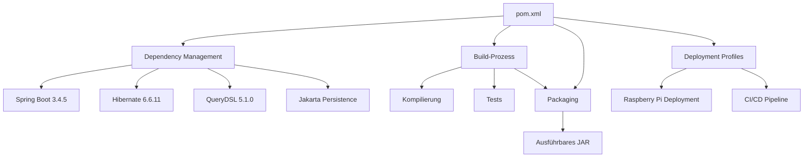

Die Build-Konfiguration in der `pom.xml` definiert folgende Kernaspekte:

| Aspekt                 | Details                                                  |
| ---------------------- | -------------------------------------------------------- |
| **Spring Boot Parent** | Version 3.4.5 als Basis für Dependency-Management        |
| **Java Version**       | JDK 21 für moderne Sprachfeatures                        |
| **Datenbank**          | SQLite mit Jakarta Persistence                           |
| **ORM/Query**          | Kombination aus JPA und QueryDSL für typsichere Abfragen |
| **Test Framework**     | JUnit 5 mit Mockito                                      |
| **Code Quality**       | Checkstyle, JaCoCo für Testabdeckung (>70%)              |
| **CI/CD**              | GitLab CI mit automatisiertem Build, Test und Deployment |

Spezielle Maven-Profile ermöglichen verschiedene Deployment-Optionen:

1. **release**: Erzeugt ein ausführbares JAR mit allen Abhängigkeiten
2. **run-on-Pi**: Kompiliert, verpackt und überträgt die Anwendung auf den Raspberry Pi
3. **restart-on-Pi**: Startet die Anwendung auf dem Raspberry Pi neu

Der CI/CD-Prozess in `.gitlab-ci.yml` implementiert folgende Pipeline-Stufen

- **build**: Kompiliert den Code und führt Unit-Tests aus
- **test**: Führt erweiterte Tests und Qualitätsprüfungen durch
- **package**: Erstellt das ausführbare JAR-Archiv
- **site**: Generiert Projektdokumentation und Testberichte
- **pages**: Veröffentlicht die generierte Dokumentation
- **deploy**: Erstellt Release-Artefakte und Tags

### 8.5.2 Entwicklungsworkflow und Coding-Konventionen

Der Entwicklungsworkflow folgt klaren Richtlinien:

| Bereich                | Konventionen                                                           |
| ---------------------- | ---------------------------------------------------------------------- |
| **Paketstruktur**      | ch.primeo.fridgely mit Unterpaketen für MVC                            |
| **Namenskonventionen** | PascalCase für Klassen, camelCase für Methoden                         |
| **Code-Formatierung**  | Einrückung: 4 Spaces, Maximale Zeilenlänge: 120 Zeichen                |
| **Kommentarstil**      | JavaDoc für öffentliche Methoden, Inline-Kommentare für komplexe Logik |
| **Testorganisation**   | Unit-Tests in src/test mit gleicher Paketstruktur                      |

### 8.5.3 Testkonzept

Das Testkonzept von Fridgely umfasst verschiedene Teststufen:

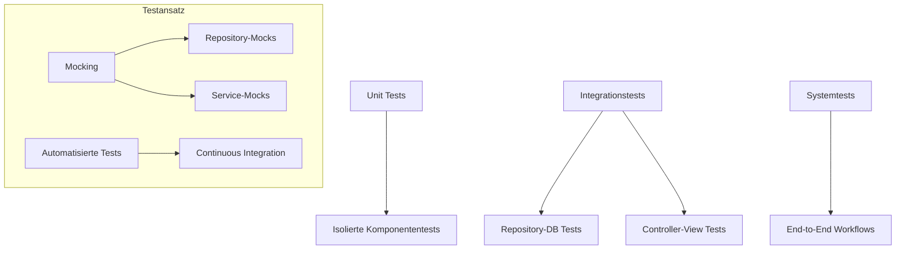

## 8.6 Betriebskonzepte

### 8.6.1 Deployment-Konzept

Fridgely wird als eigenständige Spring Boot-Anwendung deployed:

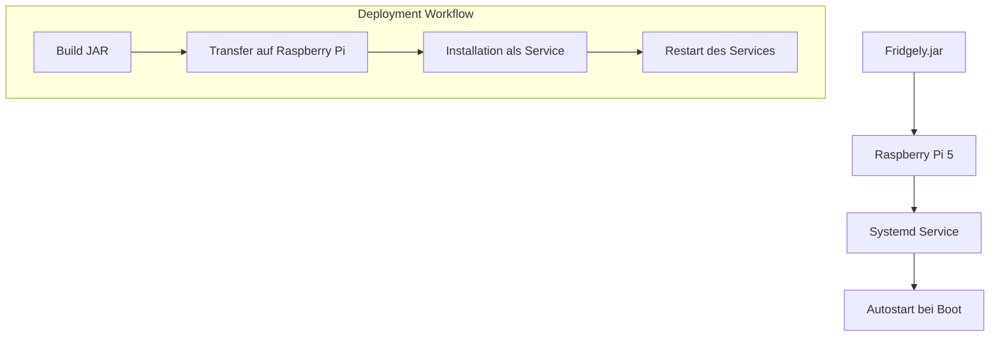

### 8.6.2 Start- und Stop-Konzept

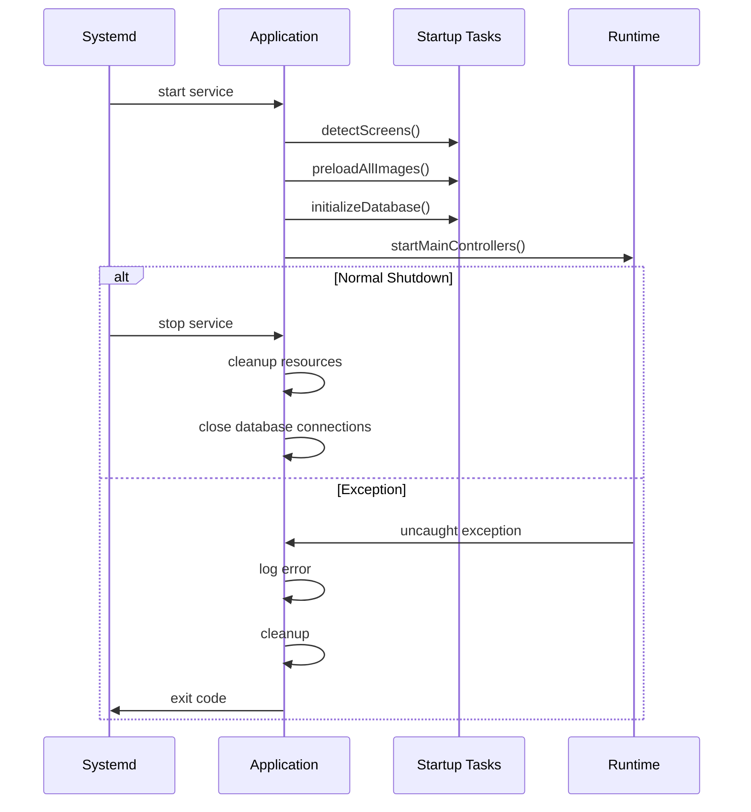

### 8.6.3 Monitoring und Logging

Das Logging-Konzept von Fridgely unterstützt das Monitoring im Betrieb:

| Logging-Aspekt             | Umsetzung                                                                                          |
| -------------------------- | -------------------------------------------------------------------------------------------------- |
| **Log-Levels**             | ERROR für kritische Fehler, WARN für Probleme, INFO für wichtige Ereignisse, DEBUG für Entwicklung |
| **Log-Format**             | Zeitstempel, Thread, Klasse, Level, Nachricht                                                      |
| **Log-Speicherung**        | Rollende Dateien mit max. Grösse und Aufbewahrungsdauer                                             |
| **Performance-Monitoring** | Start/Ende wichtiger Operationen, Speichernutzung                                                  |

## 8.7 Sicherheitskonzepte

### 8.7.1 Datenschutzkonzept

Obwohl Fridgely als Stand-alone-System konzipiert ist, wurden folgende Datenschutzaspekte berücksichtigt:

* Keine dauerhafte Speicherung personenbezogener Daten
* Lokale Begrenzung der Datenerfassung auf das Gerät
* Keine Netzwerkübertragung sensibler Daten

### 8.7.2 Betriebssicherheit

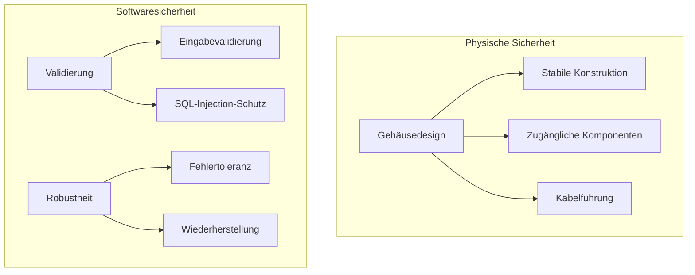

## 8.8 Zusammenfassung

Die querschnittlichen Konzepte des Fridgely-Systems bilden ein solides Fundament für die Architektur und sorgen für Konsistenz und Wartbarkeit über alle Komponenten hinweg. Die beschriebenen Muster und Ansätze wurden bewusst gewählt, um die besonderen Anforderungen eines pädagogischen, kindgerechten Smart-Fridge-Systems zu erfüllen, das:

* Intuitiv bedienbar ist
* Lehrreich und spielerisch motiviert
* Robust und wartbar bleibt
* Ressourceneffizient auf der Zielplattform läuft

Durch die durchgängige Anwendung dieser Konzepte wird die technische Qualität des Systems sichergestellt und gleichzeitig eine optimale Benutzererfahrung ermöglicht.
