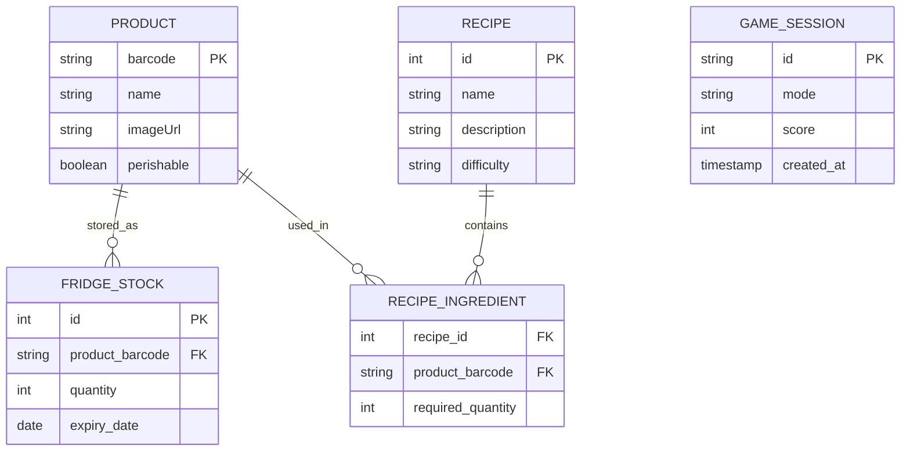
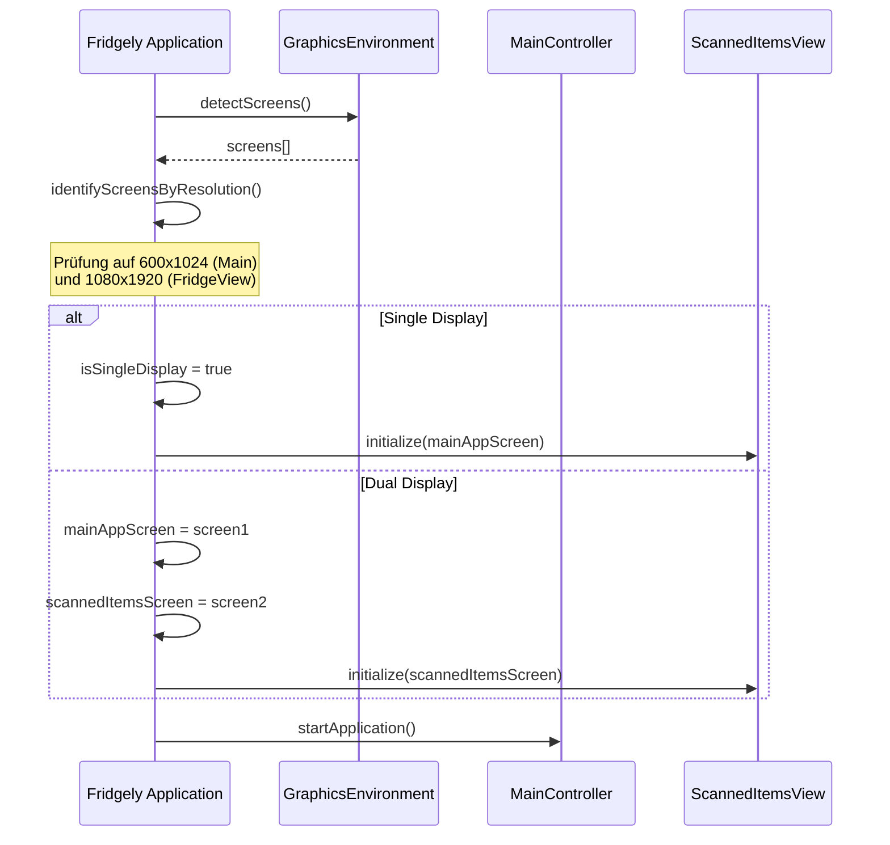
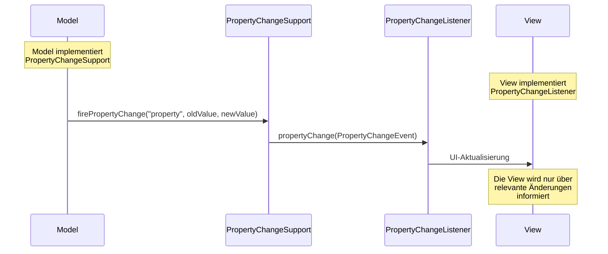

# 9. Architekturentscheidungen

Dieses Kapitel dokumentiert die wichtigsten Architekturentscheidungen, die während der Entwicklung des Fridgely-Systems getroffen wurden. Es folgt dem ADR (Architecture Decision Record) Format, um die Entscheidungen, deren Kontext, Alternativen und Konsequenzen klar zu dokumentieren.

## 9.1 Übersicht der Architekturentscheidungen

Die folgenden Architekturentscheidungen hatten wesentlichen Einfluss auf das Design und die Implementierung des Fridgely-Systems:

| ID | Titel | Kurzbeschreibung |
|----|------|------------------|
| ADR-1 | Verwendung von Java Swing statt JavaFX | Entscheidung für Java Swing als UI-Framework aufgrund von Performance-Vorteilen auf Raspberry Pi |
| ADR-2 | Implementierung des MVC-Architekturmusters | Strukturierung der Anwendung nach dem Model-View-Controller-Pattern für bessere Wartbarkeit |
| ADR-3 | Einsatz des Repository-Patterns für Datenzugriff | Abstraktion der Datenbankoperationen durch Repository-Interfaces |
| ADR-4 | Mehrsprachigkeitskonzept über zentrale Lokalisierungsservices | Implementierung eines flexiblen, Observer-basierten Mehrsprachigkeitssystems |
| ADR-5 | Verwendung von SQLite als eingebettete Datenbank | Einsatz einer lokalen, filebasierten Datenbank für Standalone-Betrieb |
| ADR-6 | Dual-Display-Management für Smart-Fridge-Erlebnis | Entwicklung einer spezialisierten Bildschirmerkennungs- und Verwaltungslogik |
| ADR-7 | Zentrale Ressourcenverwaltung via Singleton-Services | Implementierung von Singleton-Mustern für gemeinsam genutzte Ressourcen |
| ADR-8 | Einsatz von Spring Boot als Anwendungsframework | Nutzung des Dependency Injection Containers für modulare Architektur |
| ADR-9 | Observer-Pattern für UI-Aktualisierungen | Verwendung von PropertyChangeSupport/PropertyChangeListener für reaktive UI-Updates |
| ADR-10 | Barcode-Scanner Integration | Implementierung einer hardwareunabhängigen Schnittstelle für Barcode-Scannung |

## 9.2 Detaillierte Architekturentscheidungen

### ADR-1. Verwendung von Java Swing statt JavaFX

**Status:** Akzeptiert

**Kontext:** 
Für die Entwicklung der Benutzeroberfläche des Fridgely-Systems musste ein geeignetes UI-Framework gewählt werden. Die Hauptkandidaten waren Java Swing und JavaFX.

**Entscheidung:** 
Wir haben uns für Java Swing als UI-Framework anstelle von JavaFX entschieden.

**Begründung:**

- Java Swing hat einen geringeren Speicher- und Ressourcenverbrauch auf dem Raspberry Pi
- Bessere Performance auf der Zielplattform Raspberry Pi 5 mit begrenzten Ressourcen
- Einfachere Integration mit Java SE Standards
- Höhere Kompatibilität mit älteren Java-Versionen, falls Downgrades notwendig werden
- Ausreichende Funktionalität für die Anforderungen des Fridgely-UI

**Alternativen:**

- **JavaFX:** Bietet modernere UI-Komponenten und bessere Animationsunterstützung, benötigt jedoch mehr Ressourcen. In ersten Tests zeigte JavaFX Leistungsprobleme auf dem Raspberry Pi, besonders bei der Dual-Display-Konfiguration.
- **Web-basierte UI:** Wurde aufgrund von Komplexität und zusätzlichen Abhängigkeiten verworfen.

**Konsequenzen:**

- Einfachere Entwicklung auf ressourcenbeschränkter Hardware
- Eingeschränkte Animationsmöglichkeiten
- Begrenztere UI-Gestaltungsmöglichkeiten im Vergleich zu JavaFX
- Geringerer Speicherverbrauch
- Schnellere Startzeit der Anwendung

```mermaid
graph LR
    A[UI-Framework Auswahl] --> B[Java Swing]
    A --> C[JavaFX]
    A --> D[Web-basierte UI]
    
    B --> E["+ Ressourcenschonend<br>+ Gute Kompatibilität<br>- Weniger moderne UI-Elemente"]
    C --> F["+ Moderne UI-Komponenten<br>+ Bessere Animationen<br>- Höherer Ressourcenverbrauch"]
    D --> G["+ Flexibles Design<br>+ Plattformunabhängig<br>- Komplexere Architektur<br>- Zusätzliche Abhängigkeiten"]

    style B fill:#1a202c,stroke:#4a5568
    style C fill:#2b3d4f,stroke:#83a598
    style D fill:#3c3836,stroke:#fabd2f
```

### ADR-2. Implementierung des MVC-Architekturmusters

**Status:** Akzeptiert

**Kontext:** 
Die Architektur des Fridgely-Systems erforderte eine klare Trennung von Daten, Benutzeroberfläche und Anwendungslogik, um Wartbarkeit und Testbarkeit zu gewährleisten.

**Entscheidung:** 
Wir haben das MVC-Architekturmuster (Model-View-Controller) als grundlegendes Strukturierungsprinzip für das gesamte System implementiert.

**Begründung:**

- Klare Trennung von Zuständigkeiten erleichtert Wartung und Erweiterung
- Ermöglicht parallele Entwicklung von UI und Geschäftslogik
- Bessere Testbarkeit durch isolierte Komponenten
- Passt gut zu Swing-basierten Anwendungen
- Unterstützt die Observer-Mechanismen für UI-Updates und Datensynchronisation

**Alternativen:**

- **MVVM (Model-View-ViewModel):** Bietet bessere Bindings, aber höhere Komplexität.
- **MVP (Model-View-Presenter):** Ähnlich wie MVC, aber mit anderen Kommunikationsmustern.

**Konsequenzen:**

- Erhöhte Anzahl von Klassen aufgrund der Trennung von Verantwortlichkeiten
- Bessere Wiederverwendbarkeit von Komponenten
- Leichtere Wartbarkeit und Testbarkeit
- Erleichterte parallele Entwicklung

```mermaid
graph TB
    subgraph V[Views]
        MPGV[MultiplayerGameView]
        MP1V[MultiplayerPlayer1View]
        MP2V[MultiplayerPlayer2View]
        SIV[ScannedItemsView]
    end
    
    subgraph C[Controller]
        BC[BaseController Interface]
        MGC[MultiplayerGameController]
        MP1C[MultiplayerPlayer1Controller]
        MP2C[MultiplayerPlayer2Controller]
    end
    
    subgraph M[Models]
        MGSM[MultiplayerGameStateModel]
        FSM[FridgeStockModel]
        PM[PenguinModel]
    end
    
    C --> V
    C --> M
    M --> C

    classDef viewStyle fill:#2d3748,stroke:#a0aec0,stroke-width:1px;
    classDef controllerStyle fill:#3c3836,stroke:#fabd2f,stroke-width:1px;
    classDef modelStyle fill:#2d3b2d,stroke:#8ec07c,stroke-width:1px;
    
    class V viewStyle;
    class C controllerStyle;
    class M modelStyle;
    class MPGV,MP1V,MP2V,SIV viewStyle;
    class BC,MGC,MP1C,MP2C controllerStyle;
    class MGSM,FSM,PM modelStyle;
```

### ADR-3. Einsatz des Repository-Patterns für Datenzugriff

**Status:** Akzeptiert

**Kontext:** 
Für den Zugriff auf persistente Daten (Produkte, Rezepte, Kühlschrankinhalt) benötigte das System eine strukturierte und wartbare Datenzugriffsschicht.

**Entscheidung:** 
Wir haben das Repository-Pattern als Abstraktionsschicht für Datenbankzugriffe implementiert, kombiniert mit Spring Data JPA und QueryDSL für typsichere Abfragen.

**Begründung:**

- Abstrahiert Datenbankdetails von der Geschäftslogik
- Ermöglicht zentrale Fehlerbehandlung bei Datenbankoperationen
- Vereinfacht Unit-Tests durch Mock-Implementierungen der Repositories
- Unterstützt typsichere Abfragen mit QueryDSL und JPAQueryFactory
- Konsistente Schnittstelle unabhängig von der Datenbankimplementierung

**Alternativen:**

- **DAO-Pattern:** Ähnlich, aber weniger fokussiert auf die Domänenmodellierung.
- **Direct JDBC Access:** Zu niedrig-levelig, erhöht die Kopplung.
- **Active Record Pattern:** Vermischt Domänenlogik mit Datenbankzugriff.

**Konsequenzen:**

- Erhöhte Abstraktion verbessert die Testbarkeit
- Zentrale Datenzugriffslogik verringert Codeduplizierung
- Vereinfachte Migration zu anderen Datenbanktypen bei Bedarf
- Zusätzliche Abstraktionsebene, die etwas Overhead verursacht

```mermaid
graph TB
    C[Controller] --> R[Repository-Interfaces]
    R --> IMPL[Repository-Implementierungen]
    IMPL --> JPA[JPA Repositories]
    JPA --> DB[SQLite Datenbank]
    
    subgraph "Repository-Interfaces"
        PR[ProductRepository]
        RR[RecipeRepository]  
        FSR[FridgeStockRepository]
    end
    
    subgraph "JPA-Repositories"
        JPAPR[ProductJpaRepository]
        JPARR[RecipeJpaRepository]
        JPAFSR[FridgeStockJpaRepository]
    end

    classDef interfaceStyle fill:#3c3836,stroke:#fabd2f,stroke-width:1px;
    classDef implStyle fill:#2d3748,stroke:#a0aec0,stroke-width:1px;
    classDef dbStyle fill:#2d3b2d,stroke:#8ec07c,stroke-width:1px;
    
    class R,PR,RR,FSR interfaceStyle;
    class IMPL,JPAPR,JPARR,JPAFSR implStyle;
    class DB dbStyle;
```

### ADR-4. Mehrsprachigkeitskonzept über zentrale Lokalisierungsservices

**Status:** Akzeptiert

**Kontext:** 
Fridgely soll in mehreren Sprachen (Deutsch, Englisch, Französisch) verfügbar sein, um den Einsatz in verschiedenen Bildungskontexten zu ermöglichen.

**Entscheidung:** 
Wir haben einen zentralen AppLocalizationService implementiert, der das Observer-Pattern verwendet, um UI-Komponenten über Sprachänderungen zu informieren.

**Begründung:**

- Zentrale Verwaltung aller Übersetzungen
- Dynamischer Sprachwechsel zur Laufzeit ohne Anwendungsneustart
- Einheitliche Benennung von UI-Elementen in allen Sprachen
- Unterstützung für kindgerechte Formulierungen
- Erweiterbarkeit für zukünftige Sprachen

**Alternativen:**

- **ResourceBundle direkt verwenden:** Weniger flexibel und schwieriger zu zentralisieren.
- **Externe Lokalisierungsbibliotheken:** Unnötige Abhängigkeiten für unsere Anforderungen.

**Konsequenzen:**

- Konsistente mehrsprachige Benutzeroberfläche
- Einfaches Hinzufügen neuer Sprachen
- Kompaktere Wartung aller Übersetzungen an einem Ort
- Geringfügig erhöhte Komplexität durch Observer-Pattern

```mermaid
graph TD
    ALS[AppLocalizationService] --> DE[DE languages_de.properties]
    ALS --> EN[EN languages_en.properties]
    ALS --> FR[FR languages_fr.properties]
    ALS --> LO[LocalizationObserver Interface]
    
    LO --> V1[Views]
    LO --> C1[Controllers]
    LO --> M1[Models mit UI-Text]
    
    subgraph Änderungsmechanismus
        LS[Sprachauswahl] --> ALS
        ALS --> NT[Benachrichtigung an Observer]
        NT --> UT[UI-Text aktualisieren]
    end

    classDef serviceStyle fill:#3c3836,stroke:#fabd2f,stroke-width:1px;
    classDef resourceStyle fill:#2d3b2d,stroke:#8ec07c,stroke-width:1px;
    classDef interfaceStyle fill:#2b3d4f,stroke:#83a598,stroke-width:1px;
    classDef componentStyle fill:#2d3748,stroke:#a0aec0,stroke-width:1px;
    
    class ALS serviceStyle;
    class DE,EN,FR resourceStyle;
    class LO interfaceStyle;
    class V1,C1,M1,LS,NT,UT componentStyle;
```

### ADR-5. Verwendung von SQLite als eingebettete Datenbank

**Status:** Akzeptiert

**Kontext:** 
Fridgely benötigt eine Datenbank zur Speicherung von Produktinformationen, Rezepten und Spielständen. Als Stand-alone-System auf einem Raspberry Pi waren die Anforderungen an Einfachheit, Ressourceneffizienz und Wartungsarmut hoch.

**Entscheidung:** 
Wir haben SQLite als eingebettete, filebasierte Datenbank gewählt.

**Begründung:**

- Kein separater Datenbankserver erforderlich
- Geringe Ressourcenanforderungen
- Einfache Sicherung durch Datei-Kopie
- Ausreichende Leistung für die Datenmengen von Fridgely
- Gut unterstützt durch Spring Data JPA und Hibernate

**Alternativen:**

- **H2 Database:** Ähnlich zu SQLite, aber mit etwas anderen Leistungsmerkmalen.
- **PostgreSQL, MySQL:** Zu schwergewichtig für die Anforderungen, erfordert zusätzliche Server-Installation.
- **NoSQL-Datenbanken:** Überdimensioniert für die einfachen Datenstrukturen von Fridgely.

**Konsequenzen:**

- Vereinfachte Deployment- und Backup-Prozesse
- Geringerer Ressourcenverbrauch auf dem Raspberry Pi
- Eingeschränkte Parallelzugriffsmöglichkeiten (nicht kritisch für Fridgely)
- Gute Performance für die typische Nutzung von 1-2 gleichzeitigen Benutzern

### ADR-6. Dual-Display-Management für Smart-Fridge-Erlebnis

**Status:** Akzeptiert

**Kontext:** 
Das Fridgely-System benötigt zwei Bildschirme für ein immersives Erlebnis: einen Hauptbildschirm für das Spiel und einen zweiten Bildschirm für die Anzeige des Kühlschrankinhalts.

**Entscheidung:** 
Wir haben eine spezialisierte Bildschirmerkennungs- und Verwaltungslogik implementiert, die automatisch die angeschlossenen Displays erkennt und zuordnet.

**Begründung:**

- Immersives Erlebnis erfordert separate Displays für Spiel und Kühlschrankinhalt
- Automatische Erkennung ermöglicht einfache Installation
- Fallback-Mechanismus für Single-Display-Betrieb erhöht die Flexibilität
- Optimale Nutzung der unterschiedlichen Displayauflösungen
- Kindergerechte Benutzerführung durch räumliche Trennung der Informationen

**Alternativen:**

- **Single Display mit Split Screen:** Weniger immersiv und technisch komplexer in der UI-Gestaltung.
- **Manuelle Konfiguration:** Erhöhter Aufwand bei der Installation und Wartung.

**Konsequenzen:**

- Verbesserte Benutzerinteraktion durch dedizierte Displays
- Flexible Einsatzmöglichkeiten (auch mit nur einem Bildschirm)
- Erhöhte Komplexität der Software-Architektur
- Zusätzliche Hardware-Anforderungen (zweites Display)

### ADR-7. Zentrale Ressourcenverwaltung via Singleton-Services

**Status:** Akzeptiert

**Kontext:** 
Bestimmte Ressourcen wie Bilder und Lokalisierungstexte werden von vielen Komponenten im System benötigt. Eine effiziente Verwaltung dieser gemeinsam genutzten Ressourcen war erforderlich.

**Entscheidung:** 
Wir haben das Singleton-Pattern für zentrale Services wie ImageLoader und AppLocalizationService implementiert.

**Begründung:**

- Vermeidung redundanter Ressourcenladung durch zentrales Caching
- Konsistente Verwaltung gemeinsam genutzter Ressourcen
- Reduzierter Speicherverbrauch durch geteilte Ressourcen
- Vereinfachte Wartung durch Zentralisierung der Ressourcenverwaltungslogik
- Integration mit Spring-Dependency-Injection durch `@Component` und `@Scope("singleton")` Annotationen

**Alternativen:**

- **Statische Utility-Klassen:** Weniger flexibel für Dependency Injection und Testing.
- **Ressourcen bei Bedarf laden:** Ineffizient für häufig verwendete Ressourcen.

**Konsequenzen:**

- Reduzierter Speicherverbrauch durch geteilte Ressourcen
- Beschleunigte Anwendung durch vorgeladene Bilder und Texte
- Vereinfachter Zugriff auf Ressourcen im gesamten Code
- Potenzieller Thread-Safety-Overhead bei gleichzeitigen Zugriffen

```mermaid
graph TD
    SC[System-Konfiguration] --> |Basis| AC[Application.properties]
    AC --> |Erweiterung| GC[GameConfig.java]
    AC --> |Laden| PC[PersistenceConfig.java]
    
    GC --> |beeinflusst| G[Spiellogik]
    PC --> |konfiguriert| DB[Datenbankzugriff]
    
    subgraph Ressourcenmanagement 
        IL[ImageLoader Singleton]
        ALS[AppLocalizationService Singleton]
    end
    
    IL --> |lädt und cached| IM[Bilder]
    ALS --> |verwaltet| LOC[Lokalisierungstexte]
    
    subgraph "Ressourcentypen"
        IM
        LOC
        CON[Verbindungen]
        UI[UI-Komponenten]
    end
    
    classDef singletonStyle fill:#3c3836,stroke:#fabd2f,stroke-width:1px;
    classDef resourceStyle fill:#2d3b2d,stroke:#8ec07c,stroke-width:1px;
    
    class IL,ALS singletonStyle;
    class IM,LOC,CON,UI resourceStyle;
```

### ADR-8. Einsatz von Spring Boot als Anwendungsframework

**Status:** Akzeptiert

**Kontext:** 
Für die Entwicklung einer modularen, wartbaren Anwendung wurde ein Framework mit Dependency Injection und standardisierten Anwendungsstrukturen benötigt.

**Entscheidung:** 
Wir haben Spring Boot als Anwendungsframework gewählt.

**Begründung:**

- Robustes Dependency Injection System erleichtert Modularität
- Umfangreiche Unterstützung für JPA und Datenbankzugriff
- Vereinfachte Konfiguration durch Auto-Configuration
- Gute Integration mit Swing über non-web Spring Boot Mode
- Einfache Testbarkeit durch Spring Testing Support

**Alternativen:**

- **Manuelles Dependency Management:** Zu aufwändig und fehleranfällig.
- **JavaEE/Jakarta EE:** Überdimensioniert für Desktop-Anwendung.
- **Guice:** Weniger umfangreiche Ökosystem-Unterstützung.

**Konsequenzen:**

- Verbesserte Modularität und Testbarkeit
- Vereinfachtes Konfigurationsmanagement
- Verlängerter Anwendungsstart durch Spring-Kontext-Initialisierung
- Höherer Speicherbedarf durch das Framework

```mermaid
graph TD
    SB[Spring Boot Application] --> DI[Dependency Injection]
    SB --> AC[Auto Configuration]
    SB --> JPA[JPA Support]
    
    DI --> BD[Bean Definition]
    DI --> BC[Bean Creation]
    DI --> BW[Bean Wiring]
    
    subgraph Spring-Beans
        MC[ChooseGameModeController]
        IL[ImageLoader]
        ALS[AppLocalizationService]
        FSR[FridgeStockRepository]
    end
    
    BC --> Spring-Beans
    
    classDef springStyle fill:#3c3836,stroke:#fabd2f,stroke-width:1px;
    classDef beanStyle fill:#2d3748,stroke:#a0aec0,stroke-width:1px;
      class SB,DI,AC,JPA,BD,BC,BW springStyle;
    class MC,IL,ALS,FSR beanStyle;
```

### ADR-9. Observer-Pattern für UI-Aktualisierungen

**Status:** Akzeptiert

**Kontext:** 
Bei einer MVC-Architektur muss sichergestellt werden, dass die Views automatisch aktualisiert werden, wenn sich die zugrundeliegenden Daten im Model ändern, ohne direkte Abhängigkeiten zwischen diesen Komponenten zu schaffen.

**Entscheidung:** 
Wir haben das Observer-Pattern durch Verwendung von PropertyChangeSupport und PropertyChangeListener für die Kommunikation zwischen Models und Views implementiert.

**Begründung:**

- Lose Kopplung zwischen Model- und View-Komponenten
- Automatische Aktualisierung der Benutzeroberfläche bei Datenänderungen
- Standardisierte Implementierung über die Java-Bibliothek
- Unterstützung für spezifische Änderungsbenachrichtigungen durch Property-Namen
- Gute Integration mit dem MVC-Architekturmuster

**Alternativen:**

- **Eigene Event-Bus-Implementierung:** Höhere Komplexität ohne signifikante Vorteile.
- **Direkte Methodenaufrufe:** Würde die Trennung von Model und View kompromittieren.
- **Reactive Programming (z.B. RxJava):** Zu schwergewichtig für die Anforderungen.

**Konsequenzen:**

- Saubere Trennung von Datenmodell und Präsentation
- Reaktive Benutzeroberfläche, die automatisch auf Änderungen reagiert
- Leichte Erweiterbarkeit durch Hinzufügen neuer Observer ohne Änderung bestehender Komponenten
- Geringfügiger Overhead durch Event-Handling-Mechanismus

## 9.3 Zusammenfassung der Architekturentscheidungen

Die dokumentierten Architekturentscheidungen verdeutlichen die grundlegenden Designprinzipien des Fridgely-Systems. Durch die Kombination von MVC-Architektur, Repository-Pattern, Singleton-Services und Spring Boot entstand eine modulare, wartbare und erweiterbare Anwendung. Die Entscheidung für Swing als UI-Framework und SQLite als Datenbank optimiert die Performance auf der ressourcenbeschränkten Raspberry Pi Plattform.

Die Dual-Display-Lösung und das Mehrsprachigkeitskonzept unterstützen die pädagogischen Ziele des Projekts optimal und ermöglichen ein kindgerechtes, immersives Lernerlebnis. Die Implementierung des Observer-Patterns für UI-Aktualisierungen sorgt für eine reaktive Benutzeroberfläche bei gleichzeitiger sauberer Trennung der Architekturschichten. Diese Architekturentscheidungen bilden zusammen das technische Fundament, auf dem Fridgely seine Mission erfüllen kann: Kinder spielerisch für einen nachhaltigen Umgang mit Lebensmitteln zu sensibilisieren.
