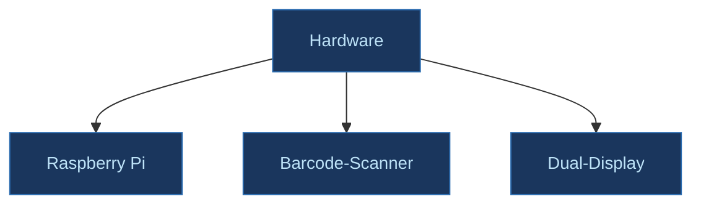
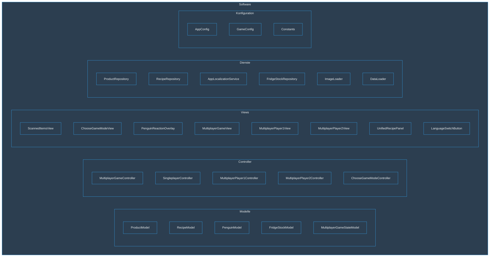
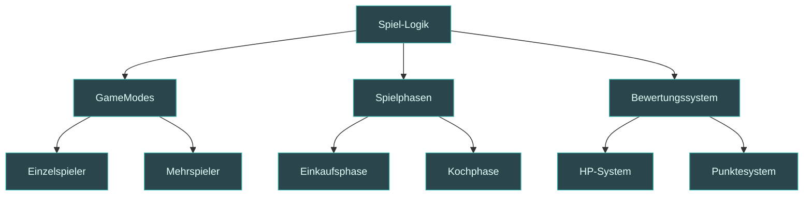
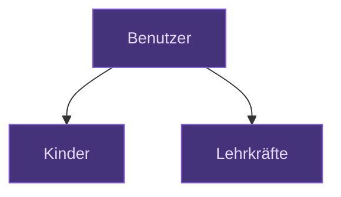

# 12. Glossar

## Begriffe und Definitionen

| Begriff     | Definition       |
|------------|------------------|
| ADR | Architecture Decision Record, Dokumentationsformat für Architekturentscheidungen, das im SAD des Fridgely-Systems verwendet wird. |
| AppConfig | Konfigurationsklasse, die anwendungsspezifische Einstellungen wie die Sprache aus der app.properties-Datei lädt und bereitstellt. |
| AppLocalizationService | Dienst, der die Mehrsprachigkeitsfunktionen der Anwendung verwaltet und die Übersetzungstexte für die aktuelle Sprache bereitstellt. |
| Barcode-Scanner | Hardwarekomponente, die zur automatischen Erfassung von Produkten durch Scannen ihrer Strichcodes verwendet wird. |
| BaseController | Abstrakte Basisklasse für alle Controller, die gemeinsame Funktionalitäten und Strukturen definiert. |
| Bio-Produkt | Lebensmittelprodukt, das nach biologischen Richtlinien hergestellt wurde. Im Fridgely-Kontext erhält der Spieler für Bio-Produkte mehr Punkte. |
| ChooseGameModeController | Controller, der die Auswahl des Spielmodus verwaltet und den entsprechenden Spielmodus startet. |
| ChooseGameModeView | Benutzeroberfläche zur Auswahl des Spielmodus (Einzelspieler oder Mehrspieler). |
| Constants | Klasse, die konstante Werte für die gesamte Anwendung definiert, einschliesslich Pfade, Dateinamen und andere unveränderliche Werte. |
| DataLoader | Komponente, die für das initiale Laden von Daten aus SQL-Skripten in die Datenbank nach der Schemaerstellung durch Hibernate verantwortlich ist. |
| Dual-Display | Hardwarekonfiguration des Fridgely-Systems mit zwei Bildschirmen - ein Hauptdisplay für die Benutzeroberfläche und ein zweites Display für die angezeigten gescannten Produkte. |
| Einkaufsphase | Phase im Spielablauf, in der die Benutzer (insbesondere Player 1 im Mehrspielermodus) Produkte scannen und einkaufen. |
| Fridgely | Name des gesamten Smart-Fridge-Systems, bestehend aus Hardware- und Softwarekomponenten zur spielerischen Sensibilisierung von Kindern für nachhaltigen Lebensmittelkonsum. |
| FridgeStock | Repräsentation des aktuellen Bestands an Lebensmitteln im Kühlschrank, gespeichert als Sammlung von Produkt-Barcodes. |
| FridgeStockJpaRepository | Interface zur Datenabfrage für FridgeStock-Entitäten mittels Spring Data JPA. |
| FridgeStockModel | Modell, das den gesamten Inhalt des Kühlschranks verwaltet und Änderungen an Beobachter kommuniziert. |
| FridgeStockRepository | Dienst zur Verwaltung des Kühlschrankbestands, vermittelt zwischen Model und Datenbankzugriff. |
| GameConfig | Konfigurationsklasse, die spielbezogene Konstanten wie Rundenzahl, minimale Produktanzahl und HP-Werte definiert. |
| GameMode | Spielmodus des Fridgely-Systems, entweder Einzelspieler (SinglePlayer) oder Mehrspieler (Multiplayer). |
| Gamifizierung | Anwendung von spieltypischen Elementen und Spieldesign-Techniken im Kontext einer Lernanwendung, um Motivation und Engagement zu fördern. |
| HP (Health Points) | Gesundheitspunkte des Pinguins im Spiel, die sich je nach Umweltfreundlichkeit der gescannten Produkte verändern. |
| ImageLoader | Hilfsprogramm zum Laden und Zwischenspeichern von Bildern für die Anwendung, um Leistung zu optimieren. |
| Kochphase | Phase im Spielablauf, in der die Benutzer (insbesondere Player 2 im Mehrspielermodus) Rezepte auswählen und kochen. |
| LanguageSwitchButton | UI-Komponente, die dem Benutzer ermöglicht, zwischen den verfügbaren Sprachen zu wechseln. |
| LocalizationObserver | Interface, das von Klassen implementiert wird, die auf Sprachänderungen reagieren müssen, um ihre Texte entsprechend anzupassen. |
| Lokales Produkt | Lebensmittelprodukt, das lokal produziert wurde. Im Fridgely-Kontext werden lokale Produkte als umweltfreundlicher bewertet. |
| Maskottchen | Pinguin-Charakter, der als visuelle Darstellung im Spiel dient und auf die Umweltauswirkungen der Lebensmittelentscheidungen reagiert. |
| Mehrspielermodus | Spielmodus, bei dem zwei Spieler kooperativ spielen - einer in der Rolle des Einkäufers (Player 1) und einer in der Rolle des Kochs (Player 2). |
| MultiplayerGameController | Controller-Klasse, die den Spielablauf im Mehrspielermodus koordiniert und zwischen den Spielern vermittelt. |
| MultiplayerGameLauncher | Klasse, die den Mehrspielermodus initialisiert, die notwendigen Controller und Views erstellt und das Spiel startet. |
| MultiplayerGameStateModel | Modellklasse zur Verwaltung des Spielzustands im Mehrspielermodus, inkl. Rundenzahl, aktueller Spieler und Punktestand. |
| MultiplayerGameView | Hauptansicht für den Mehrspielermodus, die die übergeordnete UI für beide Spieler enthält. |
| MultiplayerPlayer1Controller | Controller für Spieler 1 im Mehrspielermodus, der für die Einkaufsphase verantwortlich ist. |
| MultiplayerPlayer1View | Benutzeroberfläche für Spieler 1 im Mehrspielermodus, die Funktionen zum Scannen und Auswählen von Produkten anzeigt. |
| MultiplayerPlayer2Controller | Controller für Spieler 2 im Mehrspielermodus, der für die Kochphase verantwortlich ist. |
| MultiplayerPlayer2View | Benutzeroberfläche für Spieler 2 im Mehrspielermodus, die Funktionen zur Auswahl und Zubereitung von Rezepten anzeigt. |
| Nachhaltigkeit | Konzept des verantwortungsvollen Umgangs mit Ressourcen, insbesondere im Zusammenhang mit Lebensmitteln, um Verschwendung zu reduzieren. |
| PenguinFacialExpression | Enumeration, die die verschiedenen Gesichtsausdrücke des Pinguin-Maskottchens je nach Spielzustand definiert. |
| PenguinHPState | Zustand des Pinguin-Maskottchens basierend auf den verbleibenden HP-Punkten, beeinflusst durch umweltfreundliche oder -schädliche Produktwahl. |
| PenguinModel | Modellklasse zur Verwaltung des Zustands des Pinguins, einschliesslich seiner Gesundheit und visuellen Darstellung. |
| PenguinReactionOverlay | Visuelle Komponente, die die Reaktion des Pinguins auf die Produkt- oder Rezeptauswahl des Spielers anzeigt. |
| Player 1 | Spieler im Mehrspielermodus, der für das Scannen von Produkten zuständig ist (auch "Scanner" genannt). |
| Player 2 | Spieler im Mehrspielermodus, der für die Auswahl und Zubereitung von Rezepten zuständig ist (auch "Koch" genannt). |
| Produkt | Einzelnes Lebensmittel im System, dargestellt durch einen Barcode und zusätzliche Attribute wie Name, Beschreibung und Nachhaltigkeitseigenschaften. |
| ProductJpaRepository | Interface zur Datenabfrage für Product-Entitäten mittels Spring Data JPA. |
| ProductRepository | Service-Klasse, die den Zugriff auf die Produktdaten verwaltet und die Abfrage von Produkten nach Barcodes ermöglicht. |
| PropertyChangeListener | Interface aus dem Java-Beans-Framework, das von Views implementiert wird, um über Änderungen in Modellen informiert zu werden. |
| PropertyChangeSupport | Klasse aus dem Java-Beans-Framework, die von Modellen genutzt wird, um Änderungsbenachrichtigungen an registrierte Listener zu senden. |
| Raspberry Pi | Einplatinencomputer, auf dem die Fridgely-Software läuft, steuert die Hardware und führt die Spiellogik aus. |
| Rezept | Anleitung zur Zubereitung einer Mahlzeit aus bestimmten Zutaten, im System gespeichert mit mehrsprachigen Namen und Beschreibungen. |
| RecipeIngredient | Darstellung einer Zutat innerhalb eines Rezepts, mit Angabe des erforderlichen Produkts und der Menge. |
| RecipeIngredientJpaRepository | Interface zur Datenabfrage für RecipeIngredient-Entitäten mittels Spring Data JPA. |
| RecipeJpaRepository | Interface zur Datenabfrage für Recipe-Entitäten mittels Spring Data JPA. |
| RecipeModel | Modellklasse zur Verwaltung und Filterung von Rezepten basierend auf verfügbaren Zutaten im Kühlschrank. |
| RecipeRepository | Service-Klasse, die den Zugriff auf die Rezeptdaten verwaltet, einschliesslich der zugehörigen Zutaten. |
| ResourceLoader | Spring-Komponente, die im Fridgely-System für den Zugriff auf Ressourcendateien wie Bilder und Lokalisierungsdateien verwendet wird. |
| Runde | Einzelner Spieldurchlauf im Mehrspielermodus, bestehend aus einer Einkaufs- und einer Kochphase. |
| ScannedItemsView | Ansicht, die auf dem zweiten Display die gescannten Produkte oder ausgewählten Rezepte anzeigt. |
| SingleplayerController | (Geplante Komponente) Controller für den Einzelspielermodus, der die Spiellogik für einen einzelnen Spieler verwalten soll. Aktuell nur als Platzhalter vorhanden. |
| Smart-Fridge | Intelligenter Kühlschrank, der mithilfe von Sensoren und Software den Inhalt verwaltet und Benutzerinteraktionen ermöglicht. |
| Spring Boot | Framework, das für die Entwicklung des Fridgely-Systems verwendet wird, bietet Dependency Injection und vereinfacht die Konfiguration. |
| SQLite | Leichtgewichtige Datenbank, die zur lokalen Speicherung von Produkten, Rezepten und Spielständen verwendet wird. |
| Swing | Java-GUI-Toolkit, das für die Entwicklung der Benutzeroberfläche des Fridgely-Systems verwendet wird. |
| UnifiedRecipePanel | UI-Komponente zur einheitlichen Anzeige von Rezeptinformationen, einschliesslich Name, Beschreibung und benötigter Zutaten. |
| MVC-Pattern | Architekturmuster (Model-View-Controller), das im Fridgely-System durchgängig implementiert ist, um eine klare Trennung von Daten (Models), Benutzeroberfläche (Views) und Anwendungslogik (Controllers) zu gewährleisten. |
| Repository-Pattern | Entwurfsmuster, das im Fridgely-System verwendet wird, um die Datenzugriffsschicht zu abstrahieren und eine klare Trennung zwischen Geschäftslogik und Datenbankoperationen zu schaffen. |
| Singleton-Pattern | Entwurfsmuster für gemeinsam genutzte Ressourcen wie ImageLoader und AppLocalizationService, das sicherstellt, dass von diesen Klassen jeweils nur eine Instanz existiert. |
| Observer-Pattern | Entwurfsmuster, das im Fridgely-System mit Java-Beans PropertyChangeSupport und PropertyChangeListener implementiert ist, um UI-Komponenten über Änderungen in den Modellen zu informieren. |
| MultiplayerGameLauncher | Klasse, die den Mehrspielermodus initialisiert, die notwendigen Controller und Views erstellt und das Spiel startet. |
| JPA | Java Persistence API, die im Fridgely-System für den Datenbankzugriff und die Abbildung von Java-Objekten auf Datenbankstrukturen verwendet wird. |
| GameSession | Modellklasse, die den aktuellen Spielzustand mit Spielmodus, Punktzahl und Zeitstempel verwaltet. |
| Dependency Injection | Entwurfsprinzip, das im Fridgely-System durch Spring Boot umgesetzt wird, um Abhängigkeiten zwischen Komponenten zu verwalten und lose Kopplung zu fördern. |
| QueryDSL | Java-Framework, das im Fridgely-System für typsichere SQL-Abfragen in Verbindung mit JPA verwendet wird. |
| BaseView | Abstrakte Oberklasse für alle Views, die gemeinsame Funktionalität wie Mehrsprachigkeit und UI-Initialisierung implementiert. |
| CRUD-Operationen | Create, Read, Update, Delete - grundlegende Datenbankoperationen, die durch die Repository-Klassen im Fridgely-System implementiert werden. |
| FridgelyMainController | Hauptcontroller der Anwendung, der die Initialisierung und Koordination der verschiedenen Anwendungskomponenten übernimmt. |
| GraphicsDevice | Java AWT-Klasse, die im Fridgely-System für das Management der Dual-Display-Konfiguration verwendet wird. |
| GraphicsConfiguration | Java AWT-Klasse, die Informationen über die Bildschirmkonfiguration bereitstellt und für das Dual-Display-Management verwendet wird. |
| ISO 25010 | Qualitätsstandard für Software, der als Leitfaden für die Qualitätsanforderungen des Fridgely-Systems dient. |

## Konzeptdiagramme

