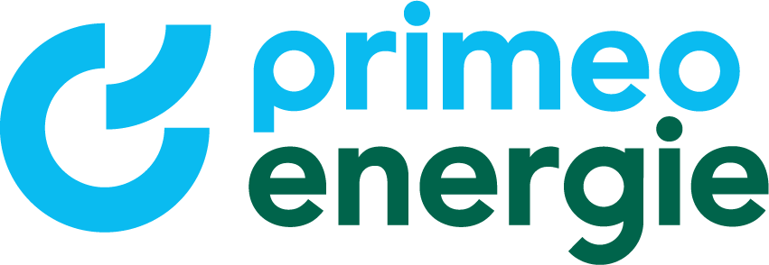
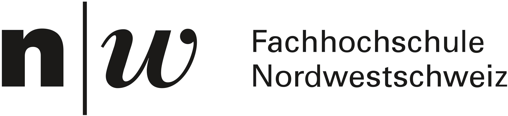

# Willkommen zum Fridgely-Projekt

<link rel="stylesheet" href="stylesheets/team-styles.css">

    

Fridgely ist mehr als nur Software – es ist ein innovatives Bildungsprojekt, das Kindern im Alter von 7-13 Jahren einen nachhaltigen Umgang mit Lebensmitteln vermittelt. Durch die Kombination eines physischen Mock-Smart-Kühlschranks mit interaktiver Software schaffen wir eine spielerische Lernumgebung, die Kinder begeistert und gleichzeitig wichtige Werte vermittelt.

    

        <h3>🎯 Projektziele</h3>
        <ul>
            <li>Sensibilisierung für Lebensmittelverschwendung</li>
            <li>Spielerisches Lernen durch Gamification</li>
            <li>Förderung nachhaltigen Handelns im Alltag</li>
            <li>Stärkung des Bewusstseins für Ressourcenschonung</li>
        </ul>
    

    

        <h3>⚙️ Physischer Prototyp</h3>
        <ul>
            <li>Mock-Smart-Kühlschrank aus Holz</li>
            <li>Dual-Monitor-Setup für immersives Erleben</li>
            <li>Barcode-Scanner für interaktive Produkterfassung</li>
            <li>Raspberry Pi 5 als leistungsstarkes Herzstück</li>
        </ul>
    

## Das Team hinter Fridgely

Unser interdisziplinäres Team vereint Expertise aus Softwareentwicklung, Pädagogik und Nachhaltigkeitsforschung, um dieses innovative Lerngerät zu entwickeln.

    <a href="mailto:erik.steinacher@students.fhnw.ch" class="team-member">
        
ES

        <h3>Erik Steinacher</h3>
        

            IP2
            Software-Architekt
            (PM Stv.)
        

        

            IP1
            Projektmanager
            (KOM Stv.)
        

    </a>
    <a href="mailto:lorenz.voser@students.fhnw.ch" class="team-member">
        
LV

        <h3>Lorenz Voser</h3>
        

            IP2
            Requirements Engineer
            (SA Stv.)
        

        

            IP1
            Software-Architekt
            (SC Stv.)
        

    </a>    <a href="mailto:patrick.heid@students.fhnw.ch" class="team-member">
        
PH

        <h3>Patrick Heid</h3>
        

            IP2
            Projektmanager
            (KOM Stv.)
        

        

            IP1
            Kommunikationsverantwortlicher
            (RE Stv.)
        

    </a>
    <a href="mailto:diego.varelapenas@students.fhnw.ch" class="team-member">
        
DV

        <h3>Diego Varela</h3>
        

            IP2
            Developer
            (RE Stv.)
        

        

            IP1
            Requirements Engineer
            (TM Stv.)
        

    </a>    <a href="mailto:ben.woodtli@students.fhnw.ch" class="team-member">
        
BW

        <h3>Ben Woodtli</h3>
        

            IP2
            Testmanager
            (UX Stv.)
        

        

            IP1
            UX-Verantwortlicher
            (PM Stv.)
        

    </a>
    <a href="mailto:joanna.marin@students.fhnw.ch" class="team-member">
        
JM

        <h3>Joanna Val Marin</h3>
        

            IP2
            UX-Verantwortliche
            (TM Stv.)
        

        

            IP1
            Testmanagerin
            (UX Stv.)
        

    </a>    <a href="mailto:philipp.eberhard@students.fhnw.ch" class="team-member">
        
PE

        <h3>Philipp Eberhard</h3>
        

            IP2
            Projektmanager
            (DEV Stv.)
        

    </a>
    <a href="mailto:stefan.vetter@fhnw.ch" class="team-member">
        
SV

        <h3>Stefan Vetter</h3>
        

            Teamcoach
        

    </a>
    <a href="mailto:elif.gurcinar@fhnw.ch" class="team-member">
        
EG

        <h3>Elif Gürcinar</h3>
        

            Product Owner
            (Experience UX)
        

    </a>

## Der physische Prototyp

Unser Fridgely-Prototyp verbindet Hardware und Software zu einem immersiven Lernerlebnis:

    

        <h3>Hardware-Komponenten</h3>
        <ul>
            <li><strong>Gehäuse:</strong> Massgefertigter Holzkühlschrank (Budget: CHF 200.-)</li>
            <li><strong>Computing:</strong> Raspberry Pi 5 mit 2GB RAM</li>
            <li><strong>Displays:</strong> Dual-Monitor-Setup (Hauptdisplay und Kühlschrankanzeige)</li>
            <li><strong>Eingabe:</strong> USB-Barcode-Scanner, Touch-Display</li>
            <li><strong>Netzwerk:</strong> WLAN für Remote-Wartung</li>
        </ul>
    

    

        <h3>Besondere Merkmale</h3>
        <ul>
            <li><strong>Interaktivität:</strong> Echtzeit-Reaktionen auf Barcode-Scans</li>
            <li><strong>Multimodalität:</strong> Visuelle und akustische Rückmeldungen</li>
            <li><strong>Kindgerechtes Design:</strong> Farbenfrohe, intuitive Benutzeroberfläche</li>
            <li><strong>Spielmodi:</strong> Einzelspieler- und Mehrspielermodus für verschiedene Lernerfahrungen</li>
            <li><strong>Mehrsprachigkeit:</strong> Vollständige Unterstützung für DE, EN und FR</li>
        </ul>
    

## Die pädagogische Vision

Fridgely ist mehr als ein Technologieprojekt – es ist ein Bildungswerkzeug mit klaren pädagogischen Zielen:

    <h3>💡 Lernziele für Kinder</h3>
    <ul>
        <li>Verständnis für den Wert von Lebensmitteln entwickeln</li>
        <li>Praktische Fähigkeiten zur Lebensmittelverwaltung erlernen</li>
        <li>Kreativität durch Rezeptvorschläge fördern</li>
        <li>Verantwortungsbewusstsein für nachhaltige Entscheidungen stärken</li>
        <li>Teamarbeit und gemeinsame Entscheidungsfindung im Mehrspielermodus üben</li>
    </ul>

## Partnerschaften

Das Fridgely-Projekt wird in Zusammenarbeit mit folgenden Partnern realisiert:

  

    

      
      
Primeo Energie AG

      
Hauptsponsor

    

    

      
      
FHNW

      
Akademischer Partner

    

    

      
      
Primeo Energie AG

      
Hauptsponsor

    

    

      
      
FHNW

      
Akademischer Partner

    

    

      
      
Primeo Energie AG

      
Hauptsponsor

    

    

      
      
FHNW

      
Akademischer Partner

    

  

## Dokumentation & Entwicklung

Um einen tieferen Einblick in die technische Umsetzung von Fridgely zu erhalten, kann die Software-Architekturdokumentation besucht werden. Diese enthält detaillierte Informationen zu Designentscheidungen, Architektur und Implementierung.

    <h2><a href="SAD/index.html">Zur Software-Architekturdokumentation</a></h2>
    
Detaillierte Einblicke in Design, Architektur und technische Entscheidungen des Fridgely-Systems

---

    Fridgely-Projekt • IP2 Team • FHNW • 2025

