# Hinzufügen von 3D-Produkten zu Fridgely

<div style="background:#2e3440;color:#eceff4;border-radius:8px;padding:16px;margin:16px 0;">
  <h3 style="margin: 10px 0px 16px 0px;">Überblick</h3>
  <p>Diese Anleitung erklärt ausführlich den Prozess zum Hinzufügen von 3D-Produkten zum Fridgely-System. Die 3D-Produkte werden in der Lageransicht und in der Benutzeroberfläche verwendet, um eine visuelle Repräsentation der gescannten Lebensmittel zu ermöglichen.</p>
  <p>Eine vollständige Dokumentation der bereits vorhandenen 3D-Produkte befindet sich hier: <a href="3D-Products.html" style="color:#88c0d0;">3D-Produkte Dokumentation</a>.</p>
</div>

## Der Prozess im Überblick

```mermaid
graph LR
    classDef defaultStep fill:#3b4252,stroke:#81a1c1,color:#eceff4,stroke-width:2px;
    H[Produkt zeichnen] --> S1[2D-Sprite erstellen]
    S1 --> S2[Sprite im Produktbilder-Ordner ablegen]
    S2 --> A[3D-Modell erstellen]
    A --> B[Modell optimieren]
    B --> C[Als STL exportieren]
    C --> D[Mit PrusaSlicer vorbereiten]
    D --> E[3D-Druck durchführen]
    E --> F1[Anmalen mit Acrylfarbe]
    F1 --> F2[Barcode generieren und aufkleben]
    F2 --> I[Datenbank Produkt anlegen]
    I --> S3[SQL-Eintrag erstellen]
    S3 --> G[Testen in der Anwendung]
    class H,S1,S2,A,B,C,D,E,F1,F2,I,S3,G defaultStep;
```



## Voraussetzungen

- **3D-Modellierungssoftware:** Blender (Version 3.0+), Fusion 360 (Version 2023+)
- **PrusaSlicer:** Version 2.6.0 oder neuer für die Vorbereitung der STL-Dateien für den 3D-Druck
- **3D-Drucker:** Original Prusa MK3.9 (0.4 mm Düse empfohlen) oder kompatibles Modell
- **Filament:** Generic PLA
- **Etikettenpapier:** HERMA PREMIUM No.4456 X2422X (3 x 10)
- **Barcode-Generator:** Beliebiger Online-Generator, z.B. [https://barcode.tec-it.com/en](https://barcode.tec-it.com/en)
- **Dateiformate:** STL für den 3D-Druck, originale Quellformate (.blend, .f3d) für Backups
- **Acrylfarben:** Wasserfeste Acrylfarben und feine Pinsel für realistische Produktgestaltung
- **Grundierung:** Weisse Acryl-Grundierung für bessere Farbhaftung (optional)
- **Grafiksoftware:** Adobe Photoshop (CC 2023+), GIMP (2.10+) oder Affinity Designer (2.0+) für die Erstellung von Produkt-Sprites
- **SQL-Kenntnisse:** Grundlegende Kenntnisse für Bearbeiten von SQL-Dateien
- **Zugriff auf:** Fridgely Code-Repository


## Detaillierte Anleitung

### 1. Produkt zeichnen und im System anlegen

- Zeichne das gewünschte Produkt (z.B. in einer Skizze oder digital).
- Lege das Produkt im Fridgely-System an, indem die Produktdaten (Name, Kategorie, Barcode) im System erfasst werden.
- Überprüfe in der [3D-Produkte Dokumentation](3D-Products.md), ob bereits ein ähnliches Produkt oder eine geeignete Vorlage existiert.

### 1.1. Produkt-Sprite erstellen und in den Ressourcen-Ordner einfügen

Für die visuelle Darstellung in der 2D-Ansicht der Fridgely-Anwendung ist es notwendig, ein Sprite (eine 2D-Grafik) des Produkts zu erstellen:

1. **Erstellen des Sprites:**
   - Öffne Grafiksoftware (Photoshop, GIMP oder Affinity Designer).
   - Erstelle ein neues Dokument mit folgenden Einstellungen:
     - **Breite:** 2000 Pixel
     - **Höhe:** 2000 Pixel
     - **Auflösung:** 300 dpi
     - **Farbmodell:** RGB
     - **Hintergrund:** Transparent
     - **Dateiformat:** PNG (mit Transparenz)
   - Zeichne oder importiere eine Frontansicht des Produkts.
   - Achte auf einen transparenten Hintergrund, um eine saubere Integration in die Anwendung zu gewährleisten.
   - Verwende realistische Farben und Details, die dem tatsächlichen Produkt entsprechen.
   - Das Produkt sollte ca. 80% der Bildgrösse einnehmen, mit etwas Abstand zum Rand.

2. **Exportieren des Sprites:**

   - Exportiere die Grafik in PNG-Format.
   - Stelle sicher, dass die Transparenz erhalten bleibt.

3. **Benennung des Sprite-Bildes:**

   - Verwende das Format: `[Barcode].png`
   - Beispiel: Für ein Produkt mit dem Barcode 085 wäre der Dateiname `085.png`

4. **Platzierung im Ressourcen-Ordner:**

   - Kopiere die erstellte Sprite-Datei in den Produktbilder-Ordner des Fridgely-Projekts:
   ```
   src\main\resources\ch\primeo\fridgely\productimages
   ```
   - Stelle sicher, dass die Dateirechte korrekt gesetzt sind, damit die Anwendung auf das Bild zugreifen kann.

> **Hinweis:** Achte darauf, dass die Bilder konsistent mit den anderen Produkt-Sprites in Stil und Qualität sind, um ein einheitliches Erscheinungsbild in der Anwendung zu gewährleisten.

### 2. Erstellen oder Beschaffen eines 3D-Modells

Es kann ein 3D-Modell selbst erstellt werden oder aus einer Bibliothek bezogen werden. Es gilt:

- Dateigrösse: Möglichst kompakt, damit der Druck nicht zu lange dauert (idealerweise unter 10 MB)
- Polygonanzahl: Nicht zu hoch, um die Druckzeit und Dateigrösse gering zu halten (Zielbereich: 5.000-20.000 Polygone)
- Massstab: Realistische Grössenverhältnisse (Skalierungsfaktor 1:1 zur realen Grösse)

**Empfohlene Quellen:**

- Printables
- Thingiverse
- Selbst modelliert (z.B. mit Blender, Fusion 360, Tinkercad)


### 3. Optimieren des 3D-Modells

| Optimierungsaspekt   | Empfohlene Werte         | Beschreibung                                               |
|----------------------|-------------------------|------------------------------------------------------------|
| Wandstärke           | Mindestens 1 mm         | Für Stabilität beim Druck                                  |
| Dateigrösse          | Max. 10 MB              | Für schnelle Verarbeitung im Slicer                        |
| Druckorientierung    | Flache Seite nach unten | Für optimale Druckqualität und Stabilität                  |

### 4. Export als STL-Format

Exportiere das Modell als `.stl`-Datei. Achte darauf, dass das Modell geschlossen (wasserdicht) ist und keine Fehler enthält.

### 5. Vorbereitung mit PrusaSlicer

- Öffne das STL-Modell in PrusaSlicer.
- Druckeinstellungen: **0.20mm SPEED** (für Details) oder **0.30mm DRAFT** (für schnelleren Druck)
- Filament: **Generic PLA** (Temperatur: 215°C für erste Schicht, 210°C für weitere Schichten)
- Drucker: **Original Prusa MK3.9** mit **0.4 mm Düse**
- Stützen: **Überall** mit **15%** Dichte
- Infill: **15-25%** (je nach gewünschter Stabilität)
- Infill-Muster: **Gitter** (für normale Modelle) oder **Gyroid** (für erhöhte Stabilität)
- Slice das Modell und speichere die GCODE-Datei.

### 6. 3D-Druck durchführen

- Übertrage die GCODE-Datei auf den Drucker.
- Starte den Druckvorgang.
- Nach dem Druck das Modell ggf. von Stützmaterial befreien.

### 6.1. Anmalen mit Acrylfarbe (optional)

- (Optional) Eine dünne Schicht weisse Grundierung auftragen und trocknen lassen (ca. 1-2 Stunden).
- Anmaltipps:
    - Verwende wasserfeste Acrylfarben für eine dauerhafte Färbung.
    - Trage die Farbe in mehreren dünnen Schichten auf, statt in einer dicken Schicht.
    - (Optional) Nach dem vollständigen Trocknen (24 Stunden) mit Acryllack versiegeln für zusätzlichen Schutz und Glanz.
- Achte darauf, erst nach dem Anmalen den Barcode anzubringen, um Farbverschmierungen zu vermeiden.

### 7. Barcode generieren und aufkleben

- Erstelle einen Barcode für das Produkt. Jeder Online-Barcode-Generator ist geeignet, z.B. [https://barcode.tec-it.com/en](https://barcode.tec-it.com/en).
    - Verwende den EAN-13 Barcode-Typ für die beste Kompatibilität mit dem Scanner
    - Drucke den Barcode mit mindestens 300 DPI Auflösung
- Drucke den Barcode auf **HERMA PREMIUM No.4456 X2422X** Etikettenpapier (3 x 10).
- Klebe den Barcode auf das gedruckte 3D-Produkt:
    - **Bevorzugte Position:** An der Unterseite des Produkts oder auf der Rückseite
    - **Alternative Position:** An einer flachen, gut sichtbaren Stelle
    - **Meide:** Kurven, Kanten oder strukturierte Oberflächen
    - Stelle sicher, dass der Barcode komplett flach aufgeklebt ist, ohne Luftblasen oder Falten

### 7.1. SQL-Eintrag für das Produkt erstellen

Für die Integration des Produkts in die Fridgely-Datenbank ist ein entsprechender SQL-Eintrag erforderlich:

1. **SQL-Datei bearbeiten:**
   - Navigiere zum SQL-Ressourcen-Ordner des Fridgely-Projekts:
   ```
   src\main\resources\ch\primeo\fridgely\sql
   ```
   - Öffne die allgemeine Produkt-Insert-Datei `data.sql`.

2. **Vorlage für den SQL-Eintrag:**
   
   ```sql
   INSERT INTO Products (
       Barcode, 
       Name, 
       NameDE, 
       NameFR,
       Description, 
       DescriptionDE, 
       DescriptionFR,
       IsDefaultProduct, 
       IsBio, 
       IsLocal, 
       IsLowCO2
   ) 

   VALUES (
       '4001234567890', 
       'Organic Milk', 
       'Bio-Milch', 
       'Lait Bio',
       'Fresh organic milk from local farms', 
       'Frische Bio-Milch von lokalen Bauernhöfen', 
       'Lait bio frais des fermes locales',
       0, -- kein Standardprodukt
       1, -- ist Bio
       1, -- ist lokal
       1  -- ist CO2-arm
   );
   ```


3. **SQL-Datei speichern:**
   - Speicher die SQL-Datei im Ressourcen-Ordner.
   - Stelle sicher, dass die Datei in UTF-8 kodiert ist, um Umlaute und Sonderzeichen korrekt darzustellen.

### 8. Testen der 3D-Darstellung

**Checkliste:**

- [ ] 3D-Modell ist stabil
- [ ] Barcode ist gut lesbar
- [ ] Produkt wird vom System korrekt erkannt und zugeordnet
- [ ] Produktinformationen werden korrekt in der App angezeigt
- [ ] Barcode lässt sich aus allen üblichen Scan-Winkeln gut lesen

**Test-Ablauf:**

1. Scannen des 3D-Produkts bei Fridgely
2. Überprüfen, ob das korrekte Produkt im System erkannt wird
3. Testen der korrekten Darstellung des Sprites

## Fehlerbehebung

| Problem                        | Mögliche Ursachen                        | Lösungsansätze                                         |
|---------------------------------|------------------------------------------|--------------------------------------------------------|
| Modell lässt sich nicht drucken | Fehlerhafte STL, zu dünne Wände          | Modell reparieren, Wandstärke erhöhen                  |
| Druck haftet nicht             | Druckbett nicht vorbereitet              | Bett reinigen, Haftmittel verwenden                    |
| Barcode wird nicht erkannt     | Schlechte Druckqualität, falscher Code   | Barcode neu drucken, anderen Generator testen          |
| Produkt zu instabil            | Zu wenig Infill, zu dünne Wände          | Infill erhöhen, Wandstärke anpassen                    |
| Modell passt nicht in den Kühlschrank | Zu gross skaliert                 | Massstab anpassen, neu skalieren                       |
| Farbe des Modells verblasst    | UV-Exposition, minderwertiges Filament   | Hochwertiges Filament verwenden, UV-Schutz auftragen   |
| Produkt wird nicht im System erkannt | Datenbank-Eintrag fehlerhaft       | Datenbankeinträge überprüfen, Barcode neu zuordnen     |
| Materialbeschaffenheit nicht realistisch | Falsches Filament, Einstellungen | Materialwechsel erwägen, Druckparameter anpassen      |
| Acrylfarbe blättert ab        | Schlechte Haftung, fehlende Grundierung | Oberfläche anschleifen, Grundierung verwenden          |
| Farben verlaufen ineinander   | Zu nasse Anwendung, zu wenig Trockenzeit | Dünnere Schichten auftragen, zwischen Farben trocknen lassen |
| SQL-Fehler beim Einfügen      | Syntax-Fehler, falsche Datentypen       | SQL-Syntax prüfen, korrekte Tabellennamen verwenden    |
| Sprite wird nicht angezeigt    | Falscher Pfad, Format nicht unterstützt  | Dateipfad und -format überprüfen, Berechtigungen prüfen |
| Datenbankeintrag führt zu Duplikat | Barcode bereits vorhanden           | Existierende Einträge prüfen, UPDATE statt INSERT verwenden |
| Bild-Ressourcen werden nicht geladen | Falscher Pfad, Schreibweise       | Korrekte Pfade und Dateinamen verwenden               |


## Best Practices

- **Druck Anmerkung:** Verwendung von 15-20% Infill für die 3D-Produkte.
- **Backups/Dokumentation:** Originale 3D-Modelle sichern. Gespeichert werden alle Modelle im `.blend`, `.f3d` oder entsprechenden Quellformat sowie bevorzugt als `.stl`. Zusätzlich sollten alle neue Produkte in der [3D-Produkte Dokumentation](3D-Products.md) hinzugefügt werden.
- **Barcode-Qualität:** Hochauflösend drucken und sauber aufkleben. Wir empfehlen mindestens 300 DPI beim Druck.
- **Bemalen für Realismus:** Verwenden von Acrylfarben für eine bessere Darstellung.

### Wichtige Dateipfade

| Ressource | Pfad | Format | Beschreibung |
|-----------|------|--------|--------------|
| Sprite-Bilder | `src\main\resources\ch\primeo\fridgely\productimages` | PNG | 2D-Bilder der Produkte für die Anzeige in der App |
| SQL-Dateien | `src\main\resources\ch\primeo\fridgely\sql` | SQL | Datenbank-Einträge für neue Produkte |
| Modell-Quelldateien | SAD Verzeichnis | .blend, .f3d, etc. | Original-Quelldateien der 3D-Modelle |

### Checkliste für vollständige Produktintegration

- [ ] 2D-Sprite erstellt und im productimages-Ordner platziert
- [ ] 3D-Modell erstellt/beschafft und optimiert 
- [ ] 3D-Modell gedruckt und nach Bedarf bemalt
- [ ] Barcode korrekt angebracht
- [ ] SQL-Eintrag erstellt
- [ ] Anwendung neu gestartet
- [ ] Barcode wird vom Fridgely-Scanner korrekt erkannt
- [ ] Produkt im 3D-Modell-Katalog dokumentiert
- [ ] Backup aller Dateien erstellt (GIT)
