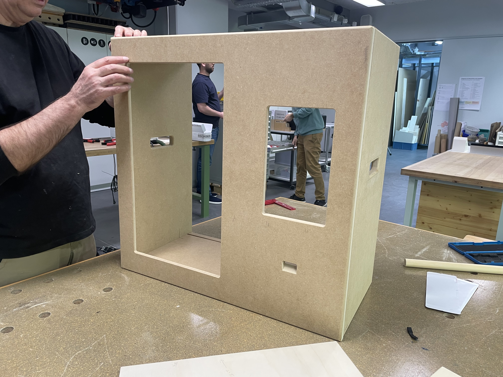

# 2. Randbedingungen

Diese Randbedingungen definieren die technischen, organisatorischen und konzeptionellen Einschränkungen, die für die Umsetzung des Fridgely-Systems zu berücksichtigen sind. Die folgenden Vorgaben gelten:

## 2.1 Technische Randbedingungen

### Hardware-Rahmenbedingungen

Das System läuft auf einem Raspberry Pi mit folgenden Spezifikationen:

* Broadcom BCM2712 2.4GHz Quad-Core 64-bit Arm Cortex-A76 CPU mit kryptografischen Erweiterungen
* 512KB L2-Cache pro Kern und 2MB gemeinsamer L3-Cache
* VideoCore VII GPU (unterstützt OpenGL ES 3.1 und Vulkan 1.2)
* Dualer 4Kp60 HDMI®-Displayausgang mit HDR-Unterstützung
* 4Kp60 HEVC-Decoder
* LPDDR4X-4267 SDRAM (2GB)
* Dual-Band 802.11ac Wi-Fi®, Bluetooth 5.0 / BLE
* microSD-Kartensteckplatz (SDR104-Modus)
* 2 × USB 3.0 Ports, 2 × USB 2.0 Ports
* Gigabit Ethernet mit PoE+-Unterstützung (PoE+ HAT erforderlich)
* 2 × 4-lane MIPI Kamera-/Display-Schnittstellen
* PCIe 2.0 x1 Schnittstelle (separater M.2 HAT oder Adapter erforderlich)
* Stromversorgung: 5V/5A DC über USB-C mit Power Delivery-Unterstützung
* Raspberry Pi Standard 40-Pin Header, Echtzeituhr (RTC) mit externer Batterie und Power-Taste

### Betriebssystem und Softwareumgebung

* Betriebssystem: Raspberry Pi OS mit Desktop (64-bit) 
    - Kernel-Version: 6.6, Debian-Version: 12 (Bookworm), Release-Datum: November 19, 2024
    - Image-Grösse: 1,179 MB
* Java-Umgebung: Java Version 21 (basierend auf Maven-Konfigurationen)
* Verwendete Frameworks, Bibliotheken und Tools:
    - Spring Boot 3.4.5 als Anwendungsframework mit Dependency Injection
    - Spring Data JPA für Datenbankzugriff 
    - Java Swing für die Benutzeroberfläche
    - JPA/Hibernate 6.6.11 für ORM (Object-Relational Mapping)
    - SQLite 3.49.1 als eingebettete Datenbank
    - Keine weiteren UI-Framework-Abhängigkeiten (rein Swing-basierte Implementierung)
    - Keine Text-to-Speech oder Speech-to-Text Komponenten in der aktuellen Implementierung
    - Testframework: JUnit 5 mit Mockito 5.17.0
    - Build Tools: Maven

### Grafische Darstellung

Für grafische Angelegenheiten wird die JavaSwing Library verwendet werden.

## 2.2 Organisatorische Randbedingungen

### Projektorganisation

* **Entwicklungsteam**: Studierendenteam der FHNW (IP12 Projekt)
* **Stakeholder**: FHNW & Primeo
* **Entwicklungsmethodik**: Agile Entwicklung mit regulären Sprints
* **Dokumentationsanforderungen**: Erstellung und Pflege der technischen Dokumentation nach arc42-Standard

### Zeit- und Ressourcenbeschränkungen

* **Projektlaufzeit**: Beschränkt auf die Dauer des IP12-Moduls
* **Personalressourcen**: Begrenzt auf das zugewiesene Studierendenteam
* **Budget**: Eingegrenzt auf die für Lehrzwecke verfügbaren Mittel (CHF 200)

## 2.3 Konventionen

### Entwicklungskonventionen

* **Coderichtlinien**: Java Code Conventions
* **Namenskonventionen**: CamelCase für Klassen, Methoden und Variablen
* **Commit-Richtlinien**: Aussagekräftige Commit-Nachrichten mit Bezug zu Tasks
* **Versionskontrolle**: Git mit GitLab

### Dokumentationskonventionen

* **Architekturendokumentation**: Nach arc42-Template
* **Code-Kommentierung**: JavaDoc
* **Sprache**: Deutsche Dokumentation, englischer Code und Kommentare

## 2.4 Betriebsbedingungen

### Einsatzszenario

Das System ist für den Betrieb durch jeweils einen oder zwei Benutzer optimiert (on-premises Nutzung).

Das Fridgely-System muss in einem stabilen, trockenen und staubfreien Umfeld betrieben werden, um eine optimale Leistung zu gewährleisten. Die Umgebungstemperatur sollte zwischen 10 °C und 40 °C liegen, und die relative Luftfeuchtigkeit sollte 10 % bis 90 % betragen (nicht kondensierend).

Anzumerken ist, dass die Hardware so konzipiert wurde, dass sie den Anforderungen der Schutzart IP20 entspricht, was bedeutet, dass sie gegen Berührung mit festen Fremdkörpern grösser als 12 mm geschützt ist, jedoch nicht gegen Wasser oder Staub. Daher sollte das System nicht in feuchten oder staubigen Umgebungen eingesetzt werden.

* **Temperatur:** 10 °C bis 40 °C
* **Luftfeuchtigkeit:** 10 % bis 90 % (nicht kondensierend)
* **Betriebsumgebung:** Stabil, trocken und staubfrei
* **Schutzart:** IP20 (geschützt gegen Berührung mit festen Fremdkörpern > 12 mm, nicht gegen Wasser oder Staub)
* **Betriebsart:** On-Premises (lokal)
* **Benutzeranzahl:** 1 oder 2 Benutzer gleichzeitig
* **Vorgesehene mögliche Einsatzorte:** Primär in Bildungseinrichtungen, wie Schulen oder ähnlichen Umgebungen

### Zuverlässigkeit

Bei korrekter Konfiguration ist die Fehlerrate nahezu null, wobei Hardwarefehler nicht ausgeschlossen werden können.

Die Zuverlässigkeit des Systems wird durch die Verwendung von bewährten Komponenten und Technologien gewährleistet. Die Softwarearchitektur ist so konzipiert, dass sie eine hohe Verfügbarkeit und Stabilität bietet, auch bei intensiver Nutzung durch Kinder. Regelmässige Wartungen sind erforderlich, um die langfristige Zuverlässigkeit der Hardware sicherzustellen.

Hier gilt insbesondere, dass regelmässige Hardware Checks stattfinden müssen, um sicherzustellen, dass alle Komponenten ordnungsgemäss funktionieren. Dazu gehören:

* Überprüfung der Stromversorgung und sonstige Beschädigungen an Strom- sowie Datenkabeln
* Überprüfung des Gehäuses/Kühlschrankmodells auf physische Schäden
* Überprüfung der folgenden Sensoren:
    - Barcode-Scanner
    - Touch-Display (Interaktions Display; klein)
    - Display (gross)
    - Lautsprecher
    - Schalter

### Testabdeckung

#### Software

Die Programmlogik wird durch JUnit Tests abgesichert. Die Testabdeckung wird durch den Einsatz von JaCoCo gemessen. Die Zielvorgabe für die Testabdeckung liegt bei 80 %. Die Tests werden in der CI/CD-Pipeline ausgeführt, um sicherzustellen, dass alle neuen Funktionen und Änderungen an der Software ausreichend getestet werden.

Aktuelle Testabdeckung nach Modulen (Stand: Oktober 2025):

| Modul/Paket | Testabdeckung | Kommentar |
|-------------|---------------|-----------|
| **Model** (ch.primeo.fridgely.model) | 100% | Vollständige Abdeckung der Datenmodelle und Entitäten |
| **Controller Multiplayer** (ch.primeo.fridgely.controller.multiplayer) | 100% | Vollständige Tests für Multiplayer-Funktionalität |
| **Service** (ch.primeo.fridgely.service) | 100% | Vollständige Abdeckung der Geschäftslogik |
| **Controller** (ch.primeo.fridgely.controller) | 100% | Umfassende Tests aller Controller-Klassen implementiert |
| **Util** (ch.primeo.fridgely.util) | 100% | Hilfsfunktionen vollständig abgesichert |
| **Model Multiplayer** (ch.primeo.fridgely.model.multiplayer) | 100% | Multiplayer-Datenmodelle vollständig getestet |
| **Gamelaunchers** (ch.primeo.fridgely.gamelaunchers) | 100% | Spielstartlogik vollständig abgedeckt |
| **Config** (ch.primeo.fridgely.config) | 100% | Konfigurationsklassen vollständig getestet |
| **Service Localization** (ch.primeo.fridgely.service.localization) | 100% | Lokalisierungsservices vollständig abgedeckt |
| **View** (ch.primeo.fridgely.view) | Ausgeschlossen | UI-Komponenten von Testabdeckungsmessung ausgenommen |
| **Gesamtabdeckung** | **100%** | Ziel von 80% deutlich übertroffen |

Die Testabdeckungsmessung erfolgt automatisch im CI/CD-Prozess bei jedem Push in den Hauptbranch. Der JaCoCo-Report wird als Teil der Pipeline generiert und ist für das Entwicklungsteam im GitLab-Repository verfügbar. Die hervorragende Testabdeckung von 100% in allen Modulen gewährleistet eine aussergewöhnlich robuste Anwendung mit minimiertem Risiko für unentdeckte Fehler.

Wenn das System neue Anforderungen der Zielgruppe erfüllen soll, können zusätzlich zu den automatisierten Tests manuelle Tests durchgeführt werden, um die Benutzerfreundlichkeit und Interaktivität des Systems zu überprüfen. Diese UX-Tests sollten umfassen:
- Benutzerstudien und Feedback von Kindern zur Usability und Benutzerfreundlichkeit des Systems
- Tests der Interaktion mit den verschiedenen Eingabegeräten (Touch-Display, Barcode-Scanner)
- Überprüfung der visuellen und akustischen Rückmeldungen des Systems

#### Hardware

Die Testabdeckung der Hardware erfolgt durch die Überprüfung der Funktionalität aller Komponenten. Dazu gehören:

* Überprüfung der Barcode-Scanner-Funktionalität
* Überprüfung des Touch-Displays auf Reaktionsfähigkeit und Genauigkeit
* Überprüfung des Lautsprechers auf Klangqualität und Lautstärke
* Überprüfung des Displays auf Helligkeit und Lesbarkeit

## Normen und Standards

Die Softwarequalität orientiert sich an den Vorgaben des ISO 25010 Standards.
