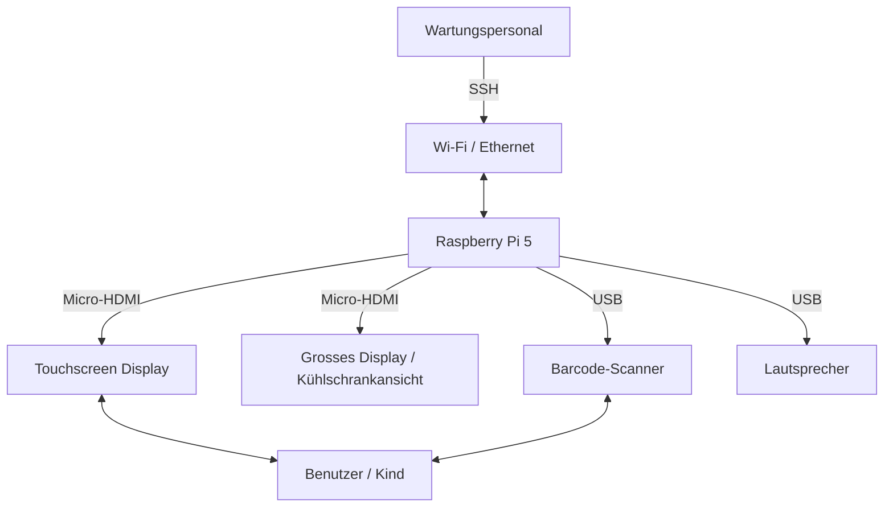
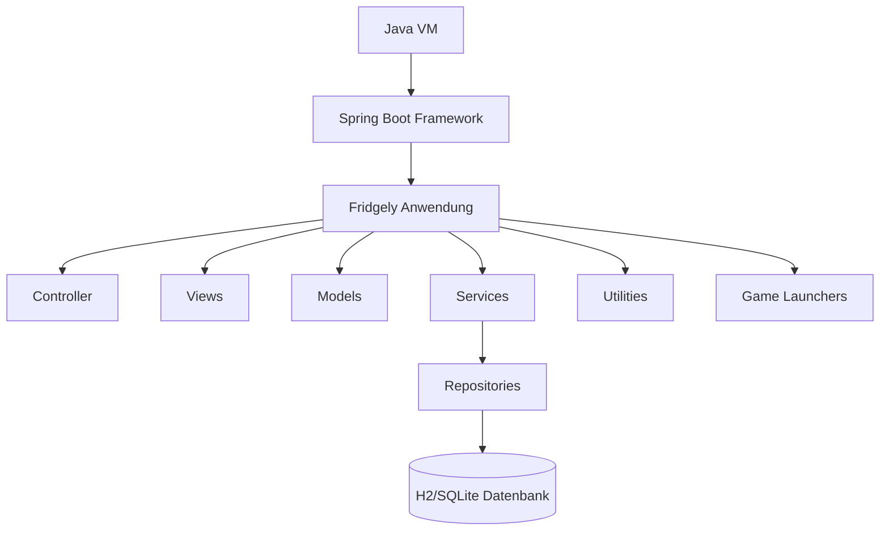

# 3. Kontextabgrenzung

Das Fridgely-System ist ein eigenständiges, interaktives Lerngerät, das als Mock-Smart-Kühlschrank konzipiert wurde. Es interagiert mit den Nutzern (hauptsächlich Kindern) über mehrere Eingabegeräte (Touch-Display, Barcode-Scanner) und liefert Ausgaben über visuelle und akustische Rückmeldungen. Die externe Kommunikation beschränkt sich auf den Zugriff zur Wartung über SSH. Alle weiteren Funktionen und Datenverarbeitungen erfolgen lokal auf dem System (Raspberry Pi).

Differenziert wird zwischen:

* Fachlichen Schnittstellen: Benutzerinteraktionen und Informationsaustausch im Rahmen der Lebensmittelverwaltung, Rezeptvorschlägen und Warnungen bei unökologischen Produkten.
* Technischen Schnittstellen: Physikalische und logische Verbindungen, die über USB, HDMI, GPIO, Audio und Netzwerk (für SSH) realisiert werden.

Die exakte Abgrenzung des Systems ist entscheidend, um Verantwortlichkeiten, Schnittstellen und Kommunikationskanäle klar zu definieren. Dies ermöglicht einen reibungslosen Betrieb, Wartung und Erweiterung des Systems.

## Fachlicher Kontext

Das Fridgely-System agiert als zentrale Schnittstelle zwischen dem Nutzer und der Verwaltung von Lebensmitteln. Folgende Kommunikationsbeziehungen bestehen:

| Kommunikationsbeziehung | Eingabe | Ausgabe |
|-------------------------|---------|---------|
| Benutzer (Kind) | Berührung am Touch-Display, Barcode-Scans | Visuelle Darstellung (Inventarliste, Maskottchen-Animation), systeminterne Benachrichtigungen |
| Wartungspersonal | SSH-Schnittstelle (Fernwartung und Debugging) | Systemstatus und Log-Daten |

Alle fachlichen Schnittstellen stellen sicher, dass das System den Nutzer in einer intuitiven und interaktiven Weise unterstützt und gleichzeitig externe Wartungszugriffe ermöglicht.

## Technischer Kontext

Die technischen Schnittstellen des Fridgely-Systems verbinden die Hardwarekomponenten und ermöglichen die fachliche Kommunikation. Wichtige technische Aspekte sind:

**Raspberry Pi Hardware:**

- Verbindungsports: USB (für Barcode-Scanner, Lautsprecher), HDMI/Touchscreen-Anschluss, GPIO (für physische Schalter)
- Netzwerkzugang: Gigabit Ethernet/802.11ac Wi-Fi für SSH-Zugriff und mobile Benachrichtigungen

**Audio/Video:**

- Audioausgang (Lautsprecher) über USB
- Touch-Display über HDMI (mit integriertem Touchscreen-Controller)
- Display (gross) über HDMI
- Multi-Screen-Unterstützung für Haupt-UI und Scanned-Items-Ansicht

**Externe Kommunikation:**

- Fernwartung über SSH-Zugang auf den Raspberry Pi

### Schnittstellen-Spezifikationen

| Schnittstelle | Protokoll/Format | Datenaustausch | Sicherheit |
|---------------|------------------|----------------|------------|
| Barcode-Scanner | USB HID (Human Interface Device) | Eindimensionale und zweidimensionale Barcodes im EAN-13, QR-Code, und weiteren Formaten | Keine spezielle Verschlüsselung, physischer Zugriff notwendig |
| Touch-Display | HDMI für Video, USB für Touch-Eingaben | Pixel-Daten (1920x1080), Touch-Events (x/y-Koordinaten) | Keine spezielle Verschlüsselung, physischer Zugriff notwendig |
| SSH-Zugang | SSH v2 über TCP/IP | Kommandozeilen-Befehle, Dateiübertragung (SCP) | Öffentlicher Schlüssel (RSA/ED25519), keine Passwort-Authentifizierung |
| Datenbank | JPA/Hibernate über SQLite | Entity-Objekte ↔ Relationale Daten | Lokale Datei, kein Netzwerkzugriff |

Zur Veranschaulichung der technischen Zusammenhänge wird ein Deployment-Diagramm (Technical-Context-View Diagramm) bereitgestellt:

**Hardware Architecture (Fridgely System)**

**Software Architecture (Fridgely Anwendung)**

Für Wartungsarbeiten oder Systemänderungen wird ein SSH-Zugang auf den Raspberry Pi eingerichtet.

### Mapping fachliche auf technische Schnittstellen

| Priorität | Fachliche Schnittstelle | Technischer Kanal / Schnittstelle | Datenfluss | Fehlerbehandlung |
|-----------|-------------------------|------------------------------------|------------|------------------|
| 1 | Touch-Display Interaktion | HDMI/Touchscreen-Anschluss am Raspberry Pi | UI-Elemente → Touch-Events → Controller-Aktionen → Modell-Updates → UI-Refresh | Timeout bei fehlenden Touch-Events, auto-reconnect bei Verbindungsverlust |
| 2 | Barcode-Scanner Eingabe | USB-Anschluss (Barcode-Scanner Modul) | Barcode → USB HID → Parser → Produktdatenbank-Abfrage → UI-Aktualisierung | Fehlermeldung bei unbekanntem Barcode, Recovery-Mechanismus bei fehlerhaftem Scan |
| 3 | Mehrere Bildschirme für verschiedene Ansichten | Dual HDMI-Ausgang des Raspberry Pi | Haupt-UI auf Touch-Display, Scanned-Items auf grossem Display | Automatische Erkennung bei Display-Wechsel, primäre UI immer auf Touch-Display |
| 4 | Wartung und Debugging | SSH-Zugang über Ethernet/Wi-Fi | Befehle → System → Logs/Responses zurück an Admin | Rate-Limiting gegen Brute-Force, schlüsselbasierte Authentifizierung |

**Datenformate:** Spring Boot verwaltet die interne Kommunikation zwischen Komponenten. Für die Datenpersistenz werden JPA-Entities verwendet, die über Repositories in die Datenbank geschrieben werden. Die wichtigsten Entity-Typen umfassen:

- `Product`: Repräsentiert ein Lebensmittelprodukt mit Attributen wie Name, Barcode, Nährwerte, CO2-Fussabdruck
- `FridgeStock`: Repräsentiert den aktuellen Bestand im Kühlschrank mit Referenzen zu Produkten
- `Recipe`: Beschreibt ein Rezept mit Zutaten (Referenzen zu Produkten) und Zubereitungsschritten
- `GameState`: Speichert den Zustand der verschiedenen Lernspiel-Modi

**Externe Systeme:** Externe Kommunikation ist primär auf SSH für Wartungszwecke beschränkt. Das System wurde als eigenständige Lösung konzipiert, die ohne Online-Zugang funktioniert.

## Benötigte Mittel für Änderungen und Weiterentwicklungen des Systems

Im Sinne einer langfristigen Wartbarkeit und Erweiterbarkeit wurden für das Fridgely-System ausschliesslich allgemein zugängliche Werkzeuge und Komponenten verwendet.

### Software

Die grundlegenden Software-Tools für Entwicklung und Anpassungen sind:

* IntelliJ IDEA als primäre Entwicklungsumgebung
* Git zur Versionskontrolle und Zusammenarbeit
* Java als Programmiersprache
* Maven für Build-Management und Dependency-Verwaltung

Alle Konfigurationsdateien und Parameter wurden in externen Dateien abgelegt, um eine schnelle Anpassung ohne tiefgehende Code-Änderungen zu ermöglichen. Das System ist bewusst ohne Abhängigkeiten zu Drittplattformen gestaltet.

### Hardware

Die grundlegenden Hardware-Komponenten des Systems sind:

* Raspberry Pi 5 als zentrale Recheneinheit
* Barcode-Scanner zur Produkterkennung
* Touchscreen-Display für die Benutzerinteraktion
* Lautsprecher für Audioausgaben
* Physische Schalter für die Steuerung

Zusätzlich wurden alle Hardware-Komponenten modular gestaltet, um eine schnelle Anpassung zu ermöglichen, ohne tiefgehende Änderungen an der Hardware vornehmen zu müssen. Das System ist bewusst ohne Abhängigkeiten zu Drittplattformen gestaltet, um die Unabhängigkeit und Langlebigkeit des Produkts sicherzustellen.

### Hardware-Dokumentation

Für die Wartung und Weiterentwicklung des Systems stehen folgende technische Dokumente zur Verfügung:

  

    

      

        

          
📄

          
Barcode-Scanner Anleitung

        

        

          
Bedienungsanleitung für den MCR12 Barcode-Scanner des Fridgely-Systems.

          <button class="stl-download-btn">Herunterladen</button>
        

      

    

    

      

        

          
📄

          
Produkt-Karten

        

        

          
Produkt-Karten für das Fridgely-System.

          <button class="stl-download-btn">Herunterladen</button>
        

      

    

  

### Fridgely Holzbau

Das Fridgely-System wurde unter Einsatz verschiedener Maschinen aus der Holzwerkstatt der FHNW entwickelt, um eine einfache Wartung und Weiterentwicklung zu gewährleisten. Die Holzkonstruktion wurde in mehreren Schritten geplant, zugeschnitten und zusammengebaut. Dabei wurde besonders auf Stabilität, sichere Kabelführung und Zugänglichkeit für Wartung und Einbau von Komponenten geachtet.
Deshalb haben wir eine komplett entfernbare Rückwand eingebaut und 19mm dickes MDF verwendet. Das Gewicht fällt damit etwas schwerer aus, aber sorgt zusätzlich für die nötige Standfestigkeit.
Die Verbindungen zwischen den tragenden Platten haben wir mit Lamellos verleimt, was für zusätzliche Stabilität sorgt.

Für den Aufbau sowie spätere Anpassungen kamen folgende grundlegende Werkzeuge und Materialien zum Einsatz:

**Werkzeuge**

* Oberfräse (Festool)
* Tauchsäge (Festool)
* Schleifmaschine (Festool)
* Zimmermann-Hammer
* Kreuz-Schraubenzieher (PH2)
* Stechbeutel
* Akkubohrmaschine mit Bohraufsatz (2.5)
* Lamellomaschine

**Material**

* MDF (19mm)
* MDF (12mm)
* MDF beschichtet (6mm)
* Holzleim
* Lamello