# 5. Bausteinsicht

Die Bausteinsicht zeigt die statische Zerlegung des Systems in Bausteine (Module, Komponenten, Subsysteme, Klassen, Schnittstellen, Pakete, Bibliotheken, Frameworks, Schichten, Partitionen, Tiers, Funktionen, Makros, Operationen, Datenstrukturen, ...) sowie deren Abhängigkeiten (Beziehungen, Assoziationen, ...).

## Gesamtsystem

**Übersicht der Architektur (Whiteboard-Style)**

```mermaid
graph TD
    %% Layers and Components
    subgraph Präsentationsschicht["Präsentationsschicht (Views)"]
        V["Views"] -.-> |implementiert| PCL["PropertyChangeListener"]
        V -.-> |implementiert| LO["LocalizationObserver"]
        V -.-> |nutzt| UIC["UI-Komponenten"]
    end
    
    subgraph Anwendungsschicht["Anwendungsschicht (Controller)"]
        C["Controller"] -.-> |implementiert| BC["BaseController"]
        C -- "aktualisiert" --> V
        C -- "verarbeitet Eingaben von" --> V
    end
    
    subgraph Domänenschicht["Domänenschicht (Models)"]
        M["Models"] -.-> |nutzt| PCS["PropertyChangeSupport"]
        M -- "stellt Daten bereit" --> C
    end
    
    subgraph Datenschicht["Datenschicht (Repositories)"]
        R["Repositories"] 
        DB[(SQLite DB)]
        R <--> DB
        M <--> R
    end

    subgraph Querschnittskomponenten["Querschnittskomponenten"]
        I["ImageLoader"] -- "stellt Ressourcen bereit" --> V
        L["AppLocalizationService"] -- "übersetzt UI" --> V
        CFG["Configuration"] -- "konfiguriert" --> C
    end
    
    %% Styling
    classDef layerStyle fill:#1a202c,stroke:#4a5568,stroke-width:2px;
    classDef componentStyle fill:#2b3d4f,stroke:#83a598,stroke-width:1px;
    classDef interfaceStyle fill:#3c3836,stroke:#fabd2f,stroke-width:1px;
    classDef dbStyle fill:#2d3b2d,stroke:#8ec07c,stroke-width:1px;
    
    class Präsentationsschicht,Anwendungsschicht,Domänenschicht,Datenschicht,Querschnittskomponenten layerStyle;
    class V,C,M,R,I,L,CFG,UIC componentStyle;
    class PCL,LO,BC,PCS interfaceStyle;
    class DB dbStyle;
```

**Übersichtsdiagramm des Fridgely-Systems**


```mermaid
graph TD
    %% Layers
    subgraph Präsentationsschicht 
        Views["Views<br>UI-Komponenten"]
        ScannedItemsView["ScannedItemsView<br>2nd Monitor"]
    end

    subgraph Anwendungsschicht
        Controllers["Controllers<br>Steuerungslogik"]
    end

    subgraph Domänenschicht
        Models["Models<br>Entities & Geschäftslogik"]
    end

    subgraph Datenschicht
        Repositories["Repositories<br>Datenzugriff"]
        DB[(SQLite DB)]
    end

    subgraph Querschnittskomponenten
        Utils["Utils<br>Gemeinsame Funktionen"]
        Config["Config<br>Konfiguration"]
        Localization["Localization<br>Mehrsprachigkeit"]
    end

    %% Connections
    Views <--> Controllers
    ScannedItemsView <--> Controllers
    Controllers <--> Models
    Models <--> Repositories
    Repositories <--> DB
    
    Utils --> Views
    Utils --> Controllers
    Utils --> Models
    Localization --> Views
    Config --> Controllers

    %% Styling
    classDef viewStyle fill:#2d3748,stroke:#a0aec0,stroke-width:1px;
    classDef controllerStyle fill:#1e3a59,stroke:#6fb1fc,stroke-width:1px;
    classDef modelStyle fill:#252d3a,stroke:#9fa8da,stroke-width:1px;
    classDef repoStyle fill:#2d3b2d,stroke:#8ec07c,stroke-width:1px;
    classDef utilsStyle fill:#3c3836,stroke:#fabd2f,stroke-width:1px;
    classDef configStyle fill:#3c3836,stroke:#fabd2f,stroke-width:1px;
    classDef localizationStyle fill:#3c3836,stroke:#fabd2f,stroke-width:1px;
    classDef dbStyle fill:#2d3b2d,stroke:#8ec07c,stroke-width:1px;
    classDef layerStyle fill:#1a202c,stroke:#4a5568,stroke-width:2px;
    
    class Präsentationsschicht,Anwendungsschicht,Domänenschicht,Datenschicht,Querschnittskomponenten layerStyle;
    class Views,ScannedItemsView viewStyle;
    class Controllers controllerStyle;
    class Models modelStyle;
    class Repositories repoStyle;
    class Utils utilsStyle;
    class Config configStyle;
    class Localization localizationStyle;
    class DB dbStyle;
```

**Begründung:** Die hier dargestellte Zerlegung folgt dem klassischen MVC-Pattern (Model-View-Controller) mit einer klaren Trennung von Datenhaltung (Repositories), Geschäftslogik (Controller und Models) und Benutzeroberfläche (Views). Diese Struktur unterstützt die Hauptanforderungen an das System - insbesondere Wartbarkeit durch klare Kapselung, Robustheit durch klare Verantwortlichkeiten sowie Erweiterbarkeit durch die modulare Struktur.

**Hauptkomponente:**

| **Name** | **Verantwortung** |
|----------|-------------------|
| Fridgely | Die Hauptklasse der Anwendung, die den Spring-Anwendungskontext initialisiert, Bildschirme erkennt und die Anwendung startet. Verantwortlich für die Konfiguration der Umgebung und den Start des ausgewählten Spielmodus. |

**Enthaltene Bausteine:**

| **Name** | **Verantwortung** |
|----------|-------------------|
| Präsentationsschicht (Views) | Enthält alle UI-Komponenten zur Darstellung der Benutzeroberfläche und Interaktion mit dem Benutzer. Verantwortlich für die Anzeige von Kühlschrankinhalten, Spieloberflächen und Ergebnisansichten. |
| Anwendungsschicht (Controller) | Steuert den Programmablauf, vermittelt zwischen Views und Models und implementiert die Spiellogik sowie Barcode-Verarbeitung. |
| Domänenschicht (Models) | Enthält die Kernentitäten und Geschäftslogik des Systems wie Produkte, Rezepte und Spielsitzungen. |
| Datenschicht (Repositories) | Verantwortlich für den Datenzugriff und die Datenpersistenz mit SQLite-Datenbank. |
| Querschnittskomponenten (Utils, Config, Localization) | Stellt übergreifende Funktionalitäten bereit, darunter Lokalisierung, UI-Komponenten und Hilfsklassen. |

**Wichtige Schnittstellen:**

| **Schnittstelle** | **Beschreibung** |
|-------------------|------------------|
| BaseController | Interface für alle Controller mit einheitlichen Lifecycle-Methoden |
| PropertyChangeListener | Java-Standard-Interface für den Observer-Pattern zur Benachrichtigung über Änderungen in Models |
| LocalizationObserver | Interface für UI-Komponenten zur Mehrsprachigkeitsunterstützung |
| FridgeStockRepository | Zentrale Schnittstelle zum Verwalten des Kühlschrankinhalts in der Datenbank |
| AppLocalizationService | Ermöglicht die mehrsprachige Darstellung der Benutzeroberfläche (EN, DE, FR) |

### Präsentationsschicht (Views)

**Zweck/Verantwortung:** Verantwortlich für die Darstellung der Benutzeroberfläche und Interaktion mit den Benutzern (hauptsächlich Kindern). Bietet eine intuitive, visuell ansprechende Oberfläche für die Spielmodi und Kühlschrankverwaltung.

**Schnittstellen:**
  
  - Stellt Oberflächenkomponenten für die Controller zur Verfügung
  - Reagiert auf Benutzeraktionen wie Touch, Tastendrücke und Barcode-Scans
  - Visualisiert Daten aus den Model-Klassen
  - Implementiert PropertyChangeListener und LocalizationObserver

**Qualitäts-/Leistungsmerkmale:**

  - Unterstützt mehrsprachige Darstellung (Deutsch, Englisch, Französisch)
  - Responsive Gestaltung für Touch-Bedienung optimiert
  - Kindgerechtes, farbenfrohes Design mit klaren visuellen Rückmeldungen

**Ablageort/Datei(en):** 

```plaintext
src/main/java/ch/primeo/fridgely/view/
```

**Hauptkomponenten:**

  - `BaseView`: Abstrakte Basisklasse für alle Views mit JFrame-Management
  - `ScannedItemsView`: Zeigt Kühlschrankinhalt auf zweitem Monitor an
  - `MultiplayerPlayer1View`: UI für Spieler 1 im Mehrspielermodus zum Scannen von Produkten
  - `MultiplayerPlayer2View`: UI für Spieler 2 im Mehrspielermodus zur Rezeptauswahl
  - `UnifiedRecipePanel`: Wiederverwendbare Komponente zur Anzeige von Rezepten
  - `LanguageSwitchButton`: UI-Komponente zum Umschalten zwischen den verfügbaren Sprachen
  - `DialogBox`: Hilfsfunktionen für die Anzeige von Benachrichtigungen und Dialogfenstern

### Anwendungsschicht (Controller)

**Zweck/Verantwortung:** Steuert den Programmablauf und die Spiellogik, koordiniert die Interaktion zwischen Views und Models und verwaltet den Zustand der Anwendung.

**Schnittstellen:**
  
  - Nimmt Benutzereingaben aus den Views entgegen
  - Aktualisiert Datenmodelle und löst UI-Updates aus
  - Steuert den Spielfluss im Einzel- und Mehrspielermodus
  - Implementiert BaseController für einheitliche Lifecycle-Methoden

**Qualitäts-/Leistungsmerkmale:**

  - Klare Trennung von Darstellung und Geschäftslogik
  - Robuste Fehlerbehandlung bei Benutzereingaben
  - Unterstützung verschiedener Spielszenarien
  - Dependency Injection über Spring-Komponenten

**Ablageort/Datei(en):** 

```plaintext
src/main/java/ch/primeo/fridgely/controller/
```

**Hauptkomponenten:**
  
  - `ChooseGameModeController`: Steuert die Spielmodusauswahl
  - `MultiplayerGameController`: Hauptcontroller für den Mehrspielermodus
  - `MultiplayerPlayer1Controller`: Verwaltet das Scannen von Produkten durch Spieler 1
  - `MultiplayerPlayer2Controller`: Verwaltet die Rezeptauswahl durch Spieler 2
  - `MultiplayerGameLauncher`: Initialisiert und startet den Mehrspielermodus, verbindet Controller und Views

### Domänenschicht (Models)

**Zweck/Verantwortung:** Enthält die Kernentitäten und Geschäftslogik des Systems, repräsentiert die Datenstrukturen und Geschäftsregeln.

**Schnittstellen:**

  - Stellt Datenstrukturen für Controller und Views bereit
  - Kapselt Geschäftslogik für Produkte, Rezepte und Spielsitzungen
  - Bindet an Repositories zur Datenpersistenz
  - Verwendet PropertyChangeSupport für Observer-Pattern

**Qualitäts-/Leistungsmerkmale:**

  - Klare Datenkapselung mit Getter/Setter-Methoden
  - Validierung von Geschäftsregeln innerhalb der Modelle
  - Unabhängigkeit von UI-Komponenten für bessere Testbarkeit

**Ablageort/Datei(en):** 

```plaintext
src/main/java/ch/primeo/fridgely/model/
```

**Hauptkomponenten:**

  - `Product`: Repräsentiert ein Lebensmittelprodukt mit Eigenschaften wie Bio und Lokalität
  - `Recipe`: Stellt ein Rezept mit Zutaten und mehrsprachigen Beschreibungen dar
  - `FridgeStock`: Entity-Klasse zur Persistierung des Kühlschrankinhalts
  - `FridgeStockModel`: Modellklasse zur Verwaltung des Kühlschrankinhalts mit PropertyChangeSupport
  - `MultiplayerGameStateModel`: Verwaltet den Zustand einer Mehrspieler-Spielsitzung
  - `PenguinModel`: Verwaltet den Zustand des Pinguin-Charakters

### Datenschicht (Repositories)

**Zweck/Verantwortung:** Abstrahiert den Datenzugriff und die Datenpersistenz, stellt eine einheitliche Schnittstelle für den Zugriff auf die SQLite-Datenbank bereit.

**Schnittstellen:**

  - CRUD-Operationen für Entitäten wie Produkte, Kühlschrankinhalt und Rezepte
  - SQL-Abfragen zur Datenmanipulation und -abfrage
  - Fehlerbehandlung bei Datenbankoperationen
  - Spring Data JPA und QueryDSL für typsicheren Datenzugriff

**Qualitäts-/Leistungsmerkmale:**

  - Kapselung aller SQL-Statements und Datenbankoperationen
  - Effiziente Datenbankabfragen für reaktionsschnelle Anwendung
  - Zentrale Fehlerbehandlung bei Datenbankzugriffen
  - Transaktionsunterstützung

**Ablageort/Datei(en):** 

```plaintext
src/main/java/ch/primeo/fridgely/service/
```

**Hauptkomponenten:**

  - `FridgeStockRepository`: Verwaltet den Kühlschrankinhalt (Hinzufügen, Entfernen, Abfragen)
  - `FridgeStockJpaRepository`: JPA-Interface für grundlegende CRUD-Operationen
  - `ProductRepository`: Stellt Produkte und deren Eigenschaften bereit
  - `RecipeRepository`: Verwaltet Rezepte und deren Zuordnung zu Zutaten

### Querschnittskomponenten (Utils)

**Zweck/Verantwortung:** 

Bietet übergreifende Funktionalitäten, die von verschiedenen Schichten des Systems verwendet werden.

**Schnittstellen:**

  - Hilfsfunktionen für UI-Komponenten
  - Mehrsprachigkeitsunterstützung
  - Bild- und Ressourcenverwaltung
  - Ereignisbehandlung und Dialogfunktionen

**Qualitäts-/Leistungsmerkmale:**

  - Wiederverwendbarkeit in verschiedenen Anwendungsteilen
  - Konsistentes Erscheinungsbild durch gemeinsame Komponenten
  - Zentrale Konfigurierbarkeit von Anwendungsparametern
  - Singleton-Pattern für zentrale Services

**Ablageort/Datei(en):**

```plaintext
src/main/java/ch/primeo/fridgely/util/
```
```plaintext
src/main/java/ch/primeo/fridgely/config/
```
```plaintext
src/main/java/ch/primeo/fridgely/service/localization/
```

**Hauptkomponenten:**

  - `ImageLoader`: Lädt und verwaltet Bild-Ressourcen (Singleton)
  - `AppLocalizationService`: Verwaltet die mehrsprachige Unterstützung der Anwendung (Singleton)
  - `Constants`: Enthält anwendungsweite Konstanten
  - `GameConfig`: Konfigurationseinstellungen für das Spiel
  - `LocalizationObserver`: Interface für lokalisierte UI-Komponenten

**Paketstruktur des Fridgely-Systems**

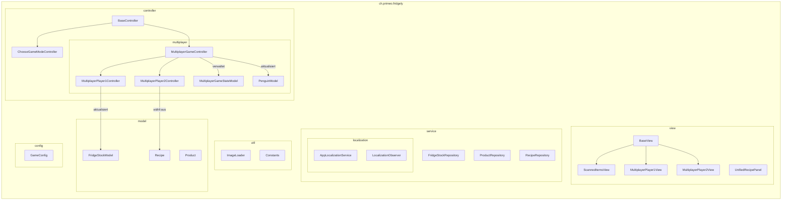

**Begründung:** Die Paketstruktur spiegelt die modulare Architektur des Fridgely-Systems wider, die auf dem MVC-Pattern basiert. Jedes Paket entspricht einer Schicht oder einem Modul des Systems und enthält alle relevanten Klassen und Schnittstellen. Dies fördert die Wartbarkeit und Verständlichkeit des Codes, da verwandte Komponenten gruppiert und klar voneinander getrennt sind. Die Verwendung von Sub-Namensräumen für spezifische Funktionen oder Rollen (z.B. `multiplayer` für Mehrspieler-spezifische Klassen) hilft zusätzlich, die Verantwortlichkeiten zu kapseln und die Übersichtlichkeit zu erhöhen.

## Ebene 2

In dieser Ebene wird die detaillierte innere Struktur der Hauptbausteine dargestellt.

### Detaillierte Struktur der Controller-Schicht

```mermaid
graph TD
    %% Controllers Layer
    subgraph Anwendungsschicht - Controller
        CGMC["ChooseGameModeController<br>(Spielmodusauswahl)"]
        MGC["MultiplayerGameController<br>(Hauptcontroller)"]
        MP1C["MultiplayerPlayer1Controller<br>(Spieler 1 Scannen)"]
        MP2C["MultiplayerPlayer2Controller<br>(Spieler 2 Rezeptauswahl)"]
    end

    %% Views Layer
    subgraph Präsentationsschicht
        CGMV["ChooseGameModeView"]
        SIV["ScannedItemsView<br>(Zweiter Monitor)"]
        MP1V["MultiplayerPlayer1View"]
        MP2V["MultiplayerPlayer2View"]
        MGV["MultiplayerGameView"]
    end

    %% Models Layer  
    subgraph Domänenschicht
        PM["Product"]
        RM["RecipeModel"]
        FSM["FridgeStockModel"]
        MGSM["MultiplayerGameStateModel"]
        PEM["PenguinModel"]
    end

    %% Services Layer
    subgraph Dienste
        ALS["AppLocalizationService"]
        IL["ImageLoader"]
    end

    %% Data Layer
    subgraph Datenschicht
        PR["ProductRepository"]
        RR["RecipeRepository"]
        FSR["FridgeStockRepository"]
    end

    %% Connections between controller and views
    CGMC --> CGMV
    MGC --> SIV
    MGC --> MGV
    MP1C --> MP1V
    MP2C --> MP2V

    %% Connections between controllers
    MGC --> MP1C
    MGC --> MP2C

    %% Connections from controllers to models
    MP1C --> FSM
    MP1C --> MGSM
    MP1C --> PEM
    MP2C --> FSM
    MP2C --> MGSM
    MP2C --> PEM
    MP2C --> RM
    MGC --> FSM
    MGC --> MGSM
    MGC --> PEM
    MGC --> RM

    %% Connections to repositories
    MP1C --> PR
    MGC --> PR
    MGC --> RR
    FSM --> FSR

    %% Services
    ALS --> CGMV
    ALS --> MP1V
    ALS --> MP2V
    ALS --> SIV
    ALS --> MGV
    IL --> CGMV
    IL --> MP1V
    IL --> MP2V
    IL --> SIV
    IL --> MGV

    %% Styling
    classDef controllerStyle fill:#1e3a59,stroke:#6fb1fc,stroke-width:1px;
    classDef viewStyle fill:#2d3748,stroke:#a0aec0,stroke-width:1px;
    classDef modelStyle fill:#252d3a,stroke:#9fa8da,stroke-width:1px;
    classDef serviceStyle fill:#3c3836,stroke:#fabd2f,stroke-width:1px;
    classDef repoStyle fill:#2d3b2d,stroke:#8ec07c,stroke-width:1px;
    
    class CGMC,MGC,MP1C,MP2C controllerStyle;
    class CGMV,SIV,MP1V,MP2V,MGV viewStyle;
    class PM,RM,FSM,MGSM,PEM modelStyle;
    class ALS,IL serviceStyle;
    class PR,RR,FSR repoStyle;
```

### Hauptinteraktionsfluss im Mehrspielermodus

Das folgende Diagramm zeigt die wichtigsten Interaktionen zwischen den Komponenten im Mehrspielermodus:

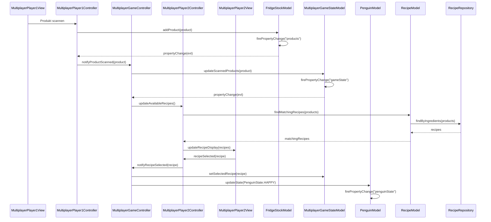

### MultiplayerGameController

**Zweck/Verantwortung:** Zentraler Controller, der den Mehrspielermodus steuert, die Kommunikation zwischen Spieler 1 und Spieler 2 koordiniert und den Spielzustand verwaltet.

**Schnittstellen:**

  - Stellt Zugriff auf die Modelle für die Views bereit
  - Koordiniert die Spiellogik und den Ablauf des Mehrspielermodus
  - Verwaltet die Spieler-Controller

**Qualitäts-/Leistungsmerkmale:**

  - Zentrale Steuerung des Spielablaufs
  - Klare Trennung der Verantwortlichkeiten zwischen den Spieler-Controllern
  - Robuste Fehlerbehandlung bei Benutzereingaben

**Ablageort/Datei(en):** 

```plaintext
src/main/java/ch/primeo/fridgely/controller/multiplayer/MultiplayerGameController.java
```

**Enthaltene Bausteine:**

  - `MultiplayerPlayer1Controller`: Verwaltet das Scannen von Produkten durch Spieler 1
  - `MultiplayerPlayer2Controller`: Verwaltet die Rezeptauswahl durch Spieler 2

### FridgeStockRepository

**Zweck/Verantwortung:**
Repository für die Verwaltung des Kühlschrankinhalts, stellt CRUD-Operationen für die Speicherung und Abfrage von Produkten im Kühlschrank bereit.

**Schnittstellen:**

- Bietet Methoden zum Hinzufügen, Entfernen und Abfragen von Produkten im Kühlschrank
- Nutzt JPA für Datenbankabfragen
- Verwendet Spring Data für grundlegende CRUD-Operationen

**Qualitäts-/Leistungsmerkmale:**

- Effiziente Datenbankzugriffe für schnelle Antwortzeiten
- Abstrahierung der Datenbankoperationen
- Transaktionale Sicherheit bei Änderungen

**Ablageort/Datei(en):** 

```plaintext
src/main/java/ch/primeo/fridgely/service/FridgeStockRepository.java
```

**Enthaltene Bausteine:**

- `FridgeStockJpaRepository`: JPA-Interface für grundlegende CRUD-Operationen

## Ebene 3

### AppLocalizationService

**Zweck/Verantwortung:**
Verwaltet die mehrsprachige Unterstützung der Anwendung, ermöglicht das Umschalten zwischen Sprachen und benachrichtigt UI-Komponenten über Sprachänderungen.

**Schnittstellen:**

- Bietet Methoden zum Abrufen lokalisierter Texte
- Ermöglicht das Umschalten zwischen Sprachen
- Observer-Pattern zur Benachrichtigung von UI-Komponenten

**Qualitäts-/Leistungsmerkmale:**

- Unterstützung für drei Sprachen (Deutsch, Englisch, Französisch)
- Dynamische Aktualisierung der UI ohne Neustart
- Singleton-Design für globalen Zugriff

**Ablageort/Datei(en):** 

```plaintext
src/main/java/ch/primeo/fridgely/service/localization/AppLocalizationService.java
```

**Enthaltene Bausteine:**

- `LocalizationObserver`: Interface für UI-Komponenten, die auf Sprachänderungen reagieren
- Ressourcen-Bundles für die verschiedenen Sprachen

```mermaid
graph TD
    %% Main service
    ALS["AppLocalizationService<br>Singleton"]
    
    %% Resource bundles
    RB_DE["languages_de.properties"]
    RB_EN["languages_en.properties"]
    RB_FR["languages_fr.properties"]
    
    %% Observers
    LOI["LocalizationObserver<br>Interface"]
    subgraph UIC["UI-Komponenten"]
        MP1V["MultiplayerPlayer1View"]
        MP2V["MultiplayerPlayer2View"]
        SIV["ScannedItemsView"]
        CGMV["ChooseGameModeView"]
        MGV["MultiplayerGameView"]
    end
    
    %% Connections
    ALS --> RB_DE
    ALS --> RB_EN
    ALS --> RB_FR
    ALS -- "Benachrichtigt" --> LOI
    LOI -- "Implementiert von" --> UIC
    
    %% Styling
    classDef serviceStyle fill:#3c3836,stroke:#fabd2f,stroke-width:1px;
    classDef resourceStyle fill:#2d3b2d,stroke:#8ec07c,stroke-width:1px;
    classDef interfaceStyle fill:#2b3d4f,stroke:#83a598,stroke-width:1px;
    classDef implStyle fill:#2d3748,stroke:#a0aec0,stroke-width:1px;
    
    class ALS serviceStyle;
    class RB_DE,RB_EN,RB_FR resourceStyle;
    class LOI interfaceStyle;
    class UIC,MP1V,MP2V,SIV,CGMV,MGV implStyle;
```

### FridgeStockModel

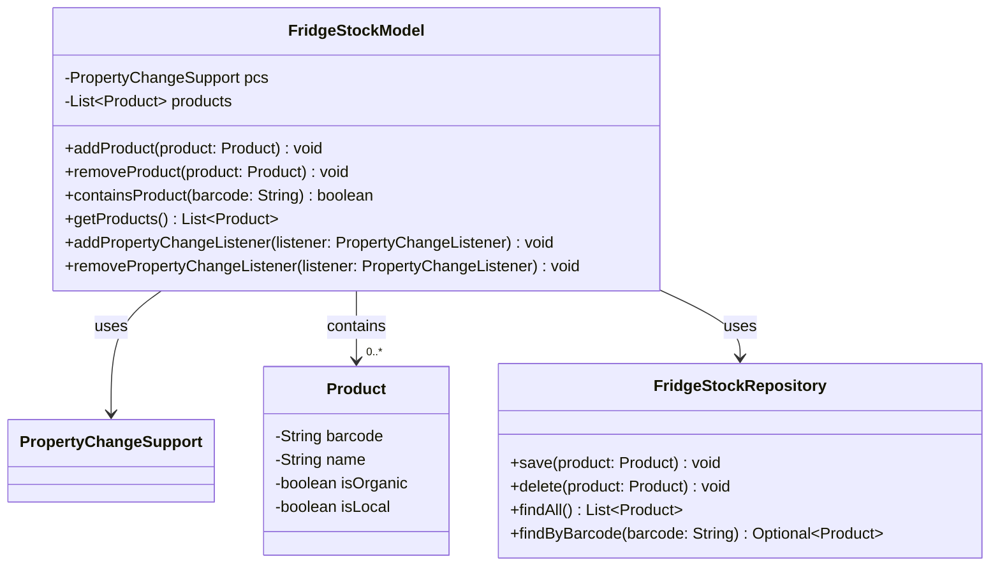

**Zweck/Verantwortung:**
Verwaltet den aktuellen Inhalt des virtuellen Kühlschranks, ermöglicht das Hinzufügen und Entfernen von Produkten und informiert UI-Komponenten über Änderungen.

**Schnittstellen:**

- PropertyChangeSupport für Observer-Pattern-Benachrichtigungen
- CRUD-Operationen für Produkte
- Integration mit dem FridgeStockRepository für Datenpersistenz

**Qualitäts-/Leistungsmerkmale:**

- Effiziente Verwaltung der Produktliste
- Ereignisbasierte Aktualisierung der UI
- Datenkonsistenz durch Repository-Validierung

**Ablageort/Datei(en):**

```plaintext
src/main/java/ch/primeo/fridgely/model/FridgeStockModel.java
```

**Enthaltene Bausteine:**

- `PropertyChangeSupport`: Teil des Java Beans Standards für den Observer-Pattern
- `Product`: Produktentitäten, die im Kühlschrank gespeichert werden

```mermaid
graph TD
    %% Main class
    FSM["FridgeStockModel"]
    
    %% Related classes
    PCS["PropertyChangeSupport"]
    PROD["Product"]
    FS["FridgeStock"]
    FSR["FridgeStockRepository"]
    
    %% Connections
    FSM --> PCS
    FSM --> PROD
    FSM --> FS
    FSM --> FSR
    
    %% Observers
    subgraph OBS["Observer"]
        MP1C["MultiplayerPlayer1Controller"]
        MP2C["MultiplayerPlayer2Controller"]
        MGC["MultiplayerGameController"]
    end
    
    PCS -- "Benachrichtigt" --> OBS
    
    %% Styling
    classDef modelStyle fill:#252d3a,stroke:#9fa8da,stroke-width:1px;
    classDef supportStyle fill:#3f3f3f,stroke:#d3d3d3,stroke-width:1px;
    classDef repoStyle fill:#2d3b2d,stroke:#8ec07c,stroke-width:1px;
    classDef controllerStyle fill:#1e3a59,stroke:#6fb1fc,stroke-width:1px;
    
    class FSM modelStyle;
    class PCS,PROD,FS supportStyle;
    class FSR repoStyle;
    class OBS,MP1C,MP2C,MGC controllerStyle;
```

### RecipeModel

**Zweck/Verantwortung:**
Modell für die Verwaltung von Rezepten im Mehrspielermodus, bietet Zugriff auf verfügbare Rezepte und deren Zutaten sowie Berechnungen zur Rezeptempfehlung basierend auf vorhandenen Produkten.

**Schnittstellen:**

- Methoden zum Abrufen von Rezepten und deren Details
- Berechnung der besten Rezeptvorschläge basierend auf dem Kühlschrankinhalt
- Bereitstellung mehrsprachiger Rezeptbeschreibungen

**Qualitäts-/Leistungsmerkmale:**

- Effiziente Algorithmen für Rezeptempfehlungen
- Caching von Rezeptdaten für schnellen Zugriff
- Unterstützung mehrsprachiger Anzeige von Rezeptdetails

**Ablageort/Datei(en):** 

```plaintext
src/main/java/ch/primeo/fridgely/model/RecipeModel.java
```

**Enthaltene Bausteine:**

- `Recipe`: Entität, die ein Rezept repräsentiert
- `RecipeIngredient`: Entität, die die Zutat eines Rezepts repräsentiert
- `RecipeRepository`: Repository für den Datenbankzugriff auf Rezepte

```mermaid
graph TD
    %% Main class
    RM["RecipeModel"]
    
    %% Related classes
    R["Recipe"]
    RI["RecipeIngredient"]
    RR["RecipeRepository"]
    PROD["Product"]
    FSM["FridgeStockModel"]
    ALS["AppLocalizationService"]
    
    %% Connections
    RM --> R
    RM --> RR
    RM --> FSM
    R --> RI
    RI --> PROD
    R --> ALS
    
    %% Styling
    classDef modelStyle fill:#252d3a,stroke:#9fa8da,stroke-width:1px;
    classDef entityStyle fill:#2d3748,stroke:#a0aec0,stroke-width:1px;
    classDef repoStyle fill:#2d3b2d,stroke:#8ec07c,stroke-width:1px;
    classDef serviceStyle fill:#3c3836,stroke:#fabd2f,stroke-width:1px;
    
    class RM,FSM modelStyle;
    class R,RI,PROD entityStyle;
    class RR repoStyle;
    class ALS serviceStyle;
```

### MultiplayerGameStateModel

**Zweck/Verantwortung:**
Zentrales Modell für den Spielzustand im Mehrspielermodus, verwaltet den Status des Spiels, die Aktionen der Spieler und den Fortschritt.

**Schnittstellen:**

- PropertyChangeSupport für Benachrichtigungen über Statusänderungen
- Methoden zur Aktualisierung des Spielzustands
- Tracking der Spieleraktivitäten und des Fortschritts

**Qualitäts-/Leistungsmerkmale:**

- Zuverlässige Zustandsverfolgung ohne Inkonsistenzen
- Echtzeitaktualisierung aller beteiligten Komponenten
- Robuste Fehlerbehandlung für unerwartete Spielerinteraktionen

**Ablageort/Datei(en):** 

```plaintext
src/main/java/ch/primeo/fridgely/model/multiplayer/MultiplayerGameStateModel.java
```

**Enthaltene Bausteine:**

- `PropertyChangeSupport`: Für Observer-Pattern-Implementierung
- `PenguinModel`: Verwaltet den Zustand des Pinguin-Charakters
- Spielstatusattribute (z.B. scannedProducts, selectedRecipe)

```mermaid
graph TD
    %% Main class
    MGSM["MultiplayerGameStateModel"]
    
    %% Related classes
    PCS["PropertyChangeSupport"]
    PM["PenguinModel"]
    Recipe["Recipe"]
    Products["List<Product>"]
    
    %% Connections
    MGSM --> PCS
    MGSM --> PM
    MGSM --> Recipe
    MGSM --> Products
    
    %% Observers
    subgraph OBS["Observer"]
        MGC["MultiplayerGameController"]
        MP1C["MultiplayerPlayer1Controller"]
        MP2C["MultiplayerPlayer2Controller"]
    end
    
    PCS -- "Benachrichtigt" --> OBS
    
    %% Styling
    classDef modelStyle fill:#252d3a,stroke:#9fa8da,stroke-width:1px;
    classDef supportStyle fill:#3f3f3f,stroke:#d3d3d3,stroke-width:1px;
    classDef controllerStyle fill:#1e3a59,stroke:#6fb1fc,stroke-width:1px;
    
    class MGSM,PM modelStyle;
    class PCS,Recipe,Products supportStyle;
    class OBS,MGC,MP1C,MP2C controllerStyle;
```

### BaseView & BaseController

**Zweck/Verantwortung:**
Basis-Komponenten, die grundlegende Funktionalitäten für alle Views und Controller bereitstellen, um Konsistenz und Wiederverwendbarkeit zu gewährleisten.

**Schnittstellen:**

- Lifecycle-Methoden für die Initialisierung und Zerstörung von Views und Controllern
- Allgemeine UI-Management-Funktionen (BaseView)
- Gemeinsame Controller-Logik (BaseController)

**Qualitäts-/Leistungsmerkmale:**

- Einheitliche Implementation von übergreifenden Funktionalitäten
- Reduzierung von redundantem Code
- Konsistentes Verhalten in allen Views und Controllern

**Ablageort/Datei(en):** 

```plaintext
src/main/java/ch/primeo/fridgely/view/BaseView.java
```
```plaintext
src/main/java/ch/primeo/fridgely/controller/BaseController.java
```

## Querschnitts-Komponenten

Die Querschnitts-Komponenten des Fridgely-Systems bieten grundlegende Dienste, die von verschiedenen Teilen der Anwendung genutzt werden. Diese Komponenten folgen grösstenteils dem Singleton-Pattern, um eine zentrale Verwaltung und Wiederverwendbarkeit zu gewährleisten.

### ImageLoader

**Zweck/Verantwortung:**
Zentrale Komponente zum Laden und Verwalten von Bildressourcen für die UI, implementiert als Singleton für einheitlichen Zugriff auf Bilddateien.

**Schnittstellen:**

- Methoden zum Laden von Bildern aus verschiedenen Quellen
- Bild-Caching für verbesserte Performance
- Hilfsmethoden für Bildmanipulation (z.B. Skalierung)

**Qualitäts-/Leistungsmerkmale:**

- Effizientes Laden und Zwischenspeichern von Bildressourcen
- Zentrale Fehlerverwaltung beim Laden von Bildern
- Thread-Sicherheit für den parallelen Zugriff

**Ablageort/Datei(en):** 

```plaintext
src/main/java/ch/primeo/fridgely/util/ImageLoader.java
```

```mermaid
graph TD
    %% Main class
    IL["ImageLoader<br>(Singleton)"]
    
    %% Related classes
    IC["Image Cache<br>Map<String, Image>"]
    REF["Resource Files<br>/resources/images/"]
    
    %% Users
    subgraph VIEWS["Views"]
        MGV["MultiplayerGameView"]
        MP1V["MultiplayerPlayer1View"]
        MP2V["MultiplayerPlayer2View"]
        SIV["ScannedItemsView"]
        CGMV["ChooseGameModeView"]
    end
    
    %% Connections
    IL --> IC
    IL --> REF
    VIEWS --> IL
    
    %% Styling
    classDef singletonStyle fill:#3c3836,stroke:#fabd2f,stroke-width:1px;
    classDef resourceStyle fill:#2d3b2d,stroke:#8ec07c,stroke-width:1px;
    classDef viewStyle fill:#2d3748,stroke:#a0aec0,stroke-width:1px;
    
    class IL singletonStyle;
    class IC,REF resourceStyle;
    class VIEWS,MGV,MP1V,MP2V,SIV,CGMV viewStyle;
```

### Constants

**Zweck/Verantwortung:**
Zentrale Klasse für anwendungsweite Konstanten, die in verschiedenen Teilen des Systems verwendet werden.

**Schnittstellen:**

- Definiert statische Konstanten für UI-Einstellungen, Datenbankzugriff, etc.
- Gruppiert zusammengehörige Konstanten in inneren Klassen/Interfaces

**Qualitäts-/Leistungsmerkmale:**

- Zentralisierte Konfigurationswerte für einfache Wartung
- Typsicherheit durch starke Typisierung der Konstanten
- Vermeidung von Magic Numbers im Quellcode

**Ablageort/Datei(en):** 

```plaintext
src/main/java/ch/primeo/fridgely/Constants.java
```

## Zusammenfassung der Bausteinsicht

Die Bausteinsicht des Fridgely-Systems zeigt eine klare Trennung der Verantwortlichkeiten nach dem MVC-Pattern:

1. **Präsentationsschicht (Views)**: Kümmert sich um die kindgerechte Darstellung der Benutzeroberfläche, mit spezialisierten Views für verschiedene Spielmodi und Spielerrollen.

2. **Anwendungsschicht (Controller)**: Steuert den Programmablauf und die Spiellogik, orchestriert die Interaktion zwischen Benutzern und der Anwendung.

3. **Domänenschicht (Models)**: Repräsentiert die Kerndaten und Geschäftslogik des Systems, darunter Produkte, Rezepte und Spielzustände.

4. **Datenschicht (Repositories)**: Abstrahiert den Datenbankzugriff und stellt persistente Daten für die Anwendung bereit.

5. **Querschnittskomponenten**: Bieten übergreifende Funktionalitäten wie Mehrsprachigkeit und Bildverwaltung für alle Schichten.

Diese Architektur ermöglicht eine hohe Wartbarkeit und Erweiterbarkeit des Systems. Durch die klare Trennung der Komponenten können einzelne Teile unabhängig voneinander entwickelt, getestet und angepasst werden. Die verwendeten Design-Patterns (Observer, Singleton, Repository) tragen zur Robustheit und Flexibilität des Systems bei.

```mermaid
graph TD
    subgraph Anwendungsschicht - Controller
        CGMC["ChooseGameModeController"]
        MGC["MultiplayerGameController"]
        MP1C["MultiplayerPlayer1Controller"]
        MP2C["MultiplayerPlayer2Controller"]
    end

    subgraph Präsentationsschicht
        CGMV["ChooseGameModeView"]
        SIV["ScannedItemsView<br>(Zweiter Monitor)"]
        MP1V["MultiplayerPlayer1View"]
        MP2V["MultiplayerPlayer2View"]
        URP["UnifiedRecipePanel"]
    end

    subgraph Domänenschicht
        PM["Product"]
        RM["RecipeModel"]
        FSM["FridgeStockModel"]
        MGSM["MultiplayerGameStateModel"]
        PEM["PenguinModel"]
    end

    subgraph Dienste
        ALS["AppLocalizationService"]
        IL["ImageLoader"]
    end

    subgraph Datenschicht
        PR["ProductRepository"]
        RR["RecipeRepository"]
        FSR["FridgeStockRepository"]
    end

    %% Connections between controller and views
    CGMC --> CGMV
    MGC --> SIV
    MGC --> MP1V
    MGC --> MP2V
    MGC --> URP

    %% Connections between controllers
    MGC --> MP1C
    MGC --> MP2C

    %% Connections from controllers to models
    MP1C --> FSM
    MP1C --> MGSM
    MP1C --> PEM
    MP2C --> FSM
    MP2C --> MGSM
    MP2C --> PEM
    MP2C --> RM
    MGC --> FSM
    MGC --> MGSM
    MGC --> PEM
    MGC --> RM

    %% Connections to repositories
    MP1C --> PR
    MGC --> PR
    MGC --> RR

    %% Services
    ALS --> CGMV
    ALS --> MP1V
    ALS --> MP2V
    ALS --> SIV
    IL --> CGMV
    IL --> MP1V
    IL --> MP2V
    IL --> SIV
    IL --> URP

    %% Styling

    classDef serviceStyle fill:#930049,stroke:#ff0080,stroke-width:1px;
    classDef repoStyle fill:#0f5132,stroke:#4b8f71,stroke-width:1px;
    classDef controllerStyle fill:#3c3836,stroke:#fabd2f,stroke-width:1px;
    classDef modelStyle fill:#2d3b2d,stroke:#8ec07c,stroke-width:1px;
    classDef viewStyle fill:#2d3748,stroke:#a0aec0,stroke-width:1px;
    
    class CGMC,MGC,MP1C,MP2C controllerStyle;
    class CGMV,SIV,MP1V,MP2V,URP viewStyle;
    class PM,RM,FSM,MGSM,PEM modelStyle;
    class ALS,IL serviceStyle;
    class PR,RR,FSR repoStyle;
```

### MultiplayerGameController

**Zweck/Verantwortung:** Zentraler Controller, der den Mehrspielermodus steuert, die Kommunikation zwischen Spieler 1 und Spieler 2 koordiniert und den Spielzustand verwaltet.

**Schnittstellen:**

  - Stellt Zugriff auf die Modelle für die Views bereit
  - Koordiniert die Spiellogik und den Ablauf des Mehrspielermodus
  - Verwaltet die Spieler-Controller

**Qualitäts-/Leistungsmerkmale:**

  - Zentrale Steuerung des Spielablaufs
  - Klare Trennung der Verantwortlichkeiten zwischen den Spieler-Controllern
  - Robuste Fehlerbehandlung bei Benutzereingaben

**Ablageort/Datei(en):** 

```plaintext
src/main/java/ch/primeo/fridgely/controller/multiplayer/MultiplayerGameController.java
```

**Enthaltene Bausteine:**

  - `MultiplayerPlayer1Controller`: Verwaltet das Scannen von Produkten durch Spieler 1
  - `MultiplayerPlayer2Controller`: Verwaltet die Rezeptauswahl durch Spieler 2

### FridgeStockRepository

**Zweck/Verantwortung:** Repository für die Verwaltung des Kühlschrankinhalts, stellt CRUD-Operationen für die Speicherung und Abfrage von Produkten im Kühlschrank bereit.

**Schnittstellen:**
  
  - Bietet Methoden zum Hinzufügen, Entfernen und Abfragen von Produkten im Kühlschrank
  - Nutzt QueryDSL für typsichere Datenbankabfragen
  - Verwendet Spring Data JPA für grundlegende CRUD-Operationen

**Qualitäts-/Leistungsmerkmale:**
  
  - Effiziente Datenbankzugriffe für schnelle Antwortzeiten
  - Abstrahierung der Datenbankoperationen
  - Transaktionale Sicherheit bei Änderungen

**Ablageort/Datei(en):** 
```plaintext
src/main/java/ch/primeo/fridgely/service/FridgeStockRepository.java
```

**Enthaltene Bausteine:**

  - `FridgeStockJpaRepository`: JPA-Interface für grundlegende CRUD-Operationen
  - `QFridgeStock`: QueryDSL-generierte Klasse für typsichere Abfragen

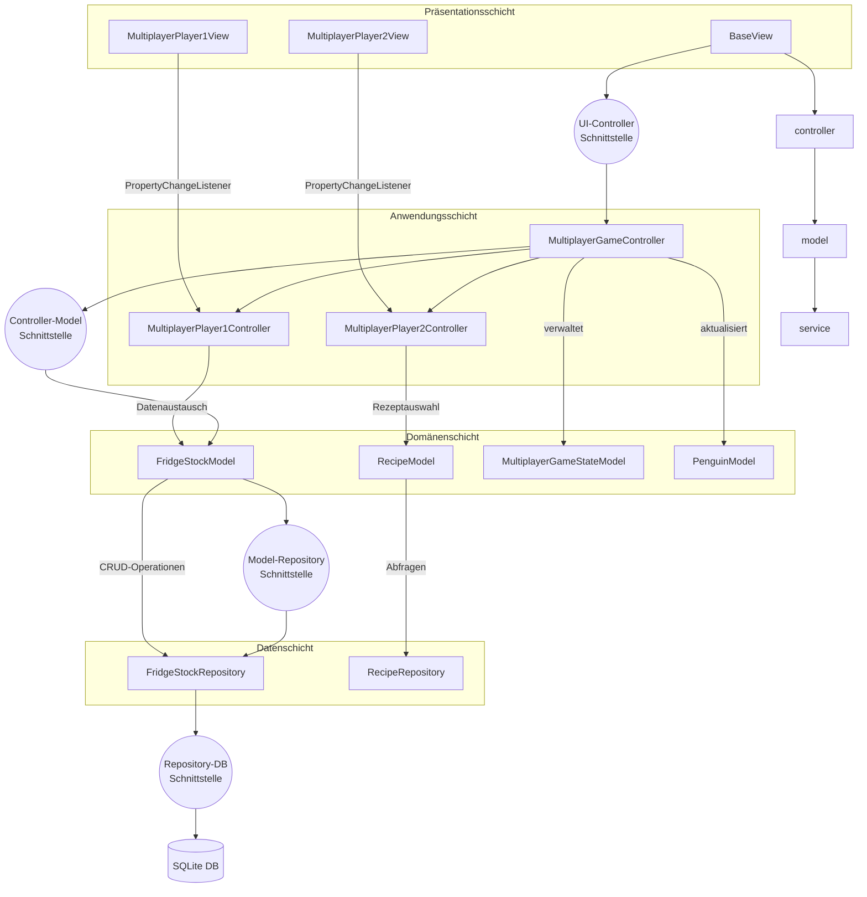

## Enthaltene Bausteine:

- **Präsentationsschicht:**
  - `BaseView`: Abstrakte Basisklasse für alle Views mit JFrame-Management
  - `ChooseGameModeView`: Startbildschirm zur Auswahl des Spielmodus
  - `ScannedItemsView`: Zeigt Kühlschrankinhalt auf zweitem Monitor an
  - `MultiplayerGameView`: Hauptansicht für den Mehrspielermodus, integriert die Spieleransichten
  - `MultiplayerPlayer1View`: UI für Spieler 1 im Mehrspielermodus zum Scannen von Produkten
  - `MultiplayerPlayer2View`: UI für Spieler 2 im Mehrspielermodus zur Rezeptauswahl
  - `PenguinReactionOverlay`: Zeigt Reaktionen des Pinguin-Charakters an
  - `UnifiedRecipePanel`: Wiederverwendbare Komponente zur Anzeige von Rezepten
  - `LanguageSwitchButton`: UI-Komponente zum Umschalten zwischen den verfügbaren Sprachen
  - `DialogBox`: Hilfsfunktionen für die Anzeige von Benachrichtigungen und Dialogfenstern

- **Anwendungsschicht:**
  - `ChooseGameModeController`: Steuert die Spielmodusauswahl
  - `MultiplayerGameController`: Hauptcontroller für den Mehrspielermodus
  - `MultiplayerPlayer1Controller`: Verwaltet das Scannen von Produkten durch Spieler 1
  - `MultiplayerPlayer2Controller`: Verwaltet die Rezeptauswahl durch Spieler 2
  - `MultiplayerGameLauncher`: Initialisiert und startet den Mehrspielermodus, verbindet Controller und Views

- **Domänenschicht:**
  - `Product`: Repräsentiert ein Lebensmittelprodukt mit Eigenschaften wie Bio und Lokalität
  - `Recipe`: Stellt ein Rezept mit Zutaten und mehrsprachigen Beschreibungen dar
  - `RecipeIngredient`: Entity-Klasse für die Zuordnung von Zutaten zu Rezepten
  - `FridgeStock`: Entity-Klasse zur Persistierung des Kühlschrankinhalts
  - `FridgeStockModel`: Modellklasse zur Verwaltung des Kühlschrankinhalts mit PropertyChangeSupport
  - `MultiplayerGameStateModel`: Verwaltet den Zustand einer Mehrspieler-Spielsitzung
  - `PenguinModel`: Verwaltet den Zustand des Pinguin-Charakters
  - `PenguinFacialExpression`: Enumeration für Gesichtsausdrücke des Pinguins
  - `PenguinHPState`: Enumeration für Gesundheitszustände des Pinguins
  - `GameMode`: Enumeration für die verschiedenen Spielmodi

- **Datenschicht:**
  - `FridgeStockRepository`: Verwaltet den Kühlschrankinhalt (Hinzufügen, Entfernen, Abfragen)
  - `FridgeStockJpaRepository`: JPA-Interface für grundlegende CRUD-Operationen
  - `ProductRepository`: Stellt Produkte und deren Eigenschaften bereit
  - `RecipeRepository`: Verwaltet Rezepte und deren Zuordnung zu Zutaten

- **Querschnittskomponenten:**
  - `ImageLoader`: Lädt und verwaltet Bild-Ressourcen (Singleton)
  - `AppLocalizationService`: Verwaltet die mehrsprachige Unterstützung der Anwendung (Singleton)
  - `Constants`: Enthält anwendungsweite Konstanten
  - `AppConfig`: Konfiguriert Spring-Anwendungskontext und Komponenten-Scanning
  - `DataLoader`: Lädt initiale Daten in die Datenbank beim Anwendungsstart
  - `GameConfig`: Konfigurationseinstellungen für das Spiel
  - `LocalizationObserver`: Interface für lokalisierte UI-Komponenten

Die Bausteinsicht zeigt die modulare Architektur des Fridgely-Systems, das auf dem MVC-Pattern basiert. Jedes Modul ist für spezifische Funktionen verantwortlich und kommuniziert über klar definierte Schnittstellen. Dies ermöglicht eine einfache Wartbarkeit, Testbarkeit und Erweiterbarkeit des Systems.

```mermaid
graph LR
    %% Cross-cutting components
    subgraph Querschnittskomponenten
        ALS[AppLocalizationService]
        IL[ImageLoader]
        C[Constants]
        GC[GameConfig]
        LO[LocalizationObserver]
    end
    
    %% Main app layers
    subgraph PS[Präsentationsschicht]
        BV[BaseView]
        subgraph Views
            MP1V[MultiplayerPlayer1View]
            MP2V[MultiplayerPlayer2View]
            SIV[ScannedItemsView]
        end
    end
    
    subgraph AS[Anwendungsschicht]
        BC[BaseController]
        subgraph Controllers
            MGC[MultiplayerGameController]
            MP1C[MultiplayerPlayer1Controller]
            MP2C[MultiplayerPlayer2Controller]
        end
    end
    
    subgraph DS[Domänenschicht]
        Models
    end
    
    %% Connections
    ALS --> LO
    LO -.-> BV
    BV --> Views
    
    IL --> PS
    
    C --> PS
    C --> AS
    C --> DS
    
    GC --> Controllers
    
    %% Styling
    classDef compStyle fill:#3c3836,stroke:#fabd2f,stroke-width:1px;
    classDef viewStyle fill:#2d3748,stroke:#a0aec0,stroke-width:1px;
    classDef ctrlStyle fill:#1e3a59,stroke:#6fb1fc,stroke-width:1px;
    classDef layerStyle fill:#1a202c,stroke:#4a5568,stroke-width:2px;
    
    class ALS,IL,C,GC,LO compStyle;
    class PS,BV,MP1V,MP2V,SIV,Views viewStyle;
    class AS,BC,MGC,MP1C,MP2C,Controllers ctrlStyle;
    class PS,AS,DS layerStyle;
```

### ImageLoader

**Zweck/Verantwortung:** Lädt und verwaltet Bild-Ressourcen für die Anwendung, stellt sicher, dass Bilder in der richtigen Grösse und Auflösung vorliegen und optimiert die Ladezeiten durch Caching.

**Schnittstellen:**

  - Bietet Methoden zum Laden von Bildern aus Ressourcen oder Dateien
  - Unterstützt verschiedene Bildformate und -grössen
  - Implementiert Lazy Loading und Caching für optimierte Ladezeiten

**Qualitäts-/Leistungsmerkmale:**

  - Schnelle Ladezeiten durch Caching und optimierte Bildgrössen
  - Unterstützung für verschiedene Bildformate (JPEG, PNG, GIF)
  - Einfache Integration in die Views zur dynamischen Anzeige von Bildern

**Ablageort/Datei(en):** 

```plaintext
src/main/java/ch/primeo/fridgely/util/ImageLoader.java
```

**Enthaltene Bausteine:**

  - `ImageLoader`: Hauptklasse zum Laden und Verwalten von Bildern mit integriertem Caching über ConcurrentMap
  - Interne Bildbearbeitungsmethoden für Skalierung und Format-Konvertierung

```mermaid
graph TD
    %% ImageLoader components
    subgraph ImageLoader
        IL[ImageLoader]
        IC[ImageCache]
        IU[ImageUtil]
    end

    %% Connections
    IL --> IC
    IL --> IU

    %% Styling
    classDef loaderStyle fill:#2b3d4f,stroke:#83a598,stroke-width:1px;
    
    class ImageLoader,ImageCache,ImageUtil loaderStyle;
```

## Enthaltene Bausteine:

- **ImageLoader:**
  - `ImageLoader`: Hauptklasse zum Laden und Verwalten von Bildern mit integriertem Caching über ConcurrentMap
  - Interne Bildbearbeitungsmethoden für Skalierung und Format-Konvertierung

Die Querschnittskomponenten des Fridgely-Systems bieten wichtige unterstützende Funktionen, die von mehreren Bausteinen der Anwendung genutzt werden. Dazu gehören die mehrsprachige Unterstützung durch `AppLocalizationService`, das Laden und Caching von Bildern durch `ImageLoader` sowie zentrale Konfigurations- und Konstantenverwaltung. Diese Komponenten sind entscheidend für die Einhaltung der Qualitätsmerkmale wie Wartbarkeit, Erweiterbarkeit und Leistung der Anwendung.

## Zusammenfassung und Bewertung


1. **Modularer Aufbau**: Die Anwendung ist in klar abgegrenzte Komponenten mit definierten Verantwortlichkeiten unterteilt, was die Wartbarkeit und Erweiterbarkeit fördert.

2. **Observer-Pattern**: Durchgängige Verwendung des Observer-Patterns (PropertyChangeSupport/PropertyChangeListener) für die ereignisbasierte Aktualisierung der UI-Komponenten.

3. **Mehrsprachigkeit**: Durchgängige Unterstützung von Mehrsprachigkeit durch den AppLocalizationService und das LocalizationObserver-Interface.

4. **Klare Schichtenarchitektur**: Die Trennung in Präsentations-, Anwendungs-, Domänen- und Datenschicht ermöglicht eine klare Zuordnung von Verantwortlichkeiten.

5. **Spring Framework**: Nutzung von Spring für Dependency Injection und Konfigurationsmanagement, was die Testbarkeit und Modularität verbessert.