<!-- Minimize mermaid hover effect for this file: -->
<style>
.mermaid:hover { 
    transform: scale(1.01) !important;
    filter: drop-shadow(0 10px 25px rgba(0, 0, 0, 0.72));
}
</style>

# 6. Laufzeitsicht


## Einführung zur Laufzeitsicht

Die Laufzeitsicht erklärt konkrete Abläufe und Beziehungen zwischen Bausteinen des Fridgely-Systems in Form von Szenarien. Diese Szenarien veranschaulichen, wie die verschiedenen Komponenten miteinander interagieren, um bestimmte Funktionen zu erfüllen. Insbesondere betrachten wir Szenarien aus den folgenden Bereichen:

* **Wichtige Abläufe und Kernfunktionen**: Wie führen die Bausteine der Architektur die wichtigsten Abläufe durch? 
* **Interaktionen an kritischen Schnittstellen**: Wie arbeiten die Systembausteine mit Benutzern und externen Systemen zusammen?
* **Betrieb und Administration**: Inbetriebnahme, Start, Stop und Wartungsprozesse.
* **Fehler- und Ausnahmeszenarien**: Wie reagiert das System bei Fehlersituationen?

Bei der Auswahl der Szenarien haben wir uns auf diejenigen konzentriert, die besonders architekturrelevant sind und das Zusammenspiel der Hauptkomponenten am besten veranschaulichen. Für jedes Szenario beschreiben wir ausführlich die Abläufe, Besonderheiten und Herausforderungen, um ein umfassendes Verständnis des Systems zu ermöglichen.

## Laufzeitsicht - Sequenzdiagramme

<!-- Reusing stl download containers for Diagramm download -->
<div class="stl-downloader-container">
  <div class="stl-downloader-grid">
    <div class="stl-card" data-file="sequence-diagrams/FridgelyMainController.svg">
      <div class="stl-card-inner">
        <div class="stl-card-front">
          <div class="stl-icon">🚀</div>
          <div class="stl-name">Main-Controller</div>
        </div>
        <div class="stl-card-back">
          <p>Sequenzdiagramm des Main-Controllers im Fridgely-System.</p>
          <button class="stl-download-btn">Herunterladen</button>
        </div>
      </div>
    </div>
    <div class="stl-card" data-file="sequence-diagrams/ChooseGameModeController.svg">
      <div class="stl-card-inner">
        <div class="stl-card-front">
          <div class="stl-icon">⚖️</div>
          <div class="stl-name">Choose GameMode Controller</div>
        </div>
        <div class="stl-card-back">
          <p>Sequenzdiagramm des Choose GameMode Controllers im Fridgely-System.</p>
          <button class="stl-download-btn">Herunterladen</button>
        </div>
      </div>
    </div>
    <div class="stl-card" data-file="sequence-diagrams/MultiplayerGameLauncher_launchGame.svg">
      <div class="stl-card-inner">
        <div class="stl-card-front">
          <div class="stl-icon">👥</div>
          <div class="stl-name">Multiplayer GameLauncher</div>
        </div>
        <div class="stl-card-back">
          <p>Sequenzdiagramm des Multiplayer GameLaunchers im Fridgely-System.</p>
          <button class="stl-download-btn">Herunterladen</button>
        </div>
      </div>
    </div>
  </div>
</div>

## Laufzeitsicht - Szenarien

### Szenario 1: Auswahl des Spielmodus

Dieses Szenario beschreibt den Ablauf der Auswahl eines Spielmodus (Einzelspieler oder Mehrspieler) durch den Benutzer und die anschliessende Initialisierung des Spiels. Es handelt sich um einen der Haupteinstiegspunkte in die Anwendung.

#### Spielstart Diagramm


#### Beschreibung

1. Der Benutzer startet die Anwendung:
    - Die `Main`-Klasse initialisiert das Fridgely-System.
    - Das System erkennt die verfügbaren Bildschirme und konfiguriert die Anzeige entsprechend.
    - Der `ChooseGameModeController` wird instanziiert.

2. Die Startoberfläche wird vorbereitet:
    - Der Controller erstellt eine neue `ChooseGameModeView`.
    - Die View wird mit Bildern und Text für die Spielmodusauswahl initialisiert.
    - Das Hauptfenster wird dem Benutzer angezeigt.

3. Der Benutzer navigiert in der Oberfläche:
    - Zwei Hauptoptionen werden angeboten: "Einzelspieler" und "Mehrspieler".
    - Jede Option ist mit intuitiven Bildern und Tooltips versehen.
    - Der Mauszeiger ändert sich beim Überfahren der klickbaren Elemente.

4. Der Benutzer wählt einen Spielmodus aus:
    - Durch Klicken auf eines der Symbole wird die Methode `selectGameMode(GameMode mode)` aufgerufen.
    - Der Controller verarbeitet die Auswahl und bestimmt den weiteren Ablauf.

5. Ein Tutorial wird angezeigt:
    - Abhängig vom gewählten Spielmodus wird ein spezifisches Tutorial geladen.
    - Das Tutorial erklärt die Spielregeln und Interaktionsmöglichkeiten.
    - Der Benutzer navigiert durch die Tutorial-Schritte mit "Weiter"-Buttons.

6. Der entsprechende Spielmodus wird gestartet:
    - Für den Einzelspielermodus: Die Methode `startSinglePlayerGame()` wird aufgerufen, welche aktuell als Platzhalter implementiert ist (TODO).
    - Für den Mehrspielermodus: Die Methode `startMultiplayerGame()` wird aufgerufen.
    - Für den Mehrspielermodus übernimmt der `MultiplayerGameLauncher` die Initialisierung. Ein `SinglePlayerGameLauncher` ist in der aktuellen Implementierung noch nicht vorhanden.

#### Besonderheiten

- Die Benutzeroberfläche ist kindgerecht gestaltet mit grossen, farbigen Symbolen.
- Die Tooltips bieten zusätzliche Erklärungen ohne den Bildschirm zu überladen.
- Die Lokalisierung erfolgt über den `AppLocalizationService`, der dynamische Sprachänderungen unterstützt.
- Das Tutorial kann übersprungen werden, wenn der Benutzer bereits mit dem Spiel vertraut ist.
- Alle UI-Komponenten passen sich automatisch an die verfügbaren Bildschirme an.


#### Diagramm

Das folgende Sequenzdiagramm zeigt den Ablauf der Spielmodusauswahl und die anschliessende Initialisierung des Mehrspielermodus:


```mermaid
sequenceDiagram
actor User
User ->> ChooseGameModeController : new
activate ChooseGameModeController
ChooseGameModeController ->> ChooseGameModeView : new
activate ChooseGameModeView
alt !Fridgely.isSingleDisplay
ChooseGameModeView ->> GraphicsDevice : setFullScreenWindow
activate GraphicsDevice
GraphicsDevice -->> ChooseGameModeView : #32; 
deactivate GraphicsDevice
else 
ChooseGameModeView ->> GraphicsDevice : getDefaultConfiguration
activate GraphicsDevice
GraphicsDevice -->> ChooseGameModeView : #32; 
deactivate GraphicsDevice
ChooseGameModeView ->> GraphicsConfiguration : getBounds
activate GraphicsConfiguration
GraphicsConfiguration -->> ChooseGameModeView : #32; 
deactivate GraphicsConfiguration
ChooseGameModeView ->> Window : setBounds
activate Window
Window -->> ChooseGameModeView : #32; 
deactivate Window
ChooseGameModeView ->> Frame : setUndecorated
activate Frame
Frame -->> ChooseGameModeView : #32; 
deactivate Frame
end
ChooseGameModeView ->> ChooseGameModeView : initializeComponents
activate ChooseGameModeView
ChooseGameModeView ->> JPanel : new
activate JPanel
JPanel -->> ChooseGameModeView : #32; 
deactivate JPanel
ChooseGameModeView ->> JLabel : new
activate JLabel
JLabel -->> ChooseGameModeView : #32; 
deactivate JLabel
ChooseGameModeView ->> JPanel : new
activate JPanel
JPanel -->> ChooseGameModeView : #32; 
deactivate JPanel
ChooseGameModeView ->> JPanel : new
activate JPanel
JPanel -->> ChooseGameModeView : #32; 
deactivate JPanel
ChooseGameModeView ->> ChooseGameModeView : createImageLabel
activate ChooseGameModeView
ChooseGameModeView ->> JLabel : new
activate JLabel
JLabel -->> ChooseGameModeView : #32; 
deactivate JLabel
ChooseGameModeView ->> JComponent : setAlignmentX
activate JComponent
JComponent -->> ChooseGameModeView : #32; 
deactivate JComponent
ChooseGameModeView ->> ImageLoader : loadScaledImage
activate ImageLoader
ImageLoader ->> ConcurrentMap : computeIfAbsent
activate ConcurrentMap
ConcurrentMap ->> ImageLoader : key -&gt;
activate ImageLoader
ImageLoader ->> ImageLoader : loadImage
activate ImageLoader
ImageLoader ->> ConcurrentMap : computeIfAbsent
activate ConcurrentMap
ConcurrentMap ->> ImageLoader : path -&gt;
activate ImageLoader
ImageLoader ->> ResourceLoader : getResource
activate ResourceLoader
ResourceLoader -->> ImageLoader : #32; 
deactivate ResourceLoader
ImageLoader ->> InputStreamSource : getInputStream
activate InputStreamSource
InputStreamSource -->> ImageLoader : #32; 
deactivate InputStreamSource
ImageLoader ->> InputStream : readAllBytes
activate InputStream
InputStream -->> ImageLoader : #32; 
deactivate InputStream
ImageLoader ->> ImageIcon : new
activate ImageIcon
ImageIcon -->> ImageLoader : #32; 
deactivate ImageIcon
ImageLoader ->> PrintStream : println
activate PrintStream
PrintStream -->> ImageLoader : #32; 
deactivate PrintStream
ImageLoader -->> ConcurrentMap : #32; 
deactivate ImageLoader
ConcurrentMap -->> ImageLoader : #32; 
deactivate ConcurrentMap
ImageLoader -->> ImageLoader : #32; 
deactivate ImageLoader
alt original == null
note right of ImageLoader : Empty
end
ImageLoader ->> ImageIcon : getImage
activate ImageIcon
ImageIcon -->> ImageLoader : #32; 
deactivate ImageIcon
ImageLoader ->> Image : getScaledInstance
activate Image
Image -->> ImageLoader : #32; 
deactivate Image
ImageLoader ->> ImageIcon : new
activate ImageIcon
ImageIcon -->> ImageLoader : #32; 
deactivate ImageIcon
ImageLoader -->> ConcurrentMap : #32; 
deactivate ImageLoader
ConcurrentMap -->> ImageLoader : #32; 
deactivate ConcurrentMap
ImageLoader -->> ChooseGameModeView : #32; 
deactivate ImageLoader
alt scaledIcon != null
ChooseGameModeView ->> JLabel : setIcon
activate JLabel
JLabel -->> ChooseGameModeView : #32; 
deactivate JLabel
else 
ChooseGameModeView ->> JLabel : setText
activate JLabel
JLabel -->> ChooseGameModeView : #32; 
deactivate JLabel
end
ChooseGameModeView -->> ChooseGameModeView : #32; 
deactivate ChooseGameModeView
ChooseGameModeView ->> JLabel : new
activate JLabel
JLabel -->> ChooseGameModeView : #32; 
deactivate JLabel
ChooseGameModeView ->> JPanel : new
activate JPanel
JPanel -->> ChooseGameModeView : #32; 
deactivate JPanel
ChooseGameModeView ->> ChooseGameModeView : createImageLabel
activate ChooseGameModeView
ChooseGameModeView ->> JLabel : new
activate JLabel
JLabel -->> ChooseGameModeView : #32; 
deactivate JLabel
ChooseGameModeView ->> JComponent : setAlignmentX
activate JComponent
JComponent -->> ChooseGameModeView : #32; 
deactivate JComponent
ChooseGameModeView ->> ImageLoader : loadScaledImage
activate ImageLoader
ImageLoader ->> ConcurrentMap : computeIfAbsent
activate ConcurrentMap
ConcurrentMap ->> ImageLoader : key -&gt;
activate ImageLoader
ImageLoader ->> ImageLoader : loadImage
activate ImageLoader
ImageLoader ->> ConcurrentMap : computeIfAbsent
activate ConcurrentMap
ConcurrentMap ->> ImageLoader : path -&gt;
activate ImageLoader
ImageLoader ->> ResourceLoader : getResource
activate ResourceLoader
ResourceLoader -->> ImageLoader : #32; 
deactivate ResourceLoader
ImageLoader ->> InputStreamSource : getInputStream
activate InputStreamSource
InputStreamSource -->> ImageLoader : #32; 
deactivate InputStreamSource
ImageLoader ->> InputStream : readAllBytes
activate InputStream
InputStream -->> ImageLoader : #32; 
deactivate InputStream
ImageLoader ->> ImageIcon : new
activate ImageIcon
ImageIcon -->> ImageLoader : #32; 
deactivate ImageIcon
ImageLoader ->> PrintStream : println
activate PrintStream
PrintStream -->> ImageLoader : #32; 
deactivate PrintStream
ImageLoader -->> ConcurrentMap : #32; 
deactivate ImageLoader
ConcurrentMap -->> ImageLoader : #32; 
deactivate ConcurrentMap
ImageLoader -->> ImageLoader : #32; 
deactivate ImageLoader
alt original == null
note right of ImageLoader : Empty
end
ImageLoader ->> ImageIcon : getImage
activate ImageIcon
ImageIcon -->> ImageLoader : #32; 
deactivate ImageIcon
ImageLoader ->> Image : getScaledInstance
activate Image
Image -->> ImageLoader : #32; 
deactivate Image
ImageLoader ->> ImageIcon : new
activate ImageIcon
ImageIcon -->> ImageLoader : #32; 
deactivate ImageIcon
ImageLoader -->> ConcurrentMap : #32; 
deactivate ImageLoader
ConcurrentMap -->> ImageLoader : #32; 
deactivate ConcurrentMap
ImageLoader -->> ChooseGameModeView : #32; 
deactivate ImageLoader
alt scaledIcon != null
ChooseGameModeView ->> JLabel : setIcon
activate JLabel
JLabel -->> ChooseGameModeView : #32; 
deactivate JLabel
else 
ChooseGameModeView ->> JLabel : setText
activate JLabel
JLabel -->> ChooseGameModeView : #32; 
deactivate JLabel
end
ChooseGameModeView -->> ChooseGameModeView : #32; 
deactivate ChooseGameModeView
ChooseGameModeView ->> JLabel : new
activate JLabel
JLabel -->> ChooseGameModeView : #32; 
deactivate JLabel
ChooseGameModeView -->> ChooseGameModeView : #32; 
deactivate ChooseGameModeView
ChooseGameModeView ->> ChooseGameModeView : setupLayout
activate ChooseGameModeView
ChooseGameModeView ->> BorderLayout : new
activate BorderLayout
BorderLayout -->> ChooseGameModeView : #32; 
deactivate BorderLayout
ChooseGameModeView ->> Container : setLayout
activate Container
Container -->> ChooseGameModeView : #32; 
deactivate Container
ChooseGameModeView ->> JComponent : setBackground
activate JComponent
JComponent -->> ChooseGameModeView : #32; 
deactivate JComponent
ChooseGameModeView ->> Container : add
activate Container
Container -->> ChooseGameModeView : #32; 
deactivate Container
ChooseGameModeView ->> BorderLayout : new
activate BorderLayout
BorderLayout -->> ChooseGameModeView : #32; 
deactivate BorderLayout
ChooseGameModeView ->> JPanel : new
activate JPanel
JPanel -->> ChooseGameModeView : #32; 
deactivate JPanel
ChooseGameModeView ->> JComponent : setBackground
activate JComponent
JComponent -->> ChooseGameModeView : #32; 
deactivate JComponent
ChooseGameModeView ->> BorderFactory : createEmptyBorder
activate BorderFactory
BorderFactory -->> ChooseGameModeView : #32; 
deactivate BorderFactory
ChooseGameModeView ->> JComponent : setBorder
activate JComponent
JComponent -->> ChooseGameModeView : #32; 
deactivate JComponent
ChooseGameModeView ->> JLabel : setHorizontalAlignment
activate JLabel
JLabel -->> ChooseGameModeView : #32; 
deactivate JLabel
ChooseGameModeView ->> Component : getFont
activate Component
Component -->> ChooseGameModeView : #32; 
deactivate Component
ChooseGameModeView ->> Font : getName
activate Font
Font -->> ChooseGameModeView : #32; 
deactivate Font
ChooseGameModeView ->> Font : new
activate Font
Font -->> ChooseGameModeView : #32; 
deactivate Font
ChooseGameModeView ->> JComponent : setFont
activate JComponent
JComponent -->> ChooseGameModeView : #32; 
deactivate JComponent
ChooseGameModeView ->> Container : add
activate Container
Container -->> ChooseGameModeView : #32; 
deactivate Container
ChooseGameModeView ->> BoxLayout : new
activate BoxLayout
BoxLayout -->> ChooseGameModeView : #32; 
deactivate BoxLayout
ChooseGameModeView ->> Container : setLayout
activate Container
Container -->> ChooseGameModeView : #32; 
deactivate Container
ChooseGameModeView ->> JComponent : setBackground
activate JComponent
JComponent -->> ChooseGameModeView : #32; 
deactivate JComponent
ChooseGameModeView ->> "Box" : createHorizontalGlue
activate "Box"
"Box" -->> ChooseGameModeView : #32; 
deactivate "Box"
ChooseGameModeView ->> Container : add
activate Container
Container -->> ChooseGameModeView : #32; 
deactivate Container
ChooseGameModeView ->> ChooseGameModeView : setupGameModePanel
activate ChooseGameModeView
ChooseGameModeView ->> JComponent : setBackground
activate JComponent
JComponent -->> ChooseGameModeView : #32; 
deactivate JComponent
ChooseGameModeView ->> BorderFactory : createEmptyBorder
activate BorderFactory
BorderFactory -->> ChooseGameModeView : #32; 
deactivate BorderFactory
ChooseGameModeView ->> JComponent : setBorder
activate JComponent
JComponent -->> ChooseGameModeView : #32; 
deactivate JComponent
ChooseGameModeView ->> BoxLayout : new
activate BoxLayout
BoxLayout -->> ChooseGameModeView : #32; 
deactivate BoxLayout
ChooseGameModeView ->> Container : setLayout
activate Container
Container -->> ChooseGameModeView : #32; 
deactivate Container
ChooseGameModeView ->> JComponent : setAlignmentX
activate JComponent
JComponent -->> ChooseGameModeView : #32; 
deactivate JComponent
ChooseGameModeView ->> Container : add
activate Container
Container -->> ChooseGameModeView : #32; 
deactivate Container
ChooseGameModeView ->> Dimension : new
activate Dimension
Dimension -->> ChooseGameModeView : #32; 
deactivate Dimension
ChooseGameModeView ->> "Box" : createRigidArea
activate "Box"
"Box" -->> ChooseGameModeView : #32; 
deactivate "Box"
ChooseGameModeView ->> Container : add
activate Container
Container -->> ChooseGameModeView : #32; 
deactivate Container
ChooseGameModeView ->> JComponent : setAlignmentX
activate JComponent
JComponent -->> ChooseGameModeView : #32; 
deactivate JComponent
ChooseGameModeView ->> JLabel : setHorizontalAlignment
activate JLabel
JLabel -->> ChooseGameModeView : #32; 
deactivate JLabel
ChooseGameModeView ->> Container : add
activate Container
Container -->> ChooseGameModeView : #32; 
deactivate Container
ChooseGameModeView -->> ChooseGameModeView : #32; 
deactivate ChooseGameModeView
ChooseGameModeView ->> ChooseGameModeView : setupGameModePanel
activate ChooseGameModeView
ChooseGameModeView ->> JComponent : setBackground
activate JComponent
JComponent -->> ChooseGameModeView : #32; 
deactivate JComponent
ChooseGameModeView ->> BorderFactory : createEmptyBorder
activate BorderFactory
BorderFactory -->> ChooseGameModeView : #32; 
deactivate BorderFactory
ChooseGameModeView ->> JComponent : setBorder
activate JComponent
JComponent -->> ChooseGameModeView : #32; 
deactivate JComponent
ChooseGameModeView ->> BoxLayout : new
activate BoxLayout
BoxLayout -->> ChooseGameModeView : #32; 
deactivate BoxLayout
ChooseGameModeView ->> Container : setLayout
activate Container
Container -->> ChooseGameModeView : #32; 
deactivate Container
ChooseGameModeView ->> JComponent : setAlignmentX
activate JComponent
JComponent -->> ChooseGameModeView : #32; 
deactivate JComponent
ChooseGameModeView ->> Container : add
activate Container
Container -->> ChooseGameModeView : #32; 
deactivate Container
ChooseGameModeView ->> Dimension : new
activate Dimension
Dimension -->> ChooseGameModeView : #32; 
deactivate Dimension
ChooseGameModeView ->> "Box" : createRigidArea
activate "Box"
"Box" -->> ChooseGameModeView : #32; 
deactivate "Box"
ChooseGameModeView ->> Container : add
activate Container
Container -->> ChooseGameModeView : #32; 
deactivate Container
ChooseGameModeView ->> JComponent : setAlignmentX
activate JComponent
JComponent -->> ChooseGameModeView : #32; 
deactivate JComponent
ChooseGameModeView ->> JLabel : setHorizontalAlignment
activate JLabel
JLabel -->> ChooseGameModeView : #32; 
deactivate JLabel
ChooseGameModeView ->> Container : add
activate Container
Container -->> ChooseGameModeView : #32; 
deactivate Container
ChooseGameModeView -->> ChooseGameModeView : #32; 
deactivate ChooseGameModeView
ChooseGameModeView ->> Container : add
activate Container
Container -->> ChooseGameModeView : #32; 
deactivate Container
ChooseGameModeView ->> Dimension : new
activate Dimension
Dimension -->> ChooseGameModeView : #32; 
deactivate Dimension
ChooseGameModeView ->> "Box" : createRigidArea
activate "Box"
"Box" -->> ChooseGameModeView : #32; 
deactivate "Box"
ChooseGameModeView ->> Container : add
activate Container
Container -->> ChooseGameModeView : #32; 
deactivate Container
ChooseGameModeView ->> Container : add
activate Container
Container -->> ChooseGameModeView : #32; 
deactivate Container
ChooseGameModeView ->> "Box" : createHorizontalGlue
activate "Box"
"Box" -->> ChooseGameModeView : #32; 
deactivate "Box"
ChooseGameModeView ->> Container : add
activate Container
Container -->> ChooseGameModeView : #32; 
deactivate Container
ChooseGameModeView ->> GridBagLayout : new
activate GridBagLayout
GridBagLayout -->> ChooseGameModeView : #32; 
deactivate GridBagLayout
ChooseGameModeView ->> JPanel : new
activate JPanel
JPanel -->> ChooseGameModeView : #32; 
deactivate JPanel
ChooseGameModeView ->> JComponent : setBackground
activate JComponent
JComponent -->> ChooseGameModeView : #32; 
deactivate JComponent
ChooseGameModeView ->> Container : add
activate Container
Container -->> ChooseGameModeView : #32; 
deactivate Container
ChooseGameModeView ->> Container : add
activate Container
Container -->> ChooseGameModeView : #32; 
deactivate Container
ChooseGameModeView ->> Container : add
activate Container
Container -->> ChooseGameModeView : #32; 
deactivate Container
ChooseGameModeView -->> ChooseGameModeView : #32; 
deactivate ChooseGameModeView
ChooseGameModeView ->> JFrame : setContentPane
activate JFrame
JFrame -->> ChooseGameModeView : #32; 
deactivate JFrame
ChooseGameModeView -->> ChooseGameModeController : #32; 
deactivate ChooseGameModeView
ChooseGameModeController ->> ChooseGameModeView : getFrame
activate ChooseGameModeView
ChooseGameModeView -->> ChooseGameModeController : #32; 
deactivate ChooseGameModeView
ChooseGameModeController ->> WindowAdapter : new
activate WindowAdapter
WindowAdapter -->> ChooseGameModeController : #32; 
deactivate WindowAdapter
ChooseGameModeController ->> Window : addWindowListener
activate Window
Window -->> ChooseGameModeController : #32; 
deactivate Window
ChooseGameModeController ->> ChooseGameModeView : getSinglePlayerImageLabel
activate ChooseGameModeView
ChooseGameModeView -->> ChooseGameModeController : #32; 
deactivate ChooseGameModeView
ChooseGameModeController ->> ChooseGameModeController : setupClickableBehavior
activate ChooseGameModeController
ChooseGameModeController ->> Cursor : new
activate Cursor
Cursor -->> ChooseGameModeController : #32; 
deactivate Cursor
ChooseGameModeController ->> Component : setCursor
activate Component
Component -->> ChooseGameModeController : #32; 
deactivate Component
ChooseGameModeController ->> AppLocalizationService : get
activate AppLocalizationService
AppLocalizationService ->> ResourceBundle : getString
activate ResourceBundle
ResourceBundle -->> AppLocalizationService : #32; 
deactivate ResourceBundle
AppLocalizationService -->> ChooseGameModeController : #32; 
deactivate AppLocalizationService
ChooseGameModeController ->> JComponent : setToolTipText
activate JComponent
JComponent -->> ChooseGameModeController : #32; 
deactivate JComponent
ChooseGameModeController ->> MouseAdapter : new
activate MouseAdapter
MouseAdapter -->> ChooseGameModeController : #32; 
deactivate MouseAdapter
ChooseGameModeController ->> Component : addMouseListener
activate Component
Component -->> ChooseGameModeController : #32; 
deactivate Component
ChooseGameModeController -->> ChooseGameModeController : #32; 
deactivate ChooseGameModeController
ChooseGameModeController ->> ChooseGameModeView : getMultiplayerImageLabel
activate ChooseGameModeView
ChooseGameModeView -->> ChooseGameModeController : #32; 
deactivate ChooseGameModeView
ChooseGameModeController ->> ChooseGameModeController : setupClickableBehavior
activate ChooseGameModeController
ChooseGameModeController ->> Cursor : new
activate Cursor
Cursor -->> ChooseGameModeController : #32; 
deactivate Cursor
ChooseGameModeController ->> Component : setCursor
activate Component
Component -->> ChooseGameModeController : #32; 
deactivate Component
ChooseGameModeController ->> AppLocalizationService : get
activate AppLocalizationService
AppLocalizationService ->> ResourceBundle : getString
activate ResourceBundle
ResourceBundle -->> AppLocalizationService : #32; 
deactivate ResourceBundle
AppLocalizationService -->> ChooseGameModeController : #32; 
deactivate AppLocalizationService
ChooseGameModeController ->> JComponent : setToolTipText
activate JComponent
JComponent -->> ChooseGameModeController : #32; 
deactivate JComponent
ChooseGameModeController ->> MouseAdapter : new
activate MouseAdapter
MouseAdapter -->> ChooseGameModeController : #32; 
deactivate MouseAdapter
ChooseGameModeController ->> Component : addMouseListener
activate Component
Component -->> ChooseGameModeController : #32; 
deactivate Component
ChooseGameModeController -->> ChooseGameModeController : #32; 
deactivate ChooseGameModeController
ChooseGameModeController ->> AppLocalizationService : subscribe
activate AppLocalizationService
AppLocalizationService ->> CopyOnWriteArrayList : add
activate CopyOnWriteArrayList
CopyOnWriteArrayList -->> AppLocalizationService : #32; 
deactivate CopyOnWriteArrayList
AppLocalizationService -->> ChooseGameModeController : #32; 
deactivate AppLocalizationService
ChooseGameModeController ->> ChooseGameModeView : onLocaleChanged
activate ChooseGameModeView
ChooseGameModeView ->> AppLocalizationService : get
activate AppLocalizationService
AppLocalizationService ->> ResourceBundle : getString
activate ResourceBundle
ResourceBundle -->> AppLocalizationService : #32; 
deactivate ResourceBundle
AppLocalizationService -->> ChooseGameModeView : #32; 
deactivate AppLocalizationService
ChooseGameModeView ->> JLabel : setText
activate JLabel
JLabel -->> ChooseGameModeView : #32; 
deactivate JLabel
ChooseGameModeView ->> AppLocalizationService : get
activate AppLocalizationService
AppLocalizationService ->> ResourceBundle : getString
activate ResourceBundle
ResourceBundle -->> AppLocalizationService : #32; 
deactivate ResourceBundle
AppLocalizationService -->> ChooseGameModeView : #32; 
deactivate AppLocalizationService
ChooseGameModeView ->> JLabel : setText
activate JLabel
JLabel -->> ChooseGameModeView : #32; 
deactivate JLabel
ChooseGameModeView ->> AppLocalizationService : get
activate AppLocalizationService
AppLocalizationService ->> ResourceBundle : getString
activate ResourceBundle
ResourceBundle -->> AppLocalizationService : #32; 
deactivate ResourceBundle
AppLocalizationService -->> ChooseGameModeView : #32; 
deactivate AppLocalizationService
ChooseGameModeView ->> JLabel : setText
activate JLabel
JLabel -->> ChooseGameModeView : #32; 
deactivate JLabel
ChooseGameModeView ->> AppLocalizationService : get
activate AppLocalizationService
AppLocalizationService ->> ResourceBundle : getString
activate ResourceBundle
ResourceBundle -->> AppLocalizationService : #32; 
deactivate ResourceBundle
AppLocalizationService -->> ChooseGameModeView : #32; 
deactivate AppLocalizationService
ChooseGameModeView ->> JComponent : setToolTipText
activate JComponent
JComponent -->> ChooseGameModeView : #32; 
deactivate JComponent
ChooseGameModeView ->> AppLocalizationService : get
activate AppLocalizationService
AppLocalizationService ->> ResourceBundle : getString
activate ResourceBundle
ResourceBundle -->> AppLocalizationService : #32; 
deactivate ResourceBundle
AppLocalizationService -->> ChooseGameModeView : #32; 
deactivate AppLocalizationService
ChooseGameModeView ->> JComponent : setToolTipText
activate JComponent
JComponent -->> ChooseGameModeView : #32; 
deactivate JComponent
ChooseGameModeView ->> AppLocalizationService : get
activate AppLocalizationService
AppLocalizationService ->> ResourceBundle : getString
activate ResourceBundle
ResourceBundle -->> AppLocalizationService : #32; 
deactivate ResourceBundle
AppLocalizationService -->> ChooseGameModeView : #32; 
deactivate AppLocalizationService
ChooseGameModeView ->> AbstractButton : setText
activate AbstractButton
AbstractButton -->> ChooseGameModeView : #32; 
deactivate AbstractButton
ChooseGameModeView -->> ChooseGameModeController : #32; 
deactivate ChooseGameModeView
ChooseGameModeController ->> ChooseGameModeView : setVisible
activate ChooseGameModeView
ChooseGameModeView ->> Window : setVisible
activate Window
Window -->> ChooseGameModeView : #32; 
deactivate Window
ChooseGameModeView -->> ChooseGameModeController : #32; 
deactivate ChooseGameModeView
deactivate ChooseGameModeController
```


### Szenario 2: Einzelspieler-Modus (Geplant)

Dieser Abschnitt beschreibt den zukünftig geplanten Einzelspielermodus. Der Einzelspielermodus befindet sich derzeit in der Konzept- und Planungsphase und ist in der aktuellen Implementierung nicht vollständig umgesetzt.

#### Geplante Features

- Bildschirminteraktion mit einem einzelnen Spieler
- Barcode-Scannen von Produkten
- Rezeptvorschläge basierend auf gescannten Produkten
- Punkte- und Fortschrittssystem
- Anpassbarer Schwierigkeitsgrad

#### Aktueller Status

Die Benutzeroberfläche ermöglicht bereits die Auswahl des Einzelspielermodus und die Anzeige eines entsprechenden Tutorials. Die eigentliche Spielimplementierung ist als TODO markiert und wird in zukünftigen Versionen umgesetzt. Die Methode `startSinglePlayerGame()` in der `ChooseGameModeController`-Klasse dient momentan als Platzhalter für die geplante Funktionalität.

Im Gegensatz zum Mehrspielermodus fehlt momentan noch ein `SinglePlayerGameLauncher`, und die Klassen für den Controller (`SinglePlayerGameController`) und das Modell (`SinglePlayerGameStateModel`) sind ebenfalls noch nicht implementiert.

### Szenario 3: Interaktion im Mehrspielermodus

Dieses Szenario beschreibt die Hauptinteraktionsabläufe während eines Mehrspielerspiels, bei dem ein Spieler Produkte scannt und der andere Rezepte auswählt.

#### Beschreibung

1. Das Spiel befindet sich im initialisierten Zustand mit Spieler 1 (Scanner) und Spieler 2 (Rezeptauswahl).
2. Spieler 1 scannt ein Produkt:
    - Der Barcode-Scanner erfasst den Barcode eines Produkts.
    - Der `MultiplayerPlayer1Controller` empfängt das Scan-Ereignis und verarbeitet es.
    - Der Controller sucht nach dem Produkt in der Datenbank über das `ProductRepository`.
    - Bei erfolgreicher Identifikation wird das Produkt dem `FridgeStockModel` hinzugefügt.
    - Das Modell benachrichtigt über `PropertyChangeSupport` alle Beobachter (Observer).
    - Die `ScannedItemsView` wird aktualisiert, um das neue Produkt anzuzeigen.
    - Der `MultiplayerGameStateModel` wird aktualisiert und löst Zustandsänderungen aus.
    - Der `PenguinModel` reagiert auf die Änderung und animiert den Pinguin entsprechend.
3. Spieler 2 sieht die gescannten Produkte:
    - Die `MultiplayerPlayer2View` zeigt eine aktualisierte Liste verfügbarer Rezepte basierend auf den gescannten Produkten.
    - Das `RecipeModel` berechnet die Eignung verschiedener Rezepte basierend auf den vorhandenen Produkten.
    - Die Rezepte werden nach ihrer Eignung sortiert und angezeigt.
4. Spieler 2 wählt ein Rezept aus:
    - Der Benutzer klickt auf ein Rezept in der Liste.
    - Der `MultiplayerPlayer2Controller` verarbeitet die Auswahl und aktualisiert den `MultiplayerGameStateModel`.
    - Alle beobachtenden Views werden über die Änderung informiert und aktualisieren ihre Anzeige.
    - Der `PenguinModel` animiert den Pinguin, um Fortschritt anzuzeigen.
5. Der `MultiplayerGameController` überprüft, ob die Spielbedingungen erfüllt sind:
    - Wenn genügend passende Produkte für das ausgewählte Rezept gescannt wurden, wird das Spiel als erfolgreich markiert.
    - Andernfalls wird Spieler 1 aufgefordert, weitere passende Produkte zu scannen.
6. Wenn das Spiel erfolgreich abgeschlossen wurde:
    - Eine Erfolgsanimation wird angezeigt.
    - Statistiken werden gespeichert.
    - Eine Option zum Neustart oder zur Rückkehr zum Hauptmenü wird angeboten.

#### Besonderheiten

- Die Kommunikation zwischen den beiden Spielern erfolgt ausschliesslich über die Modelle und den zentralen `MultiplayerGameController`.
- Der Spielfortschritt wird durch den animierten Pinguin visualisiert, der sich entsprechend dem Spielzustand bewegt.
- Die `ScannedItemsView` dient als Schnittstelle zwischen beiden Spielern und zeigt in Echtzeit die gescannten Produkte.
- Die Rezeptauswahl basiert auf einem Algorithmus, der die Eignung der Rezepte basierend auf den gescannten Produkten berechnet.
- Die Interaktion ist vollständig ereignisgesteuert, was eine lose Kopplung zwischen den Komponenten ermöglicht.


#### Diagramm

Das folgende Sequenzdiagramm zeigt den detaillierten Ablauf des Spielstarts im Mehrspielermodus:


```mermaid
sequenceDiagram
actor User
User ->> MultiplayerGameLauncher : launchGame
activate MultiplayerGameLauncher
MultiplayerGameLauncher ->> MultiplayerGameLauncher : () -&gt;
activate MultiplayerGameLauncher
MultiplayerGameLauncher ->> MultiplayerGameController : new
activate MultiplayerGameController
MultiplayerGameController ->> MultiplayerGameStateModel : new
activate MultiplayerGameStateModel
MultiplayerGameStateModel ->> MultiplayerGameStateModel : new
activate MultiplayerGameStateModel
MultiplayerGameStateModel -->> MultiplayerGameStateModel : #32; 
deactivate MultiplayerGameStateModel
MultiplayerGameStateModel -->> MultiplayerGameController : #32; 
deactivate MultiplayerGameStateModel
MultiplayerGameController ->> PenguinModel : new
activate PenguinModel
PenguinModel -->> MultiplayerGameController : #32; 
deactivate PenguinModel
MultiplayerGameController ->> FridgeStockModel : new
activate FridgeStockModel
FridgeStockModel -->> MultiplayerGameController : #32; 
deactivate FridgeStockModel
MultiplayerGameController ->> RecipeModel : new
activate RecipeModel
RecipeModel ->> RecipeModel : loadAvailableRecipes
activate RecipeModel
alt recipeDTOs != null && !recipeDTOs.isEmpty()
loop recipeDTOs
RecipeModel ->> RecipeRepository : findById
activate RecipeRepository
RecipeRepository -->> RecipeModel : #32; 
deactivate RecipeRepository
end
end
loop allRecipes
RecipeModel ->> RecipeModel : allRecipes::add
activate RecipeModel
alt recipe == null || products == null
note right of RecipeModel : Empty
end
RecipeModel ->> RecipeModel : getRecipeIngredientBarcodes
activate RecipeModel
alt recipe == null
note right of RecipeModel : Empty
end
RecipeModel ->> RecipeRepository : getRecipeIngredientBarcodes
activate RecipeRepository
RecipeRepository -->> RecipeModel : #32; 
deactivate RecipeRepository
RecipeModel -->> RecipeModel : #32; 
deactivate RecipeModel
loop products
alt ingredientBarcodes.contains(product.getBarcode())
note right of RecipeModel : Empty
end
note right of RecipeModel : Empty
end
RecipeModel -->> RecipeModel : #32; 
deactivate RecipeModel
alt getMatchingIngredientsCount(recipe, availableProducts) > 0
note right of RecipeModel : Empty
end
note right of RecipeModel : Empty
end
RecipeModel ->> Recipe : new
activate Recipe
Recipe -->> RecipeModel : #32; 
deactivate Recipe
RecipeModel -->> RecipeModel : #32; 
deactivate RecipeModel
RecipeModel -->> MultiplayerGameController : #32; 
deactivate RecipeModel
MultiplayerGameController ->> MultiplayerPlayer1Controller : new
activate MultiplayerPlayer1Controller
MultiplayerPlayer1Controller -->> MultiplayerGameController : #32; 
deactivate MultiplayerPlayer1Controller
MultiplayerGameController ->> MultiplayerPlayer2Controller : new
activate MultiplayerPlayer2Controller
MultiplayerPlayer2Controller -->> MultiplayerGameController : #32; 
deactivate MultiplayerPlayer2Controller
MultiplayerGameController -->> MultiplayerGameLauncher : #32; 
deactivate MultiplayerGameController
MultiplayerGameLauncher ->> MultiplayerGameView : new
activate MultiplayerGameView
MultiplayerGameView ->> MultiplayerGameView : initializeComponents
activate MultiplayerGameView
MultiplayerGameView ->> MultiplayerPlayer1View : new
activate MultiplayerPlayer1View
MultiplayerPlayer1View ->> MultiplayerPlayer1View : initializeComponents
activate MultiplayerPlayer1View
MultiplayerPlayer1View -->> MultiplayerPlayer1View : #32; 
deactivate MultiplayerPlayer1View
MultiplayerPlayer1View ->> MultiplayerPlayer1View : setupLayout
activate MultiplayerPlayer1View
MultiplayerPlayer1View -->> MultiplayerPlayer1View : #32; 
deactivate MultiplayerPlayer1View
MultiplayerPlayer1View ->> MultiplayerPlayer1View : registerListeners
activate MultiplayerPlayer1View
MultiplayerPlayer1View ->> MultiplayerGameStateModel : addPropertyChangeListener
activate MultiplayerGameStateModel
MultiplayerGameStateModel -->> MultiplayerPlayer1View : #32; 
deactivate MultiplayerGameStateModel
MultiplayerPlayer1View ->> FridgeStockModel : addPropertyChangeListener
activate FridgeStockModel
FridgeStockModel ->> MultiplayerPlayer1View : e -&gt;
activate MultiplayerPlayer1View
MultiplayerPlayer1View ->> MultiplayerPlayer1View : finishTurn
activate MultiplayerPlayer1View
MultiplayerPlayer1View ->> MultiplayerPlayer1Controller : finishTurn
activate MultiplayerPlayer1Controller
alt gameStateModel.getCurrentPlayer() != MultiplayerGameStateModel.Player.PLAYER1
note right of MultiplayerPlayer1Controller : Empty
end
alt fridgeStockModel.getProductCount() < GameConfig.MIN_PRODUCTS_PER_ROUND
note right of MultiplayerPlayer1Controller : Empty
end
MultiplayerPlayer1Controller ->> RecipeModel : loadAvailableRecipes
activate RecipeModel
alt recipeDTOs != null && !recipeDTOs.isEmpty()
loop recipeDTOs
RecipeModel ->> RecipeRepository : findById
activate RecipeRepository
RecipeRepository -->> RecipeModel : #32; 
deactivate RecipeRepository
end
end
loop allRecipes
RecipeModel ->> RecipeModel : allRecipes::add
activate RecipeModel
alt recipe == null || products == null
note right of RecipeModel : Empty
end
RecipeModel ->> RecipeModel : getRecipeIngredientBarcodes
activate RecipeModel
alt recipe == null
note right of RecipeModel : Empty
end
RecipeModel ->> RecipeRepository : getRecipeIngredientBarcodes
activate RecipeRepository
RecipeRepository -->> RecipeModel : #32; 
deactivate RecipeRepository
RecipeModel -->> RecipeModel : #32; 
deactivate RecipeModel
loop products
alt ingredientBarcodes.contains(product.getBarcode())
note right of RecipeModel : Empty
end
note right of RecipeModel : Empty
end
RecipeModel -->> RecipeModel : #32; 
deactivate RecipeModel
alt getMatchingIngredientsCount(recipe, availableProducts) > 0
note right of RecipeModel : Empty
end
note right of RecipeModel : Empty
end
RecipeModel ->> Recipe : new
activate Recipe
Recipe -->> RecipeModel : #32; 
deactivate Recipe
RecipeModel -->> MultiplayerPlayer1Controller : #32; 
deactivate RecipeModel
MultiplayerPlayer1Controller ->> MultiplayerGameStateModel : nextPlayer
activate MultiplayerGameStateModel
alt currentPlayer == Player.PLAYER1
else 
MultiplayerGameStateModel ->> MultiplayerGameStateModel : advanceRound
activate MultiplayerGameStateModel
alt currentRound > totalRounds
note right of MultiplayerGameStateModel : Empty
end
MultiplayerGameStateModel -->> MultiplayerGameStateModel : #32; 
deactivate MultiplayerGameStateModel
end
MultiplayerGameStateModel -->> MultiplayerPlayer1Controller : #32; 
deactivate MultiplayerGameStateModel
MultiplayerPlayer1Controller -->> MultiplayerPlayer1View : #32; 
deactivate MultiplayerPlayer1Controller
MultiplayerPlayer1View ->> MultiplayerPlayer1View : updateComponentStates
activate MultiplayerPlayer1View
alt scanPromptLabel.isVisible()
alt scanPromptTimer == null
MultiplayerPlayer1View ->> MultiplayerPlayer1View : e -&gt;
activate MultiplayerPlayer1View
MultiplayerPlayer1View -->> MultiplayerPlayer1View : #32; 
deactivate MultiplayerPlayer1View
else 
alt !scanPromptTimer.isRunning()
note right of MultiplayerPlayer1View : Empty
end
note right of MultiplayerPlayer1View : Empty
end
else 
alt scanPromptTimer != null && scanPromptTimer.isRunning()
note right of MultiplayerPlayer1View : Empty
end
note right of MultiplayerPlayer1View : Empty
end
alt currentCount < GameConfig.MIN_PRODUCTS_PER_ROUND
MultiplayerPlayer1View ->> AppLocalizationService : get
activate AppLocalizationService
AppLocalizationService -->> MultiplayerPlayer1View : #32; 
deactivate AppLocalizationService
else 
MultiplayerPlayer1View ->> AppLocalizationService : get
activate AppLocalizationService
AppLocalizationService -->> MultiplayerPlayer1View : #32; 
deactivate AppLocalizationService
end
alt isGameOver
MultiplayerPlayer1View ->> AppLocalizationService : get
activate AppLocalizationService
AppLocalizationService -->> MultiplayerPlayer1View : #32; 
deactivate AppLocalizationService
else 
alt isPlayer1Turn
MultiplayerPlayer1View ->> AppLocalizationService : get
activate AppLocalizationService
AppLocalizationService -->> MultiplayerPlayer1View : #32; 
deactivate AppLocalizationService
else 
MultiplayerPlayer1View ->> AppLocalizationService : get
activate AppLocalizationService
AppLocalizationService -->> MultiplayerPlayer1View : #32; 
deactivate AppLocalizationService
end
end
MultiplayerPlayer1View -->> MultiplayerPlayer1View : #32; 
deactivate MultiplayerPlayer1View
MultiplayerPlayer1View -->> MultiplayerPlayer1View : #32; 
deactivate MultiplayerPlayer1View
MultiplayerPlayer1View -->> FridgeStockModel : #32; 
deactivate MultiplayerPlayer1View
FridgeStockModel -->> MultiplayerPlayer1View : #32; 
deactivate FridgeStockModel
MultiplayerPlayer1View -->> MultiplayerPlayer1View : #32; 
deactivate MultiplayerPlayer1View
MultiplayerPlayer1View ->> AppLocalizationService : subscribe
activate AppLocalizationService
AppLocalizationService -->> MultiplayerPlayer1View : #32; 
deactivate AppLocalizationService
MultiplayerPlayer1View ->> MultiplayerPlayer1View : onLocaleChanged
activate MultiplayerPlayer1View
MultiplayerPlayer1View ->> AppLocalizationService : get
activate AppLocalizationService
AppLocalizationService -->> MultiplayerPlayer1View : #32; 
deactivate AppLocalizationService
MultiplayerPlayer1View ->> AppLocalizationService : get
activate AppLocalizationService
AppLocalizationService -->> MultiplayerPlayer1View : #32; 
deactivate AppLocalizationService
MultiplayerPlayer1View ->> AppLocalizationService : get
activate AppLocalizationService
AppLocalizationService -->> MultiplayerPlayer1View : #32; 
deactivate AppLocalizationService
MultiplayerPlayer1View ->> AppLocalizationService : get
activate AppLocalizationService
AppLocalizationService -->> MultiplayerPlayer1View : #32; 
deactivate AppLocalizationService
MultiplayerPlayer1View -->> MultiplayerPlayer1View : #32; 
deactivate MultiplayerPlayer1View
MultiplayerPlayer1View ->> MultiplayerPlayer1View : updateComponentStates
activate MultiplayerPlayer1View
alt scanPromptLabel.isVisible()
alt scanPromptTimer == null
MultiplayerPlayer1View ->> MultiplayerPlayer1View : e -&gt;
activate MultiplayerPlayer1View
MultiplayerPlayer1View -->> MultiplayerPlayer1View : #32; 
deactivate MultiplayerPlayer1View
else 
alt !scanPromptTimer.isRunning()
note right of MultiplayerPlayer1View : Empty
end
note right of MultiplayerPlayer1View : Empty
end
else 
alt scanPromptTimer != null && scanPromptTimer.isRunning()
note right of MultiplayerPlayer1View : Empty
end
note right of MultiplayerPlayer1View : Empty
end
alt currentCount < GameConfig.MIN_PRODUCTS_PER_ROUND
MultiplayerPlayer1View ->> AppLocalizationService : get
activate AppLocalizationService
AppLocalizationService -->> MultiplayerPlayer1View : #32; 
deactivate AppLocalizationService
else 
MultiplayerPlayer1View ->> AppLocalizationService : get
activate AppLocalizationService
AppLocalizationService -->> MultiplayerPlayer1View : #32; 
deactivate AppLocalizationService
end
alt isGameOver
MultiplayerPlayer1View ->> AppLocalizationService : get
activate AppLocalizationService
AppLocalizationService -->> MultiplayerPlayer1View : #32; 
deactivate AppLocalizationService
else 
alt isPlayer1Turn
MultiplayerPlayer1View ->> AppLocalizationService : get
activate AppLocalizationService
AppLocalizationService -->> MultiplayerPlayer1View : #32; 
deactivate AppLocalizationService
else 
MultiplayerPlayer1View ->> AppLocalizationService : get
activate AppLocalizationService
AppLocalizationService -->> MultiplayerPlayer1View : #32; 
deactivate AppLocalizationService
end
end
MultiplayerPlayer1View -->> MultiplayerPlayer1View : #32; 
deactivate MultiplayerPlayer1View
MultiplayerPlayer1View -->> MultiplayerGameView : #32; 
deactivate MultiplayerPlayer1View
MultiplayerGameView ->> MultiplayerPlayer2View : new
activate MultiplayerPlayer2View
MultiplayerPlayer2View ->> MultiplayerPlayer2View : initializeComponents
activate MultiplayerPlayer2View
MultiplayerPlayer2View ->> UnifiedRecipePanel : new
activate UnifiedRecipePanel
UnifiedRecipePanel ->> UnifiedRecipePanel : e -&gt;
activate UnifiedRecipePanel
UnifiedRecipePanel ->> UnifiedRecipePanel : checkVisibleRecipes
activate UnifiedRecipePanel
loop components
alt !(comp instanceof JPanel panel) || panel.getClientProperty("recipe") == null
note right of UnifiedRecipePanel : Empty
end
alt isVisible && !loadedRecipeCards.containsKey(recipe)
UnifiedRecipePanel ->> UnifiedRecipePanel : createRecipeCard
activate UnifiedRecipePanel
UnifiedRecipePanel ->> UnifiedRecipePanel : createIngredientsPanel
activate UnifiedRecipePanel
UnifiedRecipePanel ->> RecipeModel : getRecipeIngredientBarcodes
activate RecipeModel
alt recipe == null
note right of RecipeModel : Empty
end
RecipeModel ->> RecipeRepository : getRecipeIngredientBarcodes
activate RecipeRepository
RecipeRepository -->> RecipeModel : #32; 
deactivate RecipeRepository
RecipeModel -->> UnifiedRecipePanel : #32; 
deactivate RecipeModel
loop fridgeProducts
note right of UnifiedRecipePanel : Empty
end
UnifiedRecipePanel ->> RecipeModel : getMatchingIngredientsCount
activate RecipeModel
alt recipe == null || products == null
note right of RecipeModel : Empty
end
RecipeModel ->> RecipeModel : getRecipeIngredientBarcodes
activate RecipeModel
alt recipe == null
note right of RecipeModel : Empty
end
RecipeModel ->> RecipeRepository : getRecipeIngredientBarcodes
activate RecipeRepository
RecipeRepository -->> RecipeModel : #32; 
deactivate RecipeRepository
RecipeModel -->> RecipeModel : #32; 
deactivate RecipeModel
loop products
alt ingredientBarcodes.contains(product.getBarcode())
note right of RecipeModel : Empty
end
note right of RecipeModel : Empty
end
RecipeModel -->> UnifiedRecipePanel : #32; 
deactivate RecipeModel
loop ingredientBarcodes
alt productMap.containsKey(barcode)
else 
UnifiedRecipePanel ->> ProductRepository : getProductByBarcode
activate ProductRepository
alt barcode == null
note right of ProductRepository : Empty
end
ProductRepository -->> UnifiedRecipePanel : #32; 
deactivate ProductRepository
alt product == null
UnifiedRecipePanel ->> Product : new
activate Product
Product -->> UnifiedRecipePanel : #32; 
deactivate Product
end
end
UnifiedRecipePanel ->> UnifiedRecipePanel : createIngredientItemPanel
activate UnifiedRecipePanel
UnifiedRecipePanel ->> UnifiedRecipePanel : getProductImageIcon
activate UnifiedRecipePanel
UnifiedRecipePanel ->> ImageLoader : loadScaledImage
activate ImageLoader
ImageLoader ->> ImageLoader : key -&gt;
activate ImageLoader
ImageLoader ->> ImageLoader : loadImage
activate ImageLoader
ImageLoader ->> ImageLoader : path -&gt;
activate ImageLoader
ImageLoader -->> ImageLoader : #32; 
deactivate ImageLoader
ImageLoader -->> ImageLoader : #32; 
deactivate ImageLoader
alt original == null
note right of ImageLoader : Empty
end
ImageLoader -->> ImageLoader : #32; 
deactivate ImageLoader
ImageLoader -->> UnifiedRecipePanel : #32; 
deactivate ImageLoader
alt icon == null
UnifiedRecipePanel ->> ImageLoader : loadScaledImage
activate ImageLoader
ImageLoader ->> ImageLoader : key -&gt;
activate ImageLoader
ImageLoader ->> ImageLoader : loadImage
activate ImageLoader
ImageLoader ->> ImageLoader : path -&gt;
activate ImageLoader
ImageLoader -->> ImageLoader : #32; 
deactivate ImageLoader
ImageLoader -->> ImageLoader : #32; 
deactivate ImageLoader
alt original == null
note right of ImageLoader : Empty
end
ImageLoader -->> ImageLoader : #32; 
deactivate ImageLoader
ImageLoader -->> UnifiedRecipePanel : #32; 
deactivate ImageLoader
end
UnifiedRecipePanel -->> UnifiedRecipePanel : #32; 
deactivate UnifiedRecipePanel
alt isAvailable
else 
note right of UnifiedRecipePanel : Empty
end
alt isAvailable
else 
note right of UnifiedRecipePanel : Empty
end
UnifiedRecipePanel -->> UnifiedRecipePanel : #32; 
deactivate UnifiedRecipePanel
end
UnifiedRecipePanel -->> UnifiedRecipePanel : #32; 
deactivate UnifiedRecipePanel
UnifiedRecipePanel -->> UnifiedRecipePanel : #32; 
deactivate UnifiedRecipePanel
alt index >= 0 && index < components.length
alt recipe.equals(selectedRecipe)
UnifiedRecipePanel ->> UnifiedRecipePanel : highlightSelectedCard
activate UnifiedRecipePanel
UnifiedRecipePanel -->> UnifiedRecipePanel : #32; 
deactivate UnifiedRecipePanel
end
end
end
end
UnifiedRecipePanel -->> UnifiedRecipePanel : #32; 
deactivate UnifiedRecipePanel
UnifiedRecipePanel -->> UnifiedRecipePanel : #32; 
deactivate UnifiedRecipePanel
UnifiedRecipePanel -->> MultiplayerPlayer2View : #32; 
deactivate UnifiedRecipePanel
MultiplayerPlayer2View -->> MultiplayerPlayer2View : #32; 
deactivate MultiplayerPlayer2View
MultiplayerPlayer2View ->> MultiplayerPlayer2View : setupLayout
activate MultiplayerPlayer2View
MultiplayerPlayer2View -->> MultiplayerPlayer2View : #32; 
deactivate MultiplayerPlayer2View
MultiplayerPlayer2View ->> MultiplayerPlayer2View : registerListeners
activate MultiplayerPlayer2View
MultiplayerPlayer2View ->> MultiplayerGameStateModel : addPropertyChangeListener
activate MultiplayerGameStateModel
MultiplayerGameStateModel -->> MultiplayerPlayer2View : #32; 
deactivate MultiplayerGameStateModel
MultiplayerPlayer2View ->> RecipeModel : addPropertyChangeListener
activate RecipeModel
RecipeModel ->> MultiplayerPlayer2View : this::selectRecipe
activate MultiplayerPlayer2View
alt recipe != null
MultiplayerPlayer2View ->> MultiplayerPlayer2Controller : selectRecipe
activate MultiplayerPlayer2Controller
alt gameStateModel.getCurrentPlayer() != MultiplayerGameStateModel.Player.PLAYER2
note right of MultiplayerPlayer2Controller : Empty
end
MultiplayerPlayer2Controller ->> RecipeModel : selectRecipe
activate RecipeModel
RecipeModel -->> MultiplayerPlayer2Controller : #32; 
deactivate RecipeModel
MultiplayerPlayer2Controller -->> MultiplayerPlayer2View : #32; 
deactivate MultiplayerPlayer2Controller
MultiplayerPlayer2View ->> MultiplayerPlayer2View : updateComponentStates
activate MultiplayerPlayer2View
alt isGameOver
MultiplayerPlayer2View ->> AppLocalizationService : get
activate AppLocalizationService
AppLocalizationService -->> MultiplayerPlayer2View : #32; 
deactivate AppLocalizationService
else 
alt isPlayer2Turn
alt hasSelectedRecipe
MultiplayerPlayer2View ->> AppLocalizationService : get
activate AppLocalizationService
AppLocalizationService -->> MultiplayerPlayer2View : #32; 
deactivate AppLocalizationService
else 
MultiplayerPlayer2View ->> AppLocalizationService : get
activate AppLocalizationService
AppLocalizationService -->> MultiplayerPlayer2View : #32; 
deactivate AppLocalizationService
end
else 
MultiplayerPlayer2View ->> AppLocalizationService : get
activate AppLocalizationService
AppLocalizationService -->> MultiplayerPlayer2View : #32; 
deactivate AppLocalizationService
end
end
MultiplayerPlayer2View -->> MultiplayerPlayer2View : #32; 
deactivate MultiplayerPlayer2View
end
MultiplayerPlayer2View -->> RecipeModel : #32; 
deactivate MultiplayerPlayer2View
RecipeModel ->> MultiplayerPlayer2View : e -&gt;
activate MultiplayerPlayer2View
MultiplayerPlayer2View ->> MultiplayerPlayer2View : finishTurn
activate MultiplayerPlayer2View
MultiplayerPlayer2View ->> MultiplayerPlayer2Controller : finishTurn
activate MultiplayerPlayer2Controller
alt gameStateModel.getCurrentPlayer() != MultiplayerGameStateModel.Player.PLAYER2
note right of MultiplayerPlayer2Controller : Empty
end
alt recipe == null
note right of MultiplayerPlayer2Controller : Empty
end
MultiplayerPlayer2Controller ->> RecipeModel : getMatchingIngredientsCount
activate RecipeModel
alt recipe == null || products == null
note right of RecipeModel : Empty
end
RecipeModel ->> RecipeModel : getRecipeIngredientBarcodes
activate RecipeModel
alt recipe == null
note right of RecipeModel : Empty
end
RecipeModel ->> RecipeRepository : getRecipeIngredientBarcodes
activate RecipeRepository
RecipeRepository -->> RecipeModel : #32; 
deactivate RecipeRepository
RecipeModel -->> RecipeModel : #32; 
deactivate RecipeModel
loop products
alt ingredientBarcodes.contains(product.getBarcode())
note right of RecipeModel : Empty
end
note right of RecipeModel : Empty
end
RecipeModel -->> MultiplayerPlayer2Controller : #32; 
deactivate RecipeModel
MultiplayerPlayer2Controller ->> RecipeModel : getTotalIngredientsCount
activate RecipeModel
alt recipe == null
note right of RecipeModel : Empty
end
RecipeModel ->> RecipeModel : getRecipeIngredientBarcodes
activate RecipeModel
alt recipe == null
note right of RecipeModel : Empty
end
RecipeModel ->> RecipeRepository : getRecipeIngredientBarcodes
activate RecipeRepository
RecipeRepository -->> RecipeModel : #32; 
deactivate RecipeRepository
RecipeModel -->> RecipeModel : #32; 
deactivate RecipeModel
RecipeModel -->> MultiplayerPlayer2Controller : #32; 
deactivate RecipeModel
MultiplayerPlayer2Controller ->> MultiplayerPlayer2Controller : calculateRecipeScore
activate MultiplayerPlayer2Controller
alt matchingIngredients == totalIngredients
note right of MultiplayerPlayer2Controller : Empty
end
MultiplayerPlayer2Controller -->> MultiplayerPlayer2Controller : #32; 
deactivate MultiplayerPlayer2Controller
MultiplayerPlayer2Controller ->> MultiplayerGameStateModel : addPlayer2Score
activate MultiplayerGameStateModel
MultiplayerGameStateModel -->> MultiplayerPlayer2Controller : #32; 
deactivate MultiplayerGameStateModel
MultiplayerPlayer2Controller ->> MultiplayerPlayer2Controller : updatePenguinHPForRecipe
activate MultiplayerPlayer2Controller
alt matchRatio >= 0.5
MultiplayerPlayer2Controller ->> PenguinModel : modifyHP
activate PenguinModel
alt oldHP != hp
note right of PenguinModel : Empty
end
PenguinModel -->> MultiplayerPlayer2Controller : #32; 
deactivate PenguinModel
else 
MultiplayerPlayer2Controller ->> PenguinModel : modifyHP
activate PenguinModel
alt oldHP != hp
note right of PenguinModel : Empty
end
PenguinModel -->> MultiplayerPlayer2Controller : #32; 
deactivate PenguinModel
end
MultiplayerPlayer2Controller -->> MultiplayerPlayer2Controller : #32; 
deactivate MultiplayerPlayer2Controller
MultiplayerPlayer2Controller ->> MultiplayerGameStateModel : nextPlayer
activate MultiplayerGameStateModel
alt currentPlayer == Player.PLAYER1
else 
MultiplayerGameStateModel ->> MultiplayerGameStateModel : advanceRound
activate MultiplayerGameStateModel
alt currentRound > totalRounds
note right of MultiplayerGameStateModel : Empty
end
MultiplayerGameStateModel -->> MultiplayerGameStateModel : #32; 
deactivate MultiplayerGameStateModel
end
MultiplayerGameStateModel -->> MultiplayerPlayer2Controller : #32; 
deactivate MultiplayerGameStateModel
alt !gameStateModel.isGameOver()
MultiplayerPlayer2Controller ->> RecipeModel : selectRecipe
activate RecipeModel
RecipeModel -->> MultiplayerPlayer2Controller : #32; 
deactivate RecipeModel
MultiplayerPlayer2Controller ->> FridgeStockModel : clear
activate FridgeStockModel
alt products.isEmpty()
note right of FridgeStockModel : Empty
end
FridgeStockModel -->> MultiplayerPlayer2Controller : #32; 
deactivate FridgeStockModel
end
MultiplayerPlayer2Controller -->> MultiplayerPlayer2View : #32; 
deactivate MultiplayerPlayer2Controller
MultiplayerPlayer2View ->> MultiplayerPlayer2View : updateComponentStates
activate MultiplayerPlayer2View
alt isGameOver
MultiplayerPlayer2View ->> AppLocalizationService : get
activate AppLocalizationService
AppLocalizationService -->> MultiplayerPlayer2View : #32; 
deactivate AppLocalizationService
else 
alt isPlayer2Turn
alt hasSelectedRecipe
MultiplayerPlayer2View ->> AppLocalizationService : get
activate AppLocalizationService
AppLocalizationService -->> MultiplayerPlayer2View : #32; 
deactivate AppLocalizationService
else 
MultiplayerPlayer2View ->> AppLocalizationService : get
activate AppLocalizationService
AppLocalizationService -->> MultiplayerPlayer2View : #32; 
deactivate AppLocalizationService
end
else 
MultiplayerPlayer2View ->> AppLocalizationService : get
activate AppLocalizationService
AppLocalizationService -->> MultiplayerPlayer2View : #32; 
deactivate AppLocalizationService
end
end
MultiplayerPlayer2View -->> MultiplayerPlayer2View : #32; 
deactivate MultiplayerPlayer2View
MultiplayerPlayer2View -->> MultiplayerPlayer2View : #32; 
deactivate MultiplayerPlayer2View
MultiplayerPlayer2View -->> RecipeModel : #32; 
deactivate MultiplayerPlayer2View
RecipeModel -->> MultiplayerPlayer2View : #32; 
deactivate RecipeModel
MultiplayerPlayer2View -->> MultiplayerPlayer2View : #32; 
deactivate MultiplayerPlayer2View
MultiplayerPlayer2View ->> AppLocalizationService : subscribe
activate AppLocalizationService
AppLocalizationService -->> MultiplayerPlayer2View : #32; 
deactivate AppLocalizationService
MultiplayerPlayer2View ->> MultiplayerPlayer2View : onLocaleChanged
activate MultiplayerPlayer2View
MultiplayerPlayer2View ->> AppLocalizationService : get
activate AppLocalizationService
AppLocalizationService -->> MultiplayerPlayer2View : #32; 
deactivate AppLocalizationService
MultiplayerPlayer2View ->> MultiplayerPlayer2View : updateComponentStates
activate MultiplayerPlayer2View
alt isGameOver
MultiplayerPlayer2View ->> AppLocalizationService : get
activate AppLocalizationService
AppLocalizationService -->> MultiplayerPlayer2View : #32; 
deactivate AppLocalizationService
else 
alt isPlayer2Turn
alt hasSelectedRecipe
MultiplayerPlayer2View ->> AppLocalizationService : get
activate AppLocalizationService
AppLocalizationService -->> MultiplayerPlayer2View : #32; 
deactivate AppLocalizationService
else 
MultiplayerPlayer2View ->> AppLocalizationService : get
activate AppLocalizationService
AppLocalizationService -->> MultiplayerPlayer2View : #32; 
deactivate AppLocalizationService
end
else 
MultiplayerPlayer2View ->> AppLocalizationService : get
activate AppLocalizationService
AppLocalizationService -->> MultiplayerPlayer2View : #32; 
deactivate AppLocalizationService
end
end
MultiplayerPlayer2View -->> MultiplayerPlayer2View : #32; 
deactivate MultiplayerPlayer2View
MultiplayerPlayer2View -->> MultiplayerPlayer2View : #32; 
deactivate MultiplayerPlayer2View
MultiplayerPlayer2View ->> MultiplayerPlayer2View : updateRecipeList
activate MultiplayerPlayer2View
MultiplayerPlayer2View ->> UnifiedRecipePanel : updateRecipeList
activate UnifiedRecipePanel
loop allRecipes
UnifiedRecipePanel ->> UnifiedRecipePanel : createRecipePlaceholder
activate UnifiedRecipePanel
UnifiedRecipePanel -->> UnifiedRecipePanel : #32; 
deactivate UnifiedRecipePanel
UnifiedRecipePanel ->> UnifiedRecipePanel : this::checkVisibleRecipes
activate UnifiedRecipePanel
loop components
alt !(comp instanceof JPanel panel) || panel.getClientProperty("recipe") == null
note right of UnifiedRecipePanel : Empty
end
alt isVisible && !loadedRecipeCards.containsKey(recipe)
UnifiedRecipePanel ->> UnifiedRecipePanel : createRecipeCard
activate UnifiedRecipePanel
UnifiedRecipePanel ->> UnifiedRecipePanel : createIngredientsPanel
activate UnifiedRecipePanel
UnifiedRecipePanel ->> RecipeModel : getRecipeIngredientBarcodes
activate RecipeModel
alt recipe == null
note right of RecipeModel : Empty
end
RecipeModel ->> RecipeRepository : getRecipeIngredientBarcodes
activate RecipeRepository
RecipeRepository -->> RecipeModel : #32; 
deactivate RecipeRepository
RecipeModel -->> UnifiedRecipePanel : #32; 
deactivate RecipeModel
loop fridgeProducts
note right of UnifiedRecipePanel : Empty
end
UnifiedRecipePanel ->> RecipeModel : getMatchingIngredientsCount
activate RecipeModel
alt recipe == null || products == null
note right of RecipeModel : Empty
end
RecipeModel ->> RecipeModel : getRecipeIngredientBarcodes
activate RecipeModel
alt recipe == null
note right of RecipeModel : Empty
end
RecipeModel ->> RecipeRepository : getRecipeIngredientBarcodes
activate RecipeRepository
RecipeRepository -->> RecipeModel : #32; 
deactivate RecipeRepository
RecipeModel -->> RecipeModel : #32; 
deactivate RecipeModel
loop products
alt ingredientBarcodes.contains(product.getBarcode())
note right of RecipeModel : Empty
end
note right of RecipeModel : Empty
end
RecipeModel -->> UnifiedRecipePanel : #32; 
deactivate RecipeModel
loop ingredientBarcodes
alt productMap.containsKey(barcode)
else 
UnifiedRecipePanel ->> ProductRepository : getProductByBarcode
activate ProductRepository
alt barcode == null
note right of ProductRepository : Empty
end
ProductRepository -->> UnifiedRecipePanel : #32; 
deactivate ProductRepository
alt product == null
UnifiedRecipePanel ->> Product : new
activate Product
Product -->> UnifiedRecipePanel : #32; 
deactivate Product
end
end
UnifiedRecipePanel ->> UnifiedRecipePanel : createIngredientItemPanel
activate UnifiedRecipePanel
UnifiedRecipePanel ->> UnifiedRecipePanel : getProductImageIcon
activate UnifiedRecipePanel
UnifiedRecipePanel ->> ImageLoader : loadScaledImage
activate ImageLoader
ImageLoader ->> ImageLoader : key -&gt;
activate ImageLoader
ImageLoader ->> ImageLoader : loadImage
activate ImageLoader
ImageLoader ->> ImageLoader : path -&gt;
activate ImageLoader
ImageLoader -->> ImageLoader : #32; 
deactivate ImageLoader
ImageLoader -->> ImageLoader : #32; 
deactivate ImageLoader
alt original == null
note right of ImageLoader : Empty
end
ImageLoader -->> ImageLoader : #32; 
deactivate ImageLoader
ImageLoader -->> UnifiedRecipePanel : #32; 
deactivate ImageLoader
alt icon == null
UnifiedRecipePanel ->> ImageLoader : loadScaledImage
activate ImageLoader
ImageLoader ->> ImageLoader : key -&gt;
activate ImageLoader
ImageLoader ->> ImageLoader : loadImage
activate ImageLoader
ImageLoader ->> ImageLoader : path -&gt;
activate ImageLoader
ImageLoader -->> ImageLoader : #32; 
deactivate ImageLoader
ImageLoader -->> ImageLoader : #32; 
deactivate ImageLoader
alt original == null
note right of ImageLoader : Empty
end
ImageLoader -->> ImageLoader : #32; 
deactivate ImageLoader
ImageLoader -->> UnifiedRecipePanel : #32; 
deactivate ImageLoader
end
UnifiedRecipePanel -->> UnifiedRecipePanel : #32; 
deactivate UnifiedRecipePanel
alt isAvailable
else 
note right of UnifiedRecipePanel : Empty
end
alt isAvailable
else 
note right of UnifiedRecipePanel : Empty
end
UnifiedRecipePanel -->> UnifiedRecipePanel : #32; 
deactivate UnifiedRecipePanel
end
UnifiedRecipePanel -->> UnifiedRecipePanel : #32; 
deactivate UnifiedRecipePanel
UnifiedRecipePanel -->> UnifiedRecipePanel : #32; 
deactivate UnifiedRecipePanel
alt index >= 0 && index < components.length
alt recipe.equals(selectedRecipe)
UnifiedRecipePanel ->> UnifiedRecipePanel : highlightSelectedCard
activate UnifiedRecipePanel
UnifiedRecipePanel -->> UnifiedRecipePanel : #32; 
deactivate UnifiedRecipePanel
end
end
end
end
UnifiedRecipePanel -->> UnifiedRecipePanel : #32; 
deactivate UnifiedRecipePanel
end
UnifiedRecipePanel -->> MultiplayerPlayer2View : #32; 
deactivate UnifiedRecipePanel
MultiplayerPlayer2View -->> MultiplayerPlayer2View : #32; 
deactivate MultiplayerPlayer2View
MultiplayerPlayer2View ->> MultiplayerPlayer2View : updateComponentStates
activate MultiplayerPlayer2View
alt isGameOver
MultiplayerPlayer2View ->> AppLocalizationService : get
activate AppLocalizationService
AppLocalizationService -->> MultiplayerPlayer2View : #32; 
deactivate AppLocalizationService
else 
alt isPlayer2Turn
alt hasSelectedRecipe
MultiplayerPlayer2View ->> AppLocalizationService : get
activate AppLocalizationService
AppLocalizationService -->> MultiplayerPlayer2View : #32; 
deactivate AppLocalizationService
else 
MultiplayerPlayer2View ->> AppLocalizationService : get
activate AppLocalizationService
AppLocalizationService -->> MultiplayerPlayer2View : #32; 
deactivate AppLocalizationService
end
else 
MultiplayerPlayer2View ->> AppLocalizationService : get
activate AppLocalizationService
AppLocalizationService -->> MultiplayerPlayer2View : #32; 
deactivate AppLocalizationService
end
end
MultiplayerPlayer2View -->> MultiplayerPlayer2View : #32; 
deactivate MultiplayerPlayer2View
MultiplayerPlayer2View -->> MultiplayerGameView : #32; 
deactivate MultiplayerPlayer2View
MultiplayerGameView ->> ImageLoader : loadImage
activate ImageLoader
ImageLoader ->> ImageLoader : path -&gt;
activate ImageLoader
ImageLoader -->> ImageLoader : #32; 
deactivate ImageLoader
ImageLoader -->> MultiplayerGameView : #32; 
deactivate ImageLoader
MultiplayerGameView -->> MultiplayerGameView : #32; 
deactivate MultiplayerGameView
MultiplayerGameView ->> MultiplayerGameView : setupLayout
activate MultiplayerGameView
MultiplayerGameView -->> MultiplayerGameView : #32; 
deactivate MultiplayerGameView
MultiplayerGameView ->> MultiplayerGameView : registerListeners
activate MultiplayerGameView
MultiplayerGameView ->> MultiplayerGameStateModel : addPropertyChangeListener
activate MultiplayerGameStateModel
MultiplayerGameStateModel -->> MultiplayerGameView : #32; 
deactivate MultiplayerGameStateModel
MultiplayerGameView ->> PenguinModel : addPropertyChangeListener
activate PenguinModel
PenguinModel ->> MultiplayerGameView : e -&gt;
activate MultiplayerGameView
MultiplayerGameView ->> MultiplayerGameView : startNewGame
activate MultiplayerGameView
MultiplayerGameView ->> AppLocalizationService : get
activate AppLocalizationService
AppLocalizationService -->> MultiplayerGameView : #32; 
deactivate AppLocalizationService
MultiplayerGameView ->> AppLocalizationService : get
activate AppLocalizationService
AppLocalizationService -->> MultiplayerGameView : #32; 
deactivate AppLocalizationService
alt confirm == JOptionPane.YES_OPTION
MultiplayerGameView ->> MultiplayerGameController : startNewGame
activate MultiplayerGameController
MultiplayerGameController ->> MultiplayerGameStateModel : resetGame
activate MultiplayerGameStateModel
MultiplayerGameStateModel -->> MultiplayerGameController : #32; 
deactivate MultiplayerGameStateModel
MultiplayerGameController ->> PenguinModel : resetHP
activate PenguinModel
alt oldHP != hp
note right of PenguinModel : Empty
end
PenguinModel -->> MultiplayerGameController : #32; 
deactivate PenguinModel
MultiplayerGameController ->> FridgeStockModel : clear
activate FridgeStockModel
alt products.isEmpty()
note right of FridgeStockModel : Empty
end
FridgeStockModel -->> MultiplayerGameController : #32; 
deactivate FridgeStockModel
MultiplayerGameController ->> RecipeModel : selectRecipe
activate RecipeModel
RecipeModel -->> MultiplayerGameController : #32; 
deactivate RecipeModel
MultiplayerGameController -->> MultiplayerGameView : #32; 
deactivate MultiplayerGameController
end
MultiplayerGameView -->> MultiplayerGameView : #32; 
deactivate MultiplayerGameView
MultiplayerGameView -->> PenguinModel : #32; 
deactivate MultiplayerGameView
PenguinModel ->> MultiplayerGameView : e -&gt;
activate MultiplayerGameView
MultiplayerGameView ->> MultiplayerGameView : exitGame
activate MultiplayerGameView
MultiplayerGameView ->> AppLocalizationService : get
activate AppLocalizationService
AppLocalizationService -->> MultiplayerGameView : #32; 
deactivate AppLocalizationService
MultiplayerGameView ->> AppLocalizationService : get
activate AppLocalizationService
AppLocalizationService -->> MultiplayerGameView : #32; 
deactivate AppLocalizationService
alt confirm == JOptionPane.YES_OPTION
alt window instanceof JFrame
note right of MultiplayerGameView : Empty
end
note right of MultiplayerGameView : Empty
end
MultiplayerGameView -->> MultiplayerGameView : #32; 
deactivate MultiplayerGameView
MultiplayerGameView -->> PenguinModel : #32; 
deactivate MultiplayerGameView
PenguinModel -->> MultiplayerGameView : #32; 
deactivate PenguinModel
MultiplayerGameView -->> MultiplayerGameView : #32; 
deactivate MultiplayerGameView
MultiplayerGameView ->> MultiplayerGameView : updateGameInfo
activate MultiplayerGameView
MultiplayerGameView ->> AppLocalizationService : get
activate AppLocalizationService
AppLocalizationService -->> MultiplayerGameView : #32; 
deactivate AppLocalizationService
MultiplayerGameView ->> AppLocalizationService : get
activate AppLocalizationService
AppLocalizationService -->> MultiplayerGameView : #32; 
deactivate AppLocalizationService
MultiplayerGameView ->> AppLocalizationService : get
activate AppLocalizationService
AppLocalizationService -->> MultiplayerGameView : #32; 
deactivate AppLocalizationService
MultiplayerGameView ->> AppLocalizationService : get
activate AppLocalizationService
AppLocalizationService -->> MultiplayerGameView : #32; 
deactivate AppLocalizationService
MultiplayerGameView ->> ImageLoader : loadScaledImage
activate ImageLoader
ImageLoader ->> ImageLoader : key -&gt;
activate ImageLoader
ImageLoader ->> ImageLoader : loadImage
activate ImageLoader
ImageLoader ->> ImageLoader : path -&gt;
activate ImageLoader
ImageLoader -->> ImageLoader : #32; 
deactivate ImageLoader
ImageLoader -->> ImageLoader : #32; 
deactivate ImageLoader
alt original == null
note right of ImageLoader : Empty
end
ImageLoader -->> ImageLoader : #32; 
deactivate ImageLoader
ImageLoader -->> MultiplayerGameView : #32; 
deactivate ImageLoader
MultiplayerGameView ->> AppLocalizationService : get
activate AppLocalizationService
AppLocalizationService -->> MultiplayerGameView : #32; 
deactivate AppLocalizationService
alt gameState.isGameOver()
alt winner == MultiplayerGameStateModel.Player.PLAYER1
MultiplayerGameView ->> AppLocalizationService : get
activate AppLocalizationService
AppLocalizationService -->> MultiplayerGameView : #32; 
deactivate AppLocalizationService
else 
alt winner == MultiplayerGameStateModel.Player.PLAYER2
MultiplayerGameView ->> AppLocalizationService : get
activate AppLocalizationService
AppLocalizationService -->> MultiplayerGameView : #32; 
deactivate AppLocalizationService
else 
MultiplayerGameView ->> AppLocalizationService : get
activate AppLocalizationService
AppLocalizationService -->> MultiplayerGameView : #32; 
deactivate AppLocalizationService
end
end
end
MultiplayerGameView -->> MultiplayerGameView : #32; 
deactivate MultiplayerGameView
MultiplayerGameView ->> MultiplayerGameView : onLocaleChanged
activate MultiplayerGameView
MultiplayerGameView ->> AppLocalizationService : get
activate AppLocalizationService
AppLocalizationService -->> MultiplayerGameView : #32; 
deactivate AppLocalizationService
MultiplayerGameView ->> AppLocalizationService : get
activate AppLocalizationService
AppLocalizationService -->> MultiplayerGameView : #32; 
deactivate AppLocalizationService
MultiplayerGameView ->> AppLocalizationService : get
activate AppLocalizationService
AppLocalizationService -->> MultiplayerGameView : #32; 
deactivate AppLocalizationService
MultiplayerGameView ->> AppLocalizationService : get
activate AppLocalizationService
AppLocalizationService -->> MultiplayerGameView : #32; 
deactivate AppLocalizationService
MultiplayerGameView ->> AppLocalizationService : get
activate AppLocalizationService
AppLocalizationService -->> MultiplayerGameView : #32; 
deactivate AppLocalizationService
MultiplayerGameView ->> MultiplayerGameView : updateGameInfo
activate MultiplayerGameView
MultiplayerGameView ->> AppLocalizationService : get
activate AppLocalizationService
AppLocalizationService -->> MultiplayerGameView : #32; 
deactivate AppLocalizationService
MultiplayerGameView ->> AppLocalizationService : get
activate AppLocalizationService
AppLocalizationService -->> MultiplayerGameView : #32; 
deactivate AppLocalizationService
MultiplayerGameView ->> AppLocalizationService : get
activate AppLocalizationService
AppLocalizationService -->> MultiplayerGameView : #32; 
deactivate AppLocalizationService
MultiplayerGameView ->> AppLocalizationService : get
activate AppLocalizationService
AppLocalizationService -->> MultiplayerGameView : #32; 
deactivate AppLocalizationService
MultiplayerGameView ->> ImageLoader : loadScaledImage
activate ImageLoader
ImageLoader ->> ImageLoader : key -&gt;
activate ImageLoader
ImageLoader ->> ImageLoader : loadImage
activate ImageLoader
ImageLoader ->> ImageLoader : path -&gt;
activate ImageLoader
ImageLoader -->> ImageLoader : #32; 
deactivate ImageLoader
ImageLoader -->> ImageLoader : #32; 
deactivate ImageLoader
alt original == null
note right of ImageLoader : Empty
end
ImageLoader -->> ImageLoader : #32; 
deactivate ImageLoader
ImageLoader -->> MultiplayerGameView : #32; 
deactivate ImageLoader
MultiplayerGameView ->> AppLocalizationService : get
activate AppLocalizationService
AppLocalizationService -->> MultiplayerGameView : #32; 
deactivate AppLocalizationService
alt gameState.isGameOver()
alt winner == MultiplayerGameStateModel.Player.PLAYER1
MultiplayerGameView ->> AppLocalizationService : get
activate AppLocalizationService
AppLocalizationService -->> MultiplayerGameView : #32; 
deactivate AppLocalizationService
else 
alt winner == MultiplayerGameStateModel.Player.PLAYER2
MultiplayerGameView ->> AppLocalizationService : get
activate AppLocalizationService
AppLocalizationService -->> MultiplayerGameView : #32; 
deactivate AppLocalizationService
else 
MultiplayerGameView ->> AppLocalizationService : get
activate AppLocalizationService
AppLocalizationService -->> MultiplayerGameView : #32; 
deactivate AppLocalizationService
end
end
end
MultiplayerGameView -->> MultiplayerGameView : #32; 
deactivate MultiplayerGameView
MultiplayerGameView -->> MultiplayerGameView : #32; 
deactivate MultiplayerGameView
MultiplayerGameView ->> MultiplayerGameView : showCurrentPlayerView
activate MultiplayerGameView
alt currentPlayer == MultiplayerGameStateModel.Player.PLAYER1
else 
note right of MultiplayerGameView : Empty
end
MultiplayerGameView -->> MultiplayerGameView : #32; 
deactivate MultiplayerGameView
MultiplayerGameView ->> AppLocalizationService : subscribe
activate AppLocalizationService
AppLocalizationService -->> MultiplayerGameView : #32; 
deactivate AppLocalizationService
MultiplayerGameView -->> MultiplayerGameLauncher : #32; 
deactivate MultiplayerGameView
alt !Fridgely.isSingleDisplay
else 
loop new JFrame[]{gameFrame, scannedItemsFrame}
note right of MultiplayerGameLauncher : Empty
end
note right of MultiplayerGameLauncher : Empty
end
MultiplayerGameLauncher ->> ScannedItemsView : new
activate ScannedItemsView
ScannedItemsView ->> ImageLoader : loadImage
activate ImageLoader
ImageLoader ->> ImageLoader : path -&gt;
activate ImageLoader
ImageLoader -->> ImageLoader : #32; 
deactivate ImageLoader
ImageLoader -->> ScannedItemsView : #32; 
deactivate ImageLoader
ScannedItemsView ->> ScannedItemsView : initializeComponents
activate ScannedItemsView
ScannedItemsView -->> ScannedItemsView : #32; 
deactivate ScannedItemsView
ScannedItemsView ->> ScannedItemsView : setupLayout
activate ScannedItemsView
ScannedItemsView -->> ScannedItemsView : #32; 
deactivate ScannedItemsView
ScannedItemsView ->> ScannedItemsView : registerListeners
activate ScannedItemsView
ScannedItemsView ->> FridgeStockModel : addPropertyChangeListener
activate FridgeStockModel
FridgeStockModel -->> ScannedItemsView : #32; 
deactivate FridgeStockModel
ScannedItemsView -->> ScannedItemsView : #32; 
deactivate ScannedItemsView
ScannedItemsView ->> AppLocalizationService : subscribe
activate AppLocalizationService
AppLocalizationService -->> ScannedItemsView : #32; 
deactivate AppLocalizationService
ScannedItemsView ->> ScannedItemsView : onLocaleChanged
activate ScannedItemsView
ScannedItemsView ->> AppLocalizationService : get
activate AppLocalizationService
AppLocalizationService -->> ScannedItemsView : #32; 
deactivate AppLocalizationService
ScannedItemsView ->> ScannedItemsView : updateProductList
activate ScannedItemsView
loop products
note right of ScannedItemsView : Empty
end
loop defaultProducts
alt !inStockBarcodes.contains(p.getBarcode())
note right of ScannedItemsView : Empty
end
note right of ScannedItemsView : Empty
end
loop products
ScannedItemsView ->> ScannedItemsView : createProductCard
activate ScannedItemsView
ScannedItemsView ->> Product : getName
activate Product
alt language != null
else 
note right of Product : Empty
end
alt language != null ? language.toLowerCase() : ""
else "de"
alt nameDE != null
else 
note right of Product : Empty
end
else "fr"
alt nameFR != null
else 
note right of Product : Empty
end
else default -> name;
note right of Product : Empty
end
Product -->> ScannedItemsView : #32; 
deactivate Product
ScannedItemsView ->> ImageLoader : loadScaledImage
activate ImageLoader
ImageLoader ->> ImageLoader : key -&gt;
activate ImageLoader
ImageLoader ->> ImageLoader : loadImage
activate ImageLoader
ImageLoader ->> ImageLoader : path -&gt;
activate ImageLoader
ImageLoader -->> ImageLoader : #32; 
deactivate ImageLoader
ImageLoader -->> ImageLoader : #32; 
deactivate ImageLoader
alt original == null
note right of ImageLoader : Empty
end
ImageLoader -->> ImageLoader : #32; 
deactivate ImageLoader
ImageLoader -->> ScannedItemsView : #32; 
deactivate ImageLoader
alt icon != null
else 
ScannedItemsView ->> ImageLoader : loadScaledImage
activate ImageLoader
ImageLoader ->> ImageLoader : key -&gt;
activate ImageLoader
ImageLoader ->> ImageLoader : loadImage
activate ImageLoader
ImageLoader ->> ImageLoader : path -&gt;
activate ImageLoader
ImageLoader -->> ImageLoader : #32; 
deactivate ImageLoader
ImageLoader -->> ImageLoader : #32; 
deactivate ImageLoader
alt original == null
note right of ImageLoader : Empty
end
ImageLoader -->> ImageLoader : #32; 
deactivate ImageLoader
ImageLoader -->> ScannedItemsView : #32; 
deactivate ImageLoader
end
alt product.isBio()
ScannedItemsView ->> AppLocalizationService : get
activate AppLocalizationService
AppLocalizationService -->> ScannedItemsView : #32; 
deactivate AppLocalizationService
else 
ScannedItemsView ->> AppLocalizationService : get
activate AppLocalizationService
AppLocalizationService -->> ScannedItemsView : #32; 
deactivate AppLocalizationService
end
alt product.isBio()
else 
note right of ScannedItemsView : Empty
end
alt product.isBio()
else 
note right of ScannedItemsView : Empty
end
alt product.isLocal()
ScannedItemsView ->> AppLocalizationService : get
activate AppLocalizationService
AppLocalizationService -->> ScannedItemsView : #32; 
deactivate AppLocalizationService
else 
ScannedItemsView ->> AppLocalizationService : get
activate AppLocalizationService
AppLocalizationService -->> ScannedItemsView : #32; 
deactivate AppLocalizationService
end
alt product.isLocal()
else 
note right of ScannedItemsView : Empty
end
alt product.isLocal()
else 
note right of ScannedItemsView : Empty
end
ScannedItemsView -->> ScannedItemsView : #32; 
deactivate ScannedItemsView
end
loop filteredDefaults
ScannedItemsView ->> ScannedItemsView : createDefaultProductCard
activate ScannedItemsView
ScannedItemsView ->> Product : getName
activate Product
alt language != null
else 
note right of Product : Empty
end
alt language != null ? language.toLowerCase() : ""
else "de"
alt nameDE != null
else 
note right of Product : Empty
end
else "fr"
alt nameFR != null
else 
note right of Product : Empty
end
else default -> name;
note right of Product : Empty
end
Product -->> ScannedItemsView : #32; 
deactivate Product
ScannedItemsView ->> ImageLoader : loadScaledImage
activate ImageLoader
ImageLoader ->> ImageLoader : key -&gt;
activate ImageLoader
ImageLoader ->> ImageLoader : loadImage
activate ImageLoader
ImageLoader ->> ImageLoader : path -&gt;
activate ImageLoader
ImageLoader -->> ImageLoader : #32; 
deactivate ImageLoader
ImageLoader -->> ImageLoader : #32; 
deactivate ImageLoader
alt original == null
note right of ImageLoader : Empty
end
ImageLoader -->> ImageLoader : #32; 
deactivate ImageLoader
ImageLoader -->> ScannedItemsView : #32; 
deactivate ImageLoader
alt icon != null
else 
ScannedItemsView ->> ImageLoader : loadScaledImage
activate ImageLoader
ImageLoader ->> ImageLoader : key -&gt;
activate ImageLoader
ImageLoader ->> ImageLoader : loadImage
activate ImageLoader
ImageLoader ->> ImageLoader : path -&gt;
activate ImageLoader
ImageLoader -->> ImageLoader : #32; 
deactivate ImageLoader
ImageLoader -->> ImageLoader : #32; 
deactivate ImageLoader
alt original == null
note right of ImageLoader : Empty
end
ImageLoader -->> ImageLoader : #32; 
deactivate ImageLoader
ImageLoader -->> ScannedItemsView : #32; 
deactivate ImageLoader
end
ScannedItemsView -->> ScannedItemsView : #32; 
deactivate ScannedItemsView
end
ScannedItemsView -->> ScannedItemsView : #32; 
deactivate ScannedItemsView
ScannedItemsView -->> ScannedItemsView : #32; 
deactivate ScannedItemsView
alt screens.length > 1
note right of ScannedItemsView : Empty
end
ScannedItemsView -->> MultiplayerGameLauncher : #32; 
deactivate ScannedItemsView
MultiplayerGameLauncher -->> MultiplayerGameLauncher : #32; 
deactivate MultiplayerGameLauncher
deactivate MultiplayerGameLauncher
```



```mermaid
sequenceDiagram
    actor Player1 as Spieler 1
    actor Player2 as Spieler 2
    participant MP1C as MultiplayerPlayer1Controller
    participant PR as ProductRepository
    participant FSM as FridgeStockModel
    participant SIV as ScannedItemsView
    participant RM as RecipeModel
    participant MP2C as MultiplayerPlayer2Controller
    participant MGSM as MultiplayerGameStateModel
    participant MGC as MultiplayerGameController
    participant PM as PenguinModel

    Player1->>MP1C: Scannt Produkt
    MP1C->>PR: Sucht Produkt in Datenbank
    PR-->>MP1C: Liefert Produktdaten
    MP1C->>FSM: Fügt Produkt hinzu
    FSM->>SIV: Benachrichtigt (PropertyChange)
    SIV-->>Player1: Aktualisiert Anzeige
    FSM->>RM: Benachrichtigt (PropertyChange)
    RM->>RM: Berechnet passende Rezepte
    RM-->>MP2C: Aktualisiert Rezeptliste
    MP2C-->>Player2: Zeigt verfügbare Rezepte
    Player2->>MP2C: Wählt Rezept
    MP2C->>MGSM: Aktualisiert Spielzustand
    MGSM->>PM: Benachrichtigt über Änderung
    PM-->>Player1: Animiert Pinguin
    PM-->>Player2: Animiert Pinguin
    MGSM->>MGC: Benachrichtigt über Änderung
    MGC->>MGC: Überprüft Spielbedingungen
    MGC-->>Player1: Fordert weitere Produkte an (optional)
    MGC-->>Player2: Zeigt Erfolgsmeldung (bei Erfolg)
```

### Szenario 4: Systemstart und Initialisierung

Dieses Szenario beschreibt den Prozess des Systemstarts und der Initialisierung der Anwendung, einschliesslich der Einrichtung der Datenbank und Ressourcen.

#### Beschreibung

1. Die Anwendung wird durch Ausführen der `Main`-Klasse gestartet.
2. Die Hauptkonfiguration wird geladen und wesentliche Parameter werden initialisiert:
    - Pfade zu Ressourcen
    - Fenstergrössen und -positionen
    - Verbindungsparameter für die Datenbank
3. Die Datenbank wird initialisiert und geprüft:
    - Verbindung zur SQLite-Datenbank wird hergestellt
    - Falls die Datenbank nicht existiert, wird sie erstellt
    - Tabellen werden überprüft und bei Bedarf angelegt
    - Basisdaten (Produkte, Rezepte) werden geladen oder initialisiert
4. Singleton-Services werden initialisiert:
    - Der `AppLocalizationService` lädt die Sprachdateien und setzt die Standardsprache.
    - Der `ImageLoader` initialisiert den Bild-Cache und lädt häufig verwendete Bilder vor.
5. Die Hardware-Komponenten werden eingerichtet:
    - Der Barcode-Scanner wird konfiguriert und auf Verfügbarkeit geprüft.
    - Die zweite Anzeige (für den zweiten Spieler) wird erkannt und konfiguriert.
6. Das Haupt-UI wird erstellt und angezeigt:
    - Die `ChooseGameModeView` wird initialisiert.
    - Der zugehörige Controller wird verknüpft.
    - Das erste Fenster wird dem Benutzer angezeigt.

#### Besonderheiten

- Die Anwendung verwendet eine SQLite-Datenbank für die Persistenz, wodurch keine separate Datenbankinstallation erforderlich ist.
- Die Singleton-Services stellen sicher, dass ressourcenintensive Komponenten nur einmal initialisiert werden.
- Die Hardware-Erkennung passt sich dynamisch an die verfügbaren Geräte an:
- Wenn nur ein Bildschirm erkannt wird, wird ein alternatives Layout verwendet.
- Die Anwendung führt beim Start eine Selbstdiagnose durch, um die Funktionsfähigkeit aller Komponenten zu gewährleisten.

#### Diagramm



```mermaid
flowchart TD
    Start[Anwendungsstart] --> LoadConfig[Konfiguration laden]
    LoadConfig --> InitDB[Datenbank initialisieren]
    InitDB --> CheckDB{Existiert DB?}
    CheckDB -->|Nein| CreateDB[DB erstellen]
    CreateDB --> LoadBasicData[Basisdaten laden]
    CheckDB -->|Ja| ValidateDB[DB-Struktur prüfen]
    ValidateDB --> LoadBasicData
    LoadBasicData --> InitSingletons[Singleton-Services initialisieren]
    InitSingletons --> InitLocalization[AppLocalizationService starten]
    InitSingletons --> InitImages[ImageLoader starten]
    InitLocalization --> CheckHardware[Hardware überprüfen]
    InitImages --> CheckHardware
    CheckHardware --> CheckScanner{Barcode-Scanner verfügbar?}
    CheckScanner -->|Ja| ConfigScanner[Scanner konfigurieren]
    CheckScanner -->|Nein| SetupAlt[Alternative Eingabe einrichten]
    ConfigScanner --> CheckDisplays[Displays überprüfen]
    SetupAlt --> CheckDisplays
    CheckDisplays --> InitUI[Hauptoberfläche initialisieren]
    InitUI --> ShowGameMode[ChooseGameModeView anzeigen]
    ShowGameMode --> End[Initialisierung abgeschlossen]
```

### Szenario 5: Sprachänderung während der Laufzeit

Dieses Szenario beschreibt, wie die Anwendung mit einer Änderung der Sprache durch den Benutzer während der Laufzeit umgeht.

#### Beschreibung

1. Die Anwendung läuft bereits und zeigt Inhalte in der aktuellen Sprache (z.B. Deutsch) an.
2. Der Benutzer wählt über ein Sprachauswahlmenü eine neue Sprache aus (z.B. Französisch).
3. Der Controller verarbeitet die Sprachauswahl und ruft die Methode `changeLanguage(String langCode)` des `AppLocalizationService` auf.
4. Der Service führt folgende Schritte aus:
    - Laden der Sprachressourcen für die neue Sprache aus den entsprechenden Properties-Dateien
    - Aktualisieren des internen Sprachzustands
    - Benachrichtigen aller registrierten `LocalizationObserver` über die Sprachänderung
5. Jede UI-Komponente, die das `LocalizationObserver`-Interface implementiert, reagiert auf die Benachrichtigung:
    - Die Komponente ruft die Methode `updateLocalization()` auf
    - Alle Texte, Beschriftungen und Tooltips werden aktualisiert
    - Layout-Anpassungen werden vorgenommen, um längere oder kürzere Texte in der neuen Sprache zu berücksichtigen
6. Die Benutzeroberfläche wird vollständig in der neuen Sprache angezeigt, ohne dass ein Neustart erforderlich ist.
7. Die Spracheinstellung wird für zukünftige Anwendungsstarts gespeichert.

#### Besonderheiten

- Der `AppLocalizationService` ist als Singleton implementiert, um einen zentralen Zugriffspunkt für Sprachressourcen zu bieten.
- Die Anwendung unterstützt drei Sprachen: Deutsch, Englisch und Französisch.
- Alle UI-Komponenten sind so gestaltet, dass sie dynamisch auf Sprachänderungen reagieren können.
- Das Layout der Komponenten ist flexibel gestaltet, um unterschiedliche Textlängen in verschiedenen Sprachen zu berücksichtigen.
- Die Sprachänderung erfolgt in Echtzeit ohne Neustart der Anwendung oder Verlust des aktuellen Spielzustands.

#### Diagramm



```mermaid
sequenceDiagram
    participant User as Benutzer
    participant UI as Sprachauswahl-UI:::viewStyle
    participant Controller as Controller:::controllerStyle
    participant ALS as AppLocalizationService:::localizationStyle
    participant Observers as UI-Komponenten:::viewStyle
    participant Resources as Sprachressourcen:::configStyle
    participant Storage as Einstellungsspeicher:::utilsStyle
    
    User->>UI: Wählt neue Sprache aus
    UI->>Controller: onLanguageSelected(langCode)
    Controller->>ALS: changeLanguage(langCode)
    ALS->>Resources: Lädt Sprachressourcen
    Resources-->>ALS: Liefert lokalisierte Texte
    ALS->>Storage: Speichert Sprachpräferenz
    ALS->>Observers: notifyObservers()
    loop Für jede UI-Komponente
        Observers->>Observers: updateLocalization()
        Observers->>ALS: getText(key)
        ALS-->>Observers: Lokalisierter Text
        Observers->>Observers: Aktualisiert UI-Elemente
    end
    Observers-->>User: Zeigt UI in neuer Sprache
```

### Szenario 6: Zustandsmanagement im Mehrspielermodus

Dieses Szenario beschreibt, wie das System den Spielzustand im Mehrspielermodus verwaltet und synchronisiert, um eine konsistente Spielerfahrung zu gewährleisten.

#### Beschreibung

1. Ein Mehrspielerspiel ist bereits im Gange mit zwei aktiven Spielern.
2. Der `MultiplayerGameStateModel` ist das zentrale Element für die Zustandsverwaltung und enthält:
    - Die Liste gescannter Produkte
    - Das aktuell ausgewählte Rezept
    - Den Fortschritt des Spiels
    - Den Zustand des Pinguin-Charakters
3. Bei jeder Aktion eines Spielers:
    - Der zuständige Controller aktualisiert das entsprechende Modell.
    - Das Modell aktualisiert den `MultiplayerGameStateModel`.
    - Der `MultiplayerGameStateModel` benachrichtigt alle Observer.
4. Der `MultiplayerGameController` reagiert auf Zustandsänderungen:
    - Berechnet den aktuellen Spielfortschritt
    - Bestimmt, ob Spielziele erreicht wurden
    - Koordiniert die Aktionen zwischen beiden Spielern
5. Wenn ein Spieler eine Aktion ausführt, die den Spielzustand ändert:
    - Der Zustand wird atomar aktualisiert, um Race-Conditions zu vermeiden.
    - Alle UI-Komponenten werden konsistent aktualisiert.
    - Ausgaben auf beiden Bildschirmen werden synchronisiert.
6. Bei bestimmten Spielzuständen:
    - Der Pinguin-Charakter ändert seinen Animationszustand.
    - Sound-Effekte werden abgespielt.
    - Visuelle Hinweise werden angezeigt, um die Spieler zu leiten.

#### Besonderheiten

- Der `MultiplayerGameStateModel` verwendet das State-Pattern, um verschiedene Spielphasen zu verwalten.
- Die Zustandsänderungen werden durch ein ereignisbasiertes System propagiert, was eine lose Kopplung ermöglicht.
- Kritische Zustandsübergänge werden in synchronisierten Blöcken ausgeführt, um Datenkonsistenz zu gewährleisten.
- Das Modell implementiert eine History-Funktionalität, die es ermöglicht, zu früheren Zuständen zurückzukehren.
- Die Beobachter werden nach Priorität benachrichtigt, um eine geordnete UI-Aktualisierung zu gewährleisten.

#### Diagramm



```mermaid
stateDiagram
    [*] --> Initialisierung
    Initialisierung --> ErwarteScan: Spiel gestartet
    ErwarteScan --> ProduktGescannt: Barcode erkannt
    ProduktGescannt --> ErwarteScan: Weiteres Produkt benötigt
    ProduktGescannt --> RezeptVorgeschlagen: Genug Produkte für Rezept
    RezeptVorgeschlagen --> RezeptAusgewählt: Spieler 2 wählt Rezept
    RezeptAusgewählt --> RezeptPasst: Alle Zutaten vorhanden
    RezeptAusgewählt --> ErwarteScan: Fehlende Zutaten
    RezeptPasst --> SpielGewonnen: Rezept vollständig
    SpielGewonnen --> [*]: Neustart oder Beenden
    
    state ErwarteScan {
        [*] --> ScannerBereit
        ScannerBereit --> ScannerAktiv: Scan-Vorgang
        ScannerAktiv --> ScannerBereit: Scan abgebrochen
        ScannerAktiv --> ProduktIdentifizieren: Barcode erfasst
        ProduktIdentifizieren --> ScannerBereit: Produkt nicht gefunden
        ProduktIdentifizieren --> [*]: Produkt erkannt
    }
    
    state RezeptVorgeschlagen {
        [*] --> RezepteBerechnen
        RezepteBerechnen --> RezepteAnzeigen: Ranking erstellt
        RezepteAnzeigen --> [*]: Rezept ausgewählt
    }
```

## Zusammenfassung der Laufzeitsicht

Die dargestellten Szenarien zeigen die wichtigsten Abläufe im Fridgely-System. Die Architektur ermöglicht durch ihre klare Strukturierung nach dem MVC-Pattern eine hohe Flexibilität und Robustheit. Besonders hervorzuheben sind:

1. **Modulare Komponentenstruktur**: Die Trennung in Controller, Views und Models ermöglicht eine unabhängige Entwicklung und Testung der Komponenten. Dies zeigt sich vor allem in der Implementierung des Mehrspielermodus mit spezialisierten Controllern (`MultiplayerPlayer1Controller` und `MultiplayerPlayer2Controller`). Die Einzelspielerimplementierung befindet sich derzeit noch in einem frühen Planungsstadium.

2. **Observer-Pattern für Datenaustausch**: Die Verwendung von `PropertyChangeSupport` und `PropertyChangeListener` sowie des `LocalizationObserver`-Interfaces ermöglicht eine lose Kopplung der Komponenten und eine effiziente Reaktion auf Änderungen. Dies ist besonders im Mehrspielermodus wichtig, wo die Aktionen eines Spielers direkt die Anzeige für den anderen Spieler beeinflussen.

3. **Zentrale Services als Singletons**: Die gemeinsame Nutzung von Ressourcen über Singleton-Services (`AppLocalizationService`, `ImageLoader`) erhöht die Effizienz und Konsistenz und sorgt für ein einheitliches Erscheinungsbild in beiden Spielmodi.

4. **Mehrsprachigkeit und Lokalisierung**: Die dynamische Sprachänderung während der Laufzeit erhöht die Benutzerfreundlichkeit und Zugänglichkeit des Systems für Kinder verschiedener Sprachhintergründe.

5. **Spielfluss-Management**: Das spezialisierte State-Model (`MultiplayerGameStateModel`) steuert den Spielablauf im Mehrspielermodus und sorgt für eine zuverlässige Spielerfahrung. Für den Einzelspielermodus ist ein entsprechendes Model (`SinglePlayerGameStateModel`) in der Konzeptphase.