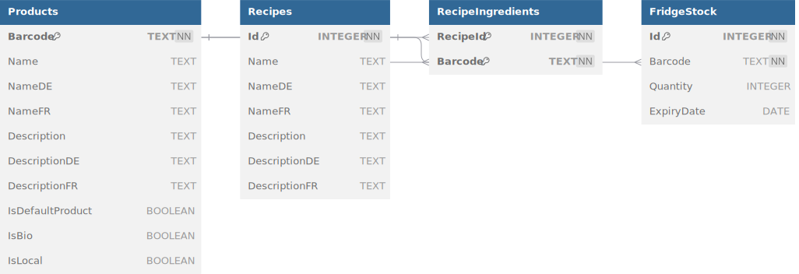

# 7. Verteilungssicht

Diese Verteilungssicht beschreibt die physische Infrastruktur, auf der das Fridgely-System läuft, sowie die Zuordnung der Softwarekomponenten zu dieser Infrastruktur. Da Fridgely als physischer Smart-Fridge-Prototyp konzipiert ist, ist die Verteilungssicht besonders wichtig, um zu verstehen, wie die verschiedenen Hardware- und Softwarekomponenten zusammenwirken.

---

## 7.1 Infrastruktur Ebene 1

Das Fridgely-System besteht aus mehreren Hardware- und Software-Komponenten, die zusammen ein interaktives Smart-Fridge-Erlebnis bieten. Die folgende Übersicht zeigt die Hauptkomponenten und ihre Verbindungen.

### Übersichtsdiagramm

```mermaid
graph TD
    classDef layerStyle fill:#1a202c,stroke:#4a5568,stroke-width:2px;
    classDef componentStyle fill:#2b3d4f,stroke:#83a598,stroke-width:1px;
    classDef interfaceStyle fill:#3c3836,stroke:#fabd2f,stroke-width:1px;
    classDef dbStyle fill:#2d3b2d,stroke:#8ec07c,stroke-width:1px;
    
    RaspberryPi["Raspberry Pi 5"] --> Display1["Hauptbildschirm (Touchscreen 1024x600)"]
    RaspberryPi --> Display2["Zweiter Bildschirm (Kühlschrankinhalt 1024x600)"]
    RaspberryPi --> BarcodeScanners["Barcode-Scanner (USB-Verbindung)"]
    RaspberryPi --> SQLiteDB[("SQLite Datenbank (Lokale Speicherung)")]
    
    JVM["Java Virtual Machine 21"] --> FridgelyApp["Fridgely Anwendung (Spring Boot JAR)"]
    RaspberryPi --> JVM
    
    FridgelyApp --> UIComponents["Benutzerschnittstelle (Swing-Komponenten)"]
    FridgelyApp --> BusinessLogic["Geschäftslogik (Controller & Services)"]
    FridgelyApp --> DataAccess["Datenzugriff (Repository-Schicht)"]
    
    DataAccess --> SQLiteDB
    BusinessLogic --> DataAccess
    UIComponents --> BusinessLogic
    
    class RaspberryPi,Display1,Display2,BarcodeScanners layerStyle
    class JVM,FridgelyApp,UIComponents,BusinessLogic,DataAccess componentStyle
    class SQLiteDB dbStyle
```




### Infrastrukturelemente

| Element | Beschreibung |
|---------|--------------|
| **Raspberry Pi 5** | Hauptrechner, auf dem die Fridgely-Anwendung läuft. Ausgestattet mit 8GB RAM und Raspberry Pi OS. |
| **Hauptbildschirm** | 7-Zoll-Touch-Display (1024x600) für die Benutzerinteraktion. Dient als primäre Benutzeroberfläche für das Spiel. |
| **Zweiter Bildschirm** | 7-Zoll-Display (1024x600) zur Anzeige des Kühlschrankinhalts. Nicht berührungsempfindlich. |
| **Barcode-Scanner** | USB-verbundene Barcode-Scanner zum Erfassen von Lebensmittelprodukten. |
| **Java VM** | Java Virtual Machine (JRE 21), auf der die Fridgely-Anwendung ausgeführt wird. |
| **Fridgely-Anwendung** | JAR-Datei (Java-Archiv), das die gesamte Anwendung enthält. |
| **SQLite-Datenbank** | Lokale eingebettete Datenbank zur Speicherung von Produkten, Rezepten und Spielständen. |

### Begründung für die Verteilungsstruktur

Die Wahl eines Raspberry Pi 5 als zentrale Hardware-Plattform bietet mehrere Vorteile:

1. **Kosteneffizienz**: Der Raspberry Pi ist eine kostengünstige Plattform für Prototypen und Bildungszwecke.
2. **Ausreichende Leistung**: Mit 8GB RAM und einem leistungsstarken ARM-Prozessor bietet er genügend Ressourcen für die Java-Anwendung, die zwei Displays und mehrere Barcode-Scanner verwaltet.
3. **Einfache Integration von Peripheriegeräten**: USB-Schnittstellen für Scanner, HDMI und DSI für Displays.
4. **Geringe Leistungsaufnahme**: Ideal für einen dauerhaft laufenden Smart-Fridge-Anwendungsfall.

Die Zweibildschirlösung wurde gewählt, um das Nutzererlebnis zu verbessern:
1. **Hauptbildschirm (Touch)**: Für Benutzerinteraktionen und Spielablauf
2. **Zweiter Bildschirm**: Zeigt den aktuellen Kühlschrankinhalt, simuliert ein "Smart-Fridge-Display"

Die Barcode-Scanner sind USB-verbunden, um eine zuverlässige und schnelle Datenerfassung zu ermöglichen.

### Qualitäts- und Leistungsmerkmale

| Qualitätsmerkmal | Bewertung | Erläuterung |
|------------------|-----------|-------------|
| **Verfügbarkeit** | Hoch | Das System ist als Standalone-Lösung konzipiert und benötigt keine Internetverbindung für den Betrieb. |
| **Modifizierbarkeit** | Mittel | Durch die Java-basierte Implementierung und die MVC-Architektur ist die Software gut wartbar. Hardware-Änderungen erfordern jedoch physischen Zugriff. |
| **Performance** | Ausreichend | Die Anwendung wurde für die begrenzten Ressourcen des Raspberry Pi optimiert. Tests haben gezeigt, dass Swing eine bessere Performance als JavaFX auf dieser Plattform bietet. |
| **Sicherheit** | Mittel | Als geschlossenes System ohne Internetanbindung bietet es inhärente Sicherheit. Die lokale SQLite-Datenbank erfordert keinen zusätzlichen Datenbankserver. |
| **Testbarkeit** | Gut | Das Repository-Pattern und die klare Schichtenarchitektur ermöglichen gute Testabdeckung mit JUnit. |

### Zuordnung von Bausteinen zu Infrastruktur

| Softwarebaustein | Infrastrukturelement | Erläuterung |
|-----------------|---------------------|-------------|
| **Fridgely Main Application** | Raspberry Pi / JVM | Hauptanwendung, die über das Spring Framework initialisiert wird. |
| **Controller-Schicht** | JVM | Enthält die Steuerungslogik für Spiele (MultiplayerGameController) und UI-Navigation (ChooseGameModeController). |
| **View-Komponenten** | JVM / Displays | Swing-basierte UI-Komponenten, die auf beiden Displays dargestellt werden. |
| **Model-Schicht** | JVM | Enthält die Geschäftslogik und Domänenmodelle wie Product, Recipe, etc. |
| **Repository-Schicht** | JVM | Implementiert den Datenzugriff auf die SQLite-Datenbank. |
| **SQLite-Datenbank** | Raspberry Pi / Dateisystem | Eingebettete Datenbank, die als Datei im Dateisystem des Raspberry Pi gespeichert ist. |

---

## 7.2 Infrastruktur Ebene 2

Auf dieser Ebene betrachten wir die inneren Details der wichtigsten Infrastrukturelemente. Wir konzentrieren uns dabei besonders auf die Softwarearchitektur des Fridgely-Systems und den Aufbau des Raspberry Pi-Setups.


### 7.2.1 Raspberry Pi 5 (Hardware-Setup)

```mermaid
graph TD
    classDef layerStyle fill:#1a202c,stroke:#4a5568,stroke-width:2px;
    classDef componentStyle fill:#2b3d4f,stroke:#83a598,stroke-width:1px;
    classDef interfaceStyle fill:#3c3836,stroke:#fabd2f,stroke-width:1px;
    classDef dbStyle fill:#2d3b2d,stroke:#8ec07c,stroke-width:1px;

    RaspberryPi["Raspberry Pi 5 8GB RAM, ARM Cortex-A76"] --> OS["Raspberry Pi OS (64-bit Bullseye)"]
    OS --> JavaRuntime["Java Runtime 21 (OpenJDK)"]
    OS --> FileSystem["Dateisystem (ext4)"]
    
    RaspberryPi --> PowerSupply["Stromversorgung (USB-C, 5V/3A)"]
    RaspberryPi --> USBPorts["USB-Ports (2x USB 2.0, 2x USB 3.0)"]
    RaspberryPi --> DisplayPorts["Display-Anschlüsse (2x micro-HDMI, 1x DSI)"]
    RaspberryPi --> Network["Netzwerk (Gigabit Ethernet, WiFi 5)"]
    
    USBPorts --> BarcodeScanner1["Barcode-Scanner 1 (USB 2.0)"]
    USBPorts --> BarcodeScanner2["Barcode-Scanner 2 (USB 2.0)"]
    
    DisplayPorts --> MainDisplay["Hauptdisplay (Touch, 1024x600)"]
    DisplayPorts --> SecondaryDisplay["Sekundärdisplay (1024x600)"]
    
    FileSystem --> SQLiteFile["SQLite-Datenbankdatei (fridgely.db)"]
    FileSystem --> LogFiles["Log-Dateien"]
    FileSystem --> ConfigFiles["Konfigurationsdateien"]
    FileSystem --> AppJar["Fridgely-JAR-Datei"]
    
    class RaspberryPi,PowerSupply,USBPorts,DisplayPorts,Network,BarcodeScanner1,BarcodeScanner2,MainDisplay,SecondaryDisplay layerStyle
    class OS,JavaRuntime componentStyle
    class FileSystem interfaceStyle
    class SQLiteFile,LogFiles,ConfigFiles,AppJar dbStyle
```



#### Hardware-Komponenten

| Komponente | Spezifikation | Verwendungszweck |
|------------|---------------|------------------|
| **Prozessor** | ARM Cortex-A76 (Quad-Core) | Ausführung der Java-Anwendung und Betriebssystem |
| **Arbeitsspeicher** | 8GB LPDDR4 | Arbeitsspeicher für die Anwendung und Betriebssystem |
| **Speicher** | 32GB microSD-Karte | Speicherung von Betriebssystem, Anwendung und Datenbank |
| **Hauptdisplay** | 7" Touchscreen, 1024x600 | Primäre Benutzeroberfläche mit Touch-Eingabe |
| **Sekundärdisplay** | 7" Display, 1024x600 | Anzeige des Kühlschrankinhalts (FridgeStockView) |
| **Barcode-Scanner** | 2x USB-Barcode-Scanner | Erfassung von Produkten für Einzel- und Mehrspielermodus |
| **Stromversorgung** | USB-C, 5V/3A | Stromversorgung für das Gesamtsystem |
| **Gehäuse** | Kunststoffgehäuse | Schützt die Hardware und integriert die Displays |

### 7.2.2 Fridgely-Anwendung (Softwarearchitektur)

```mermaid
graph TD
    classDef layerStyle fill:#1a202c,stroke:#4a5568,stroke-width:2px;
    classDef componentStyle fill:#2b3d4f,stroke:#83a598,stroke-width:1px;
    classDef interfaceStyle fill:#3c3836,stroke:#fabd2f,stroke-width:1px;
    classDef dbStyle fill:#2d3b2d,stroke:#8ec07c,stroke-width:1px;
    
    FridgelyApp["Fridgely-Hauptanwendung (Spring Boot)"]
    
    FridgelyApp --> Views["Präsentationsschicht (Swing UI-Komponenten)"]
    FridgelyApp --> Controllers["Anwendungsschicht (Controller)"]
    FridgelyApp --> Models["Domänenschicht (Modelle)"]
    FridgelyApp --> Repositories["Datenschicht (Repositories)"]
    FridgelyApp --> Utils["Querschnittskomponenten (Utilities)"]
    FridgelyApp --> GameLaunchers["Spielstarter-Komponenten"]
    
    Views --> MainUI["Hauptspiel-UI"]
    Views --> FridgeStockView["Kühlschrankinhalt-Ansicht"]
    Views --> ScannedItemsView["Gescannte-Produkte-Ansicht"]
      Controllers --> GameControllers["Spielmodus-Controller"]
    Controllers --> NavigationController["Navigations-Controller"]
    Controllers --> FridgeStockController["Kühlschrankinhalt-Controller"]
    
    GameLaunchers --> MultiplayerLauncher["Mehrspieler-Starter"]
    
    Models --> Product["Produkt-Modell"]
    Models --> Recipe["Rezept-Modell"]
    Models --> GameSession["Spielsitzungs-Modell"]
    Models --> FridgeStockModel["Kühlschrankinhalts-Modell"]
    Models --> PenguinModel["Pinguin-Modell"]
    
    Repositories --> ProductRepo["Produkt-Repository"]
    Repositories --> RecipeRepo["Rezept-Repository"]
    Repositories --> StockRepo["Lagerbestands-Repository"]
      Utils --> ImageLoader["Bild-Loader"]
    Utils --> Localization["Lokalisierung"]
    Utils --> Configuration["Konfiguration"]
    
    Repositories --> SQLiteDB[("SQLite-Datenbank")]
      class Views,MainUI,FridgeStockView,ScannedItemsView componentStyle
    class Controllers,GameControllers,NavigationController,FridgeStockController componentStyle
    class Models,Product,Recipe,GameSession,FridgeStockModel,PenguinModel componentStyle
    class Repositories,ProductRepo,RecipeRepo,StockRepo componentStyle
    class Utils,ImageLoader,Localization,Configuration componentStyle
    class GameLaunchers,MultiplayerLauncher componentStyle
    class FridgelyApp layerStyle
    class SQLiteDB dbStyle
```



#### Softwarekomponenten

| Komponente | Beschreibung | Technologie |
|------------|--------------|-------------|
| **Hauptanwendung** | Spring Boot-Anwendung, die alle Komponenten initialisiert und verwaltet | Spring Boot 3.4.5, Java 21 |
| **Präsentationsschicht** | Benutzeroberflächenkomponenten für Spiel und Kühlschrankansicht | Swing |
| **Anwendungsschicht** | Controller für Spiellogik, Navigation und Kühlschrankinhalt | Java |
| **Spielstarter** | Spezialisierte Komponenten zum Starten von Spielmodi (MultiplayerGameLauncher) | Java |
| **Domänenschicht** | Modellklassen für Produkte, Rezepte, Spielsitzungen, Pinguin und Kühlschrankinhalt | Java |
| **Datenschicht** | Repository-Implementierungen für Datenbankzugriff mit Spring Data JPA und QueryDSL für flexible und typsichere Abfragen | JPA, QueryDSL, JDBC |
| **Konfiguration** | AppConfig, GameConfig und andere Konfigurationsklassen | Java, Spring Configuration |
| **Lokalisierung** | AppLocalizationService für mehrsprachige Unterstützung | Java |
| **Querschnittskomponenten** | Hilfsklassen für Bilder und Utility-Funktionen | Java |

### 7.2.3 Deployment- und Build-Prozess

```mermaid
graph TD
    classDef layerStyle fill:#1a202c,stroke:#4a5568,stroke-width:2px;
    classDef componentStyle fill:#2b3d4f,stroke:#83a598,stroke-width:1px;
    classDef interfaceStyle fill:#3c3836,stroke:#fabd2f,stroke-width:1px;
    classDef dbStyle fill:#2d3b2d,stroke:#8ec07c,stroke-width:1px;
    
    GitRepo["Git-Repository (GitLab FHNW)"] --> CI["CI/CD-Pipeline (GitLab CI)"]
    
    CI --> Validate["Validierung (Maven validate)"]
    Validate --> Test["Tests (Maven test)"]
    Test --> Package["Paketierung (Maven package)"]
    Package --> Deploy["Deployment (Maven deploy)"]
    Deploy --> Release["Release (GitLab Release)"]
    
    Release --> ArtifactJAR["JAR-Artefakt (fridgely-*.jar)"]
    
    ArtifactJAR --> RaspberryPi["Raspberry Pi (Zielumgebung)"]
    
    RaspberryPi --> StartScript["Start-Skript (start.sh)"]
    RaspberryPi --> RestartScript["Neustart-Skript (restart.sh)"]
    
    class GitRepo,CI,Validate,Test,Package,Deploy,Release componentStyle
    class ArtifactJAR interfaceStyle
    class RaspberryPi,StartScript,RestartScript layerStyle
```



Der Deployment-Prozess für Fridgely umfasst mehrere Schritte:

1. **Versionskontrolle**: Der Quellcode wird in einem GitLab-Repository bei der FHNW verwaltet.
2. **Automatisierte Builds**: Eine GitLab CI/CD-Pipeline führt folgende Schritte aus:
   - Code-Validierung (Maven validate)
   - Ausführung von Tests (Maven test, mit JaCoCo für Code-Coverage)
   - Erstellung des JAR-Pakets (Maven package)
   - Deployment des Artefakts (Maven deploy)
   - Erstellung eines Releases in GitLab

3. **Deployment auf dem Raspberry Pi**:
   - Kopieren der JAR-Datei auf den Raspberry Pi über SSH
   - Ausführung des Start-Skripts (start.sh)
   - Bei Bedarf Neustart über restart.sh

#### Automatisierte Deployment-Konfiguration

Die pom.xml enthält spezifische Konfigurationen für das Deployment auf dem Raspberry Pi:

| Parameter | Wert | Beschreibung |
|-----------|------|--------------|
| **pi.hostname** | raspberrypi | Hostname des Raspberry Pi |
| **pi.ipnumber** | 10.207.10.169 | IP-Adresse des Raspberry Pi |
| **pi.port** | 22 | SSH-Port für die Verbindung |
| **pi.username** | ip12 | Benutzername für SSH-Zugriff |
| **pi.password** | -IP12Fridgely- | Passwort für SSH-Zugriff |
| **pi.deploydirectory** | /home/ip12/deploy | Zielverzeichnis für das Deployment |
| **pi.startScript** | start.sh | Skript zum Starten der Anwendung |
| **pi.restartScript** | restart.sh | Skript zum Neustarten der Anwendung |

### 7.2.4 SQLite-Datenbank

Die SQLite-Datenbank ist eine eingebettete Datenbank, die als einzelne Datei im Dateisystem des Raspberry Pi existiert. Sie speichert alle persistenten Daten für das Fridgely-System. Der Zugriff erfolgt über Spring Data JPA und QueryDSL für flexible und typsichere Abfragen.



#### Datenbankschema

| Tabelle | Beschreibung | Wichtige Felder |
|---------|--------------|-----------------|
| **PRODUCTS** | Speichert Informationen zu allen Produkten | barcode, name, description |
| **RECIPES** | Enthält Rezeptinformationen | id, name, description, difficulty, preparationTime |
| **RECIPEINGREDIENTS** | Verknüpfungstabelle zwischen Rezepten und Kühlschrankinhalt | recipeId, barcode |
| **FRIDGESTOCK** | Speichert den aktuellen Kühlschrankinhalt | id, barcode, quantity, expirydate |

Die Datenbank wird über das Repository-Pattern angesprochen, das eine saubere Trennung zwischen Datenzugriffscode und Geschäftslogik gewährleistet. Die technische Implementierung umfasst:

- **JPA-Entities**: Für die ORM-Mappings der Tabellen zu Java-Objekten
- **JPA-Repositories**: Für grundlegende CRUD-Operationen (wie FridgeStockJpaRepository, ProductJpaRepository)
- **Custom Repository-Implementierungen**: Für komplexere Geschäftslogik (wie FridgeStockRepository, ProductRepository)
- **QueryDSL**: Für typsichere und dynamische Abfragen (mit QFridgeStock)
- **Hibernate Dialect**: Spezifischer SQLite-Dialekt für die Kompatibilität mit Hibernate

---

## 7.3 Deployment für verschiedene Umgebungen

### 7.3.1 Entwicklungsumgebung

In der Entwicklungsumgebung wird Fridgely auf Standard-Entwickler-PCs mit Windows oder macOS entwickelt:

| Aspekt | Beschreibung |
|--------|--------------|
| **Hardware** | Standard-Entwickler-PC oder Laptop (Windows/macOS) |
| **JDK** | OpenJDK 21 |
| **IDE** | IntelliJ IDEA oder Visual Studio Code |
| **Build-Tool** | Maven |
| **Datenbank** | Lokale SQLite-Datenbank |
| **Displays** | Simulation der Dual-Display-Konfiguration durch separate Fenster |

Entwickler können die Anwendung lokal ausführen und die Dual-Display-Funktionalität simulieren, indem separate Fenster für die Hauptansicht und die Kühlschrankansicht verwendet werden.

### 7.3.2 Test- und Staging-Umgebung

Vor dem produktiven Einsatz wird Fridgely in einer Test-Umgebung validiert:

| Aspekt | Beschreibung |
|--------|--------------|
| **Hardware** | Raspberry Pi 5 mit identischer Konfiguration wie in der Produktionsumgebung |
| **JRE** | OpenJDK 21 für ARM |
| **Displays** | Zwei 7-Zoll-Displays in der finalen Konfiguration |
| **Barcode-Scanner** | Die gleichen USB-Barcode-Scanner wie in der Produktionsumgebung |
| **Datenbank** | Test-SQLite-Datenbank mit Testdaten |

### 7.3.3 Produktionsumgebung

Die endgültige Produktionsumgebung entspricht der in Ebene 1 beschriebenen Infrastruktur. Besondere Aspekte:

| Aspekt | Beschreibung |
|--------|--------------|
| **Automatischer Start** | Die Anwendung startet automatisch beim Hochfahren des Raspberry Pi |
| **Kiosk-Modus** | Das System läuft im Kiosk-Modus, um Zugriff auf das Betriebssystem zu verhindern |
| **Datensicherung** | Regelmässige Sicherung der SQLite-Datenbankdatei |
| **Logging** | Erweitertes Logging für Fehlerdiagnose und Analyse |

## 7.4 Hardware-Software-Integration

### 7.4.1 Barcode-Scanner-Integration

Der Barcode-Scanner ist ein zentrales Element der Fridgely-Anwendung. Es ermöglicht die schnelle und zuverlässige Erfassung von Produkten während des Spiels. Die Integration erfolgt über folgende Komponenten:

| Komponente | Beschreibung |
|------------|--------------|
| **JVM-Tastatureingabe** | Da Barcode-Scanner als HID-Geräte arbeiten, werden deren Eingaben vom System als Tastatureingaben interpretiert |
| **Controller-Komponenten** | Die Controller empfangen und verarbeiten die Barcode-Eingaben im jeweiligen Spielkontext |
| **USB-Treiber** | Standardtreiber des Raspberry Pi OS für die USB-Barcode-Scanner |

Die Scanner werden an USB-Ports des Raspberry Pi angeschlossen und funktionieren ohne spezielle Treiber. Im Mehrspielermodus werden sie physisch den entsprechenden Spielern zugeordnet. Der Scan-Prozess:

1. Barcode wird vom Scanner erfasst und als Zeichenfolge (simulierte Tastatureingabe) an das System gesendet
2. Die Controller-Komponenten der Anwendung empfangen diese Eingabe im Fokus-Kontext
3. Die jeweiligen Controller verarbeiten den Barcode gemäss dem aktuellen Spielzustand
4. Der Controller sucht das entsprechende Produkt in der Datenbank und führt die Spiellogik aus

### 7.4.2 Dual-Display-Management

Das Dual-Display-Management ist eine weitere Besonderheit des Fridgely-Systems. Die Anwendung erkennt automatisch die verfügbaren Bildschirme und konfiguriert sie entsprechend:

```java
public static void detectScreens() {
    try {
        GraphicsEnvironment ge = GraphicsEnvironment.getLocalGraphicsEnvironment();
        GraphicsDevice[] screens = ge.getScreenDevices();
        for (GraphicsDevice screen : screens) {
            Rectangle bounds = screen.getDefaultConfiguration().getBounds();
            // Assign screens based on new requirement:
            if (bounds.width == 600 && bounds.height == 1024) {
                mainAppScreen = screen;
                LOGGER.info("Identified main app screen (1024x600): " + screen.getIDstring());
            } else if (bounds.width == 1080 && bounds.height == 1920) {
                scannedItemsScreen = screen;
                LOGGER.info("Identified scanned items screen (1920x1080): " + screen.getIDstring());
            }
        }
        // Fallback logic
        if (mainAppScreen == null) {
            mainAppScreen = ge.getDefaultScreenDevice();
            LOGGER.warning("Target main app screen (1024x600) not found. Using default: " + mainAppScreen.getIDstring());
        }
        if (scannedItemsScreen == null) {
            if (screens.length > 1) {
                for (GraphicsDevice screen : screens) {
                    if (screen != mainAppScreen) {
                        scannedItemsScreen = screen;
                        LOGGER.warning("Target scanned items screen (1920x1080) not found. Using a different screen: " + scannedItemsScreen.getIDstring());
                        break;
                    }
                }
            }
            if (scannedItemsScreen == null) {
                scannedItemsScreen = mainAppScreen;
                isSingleDisplay = true;
                LOGGER.warning("Scanned items screen will use the main app screen as target.");
            }
        }
    } catch (Exception e) {
        LOGGER.severe("Error during screen detection: " + e.getMessage());
    }
}
```

Dieses flexible System ermöglicht es, dass Fridgely sowohl in der Entwicklungsumgebung auf einem einzelnen PC-Bildschirm als auch in der Produktionsumgebung mit zwei dedizierten Displays funktioniert.

## 7.5 Fazit und Besonderheiten der Verteilungssicht

Die Verteilungssicht des Fridgely-Systems zeichnet sich durch mehrere wichtige Eigenschaften aus:

1. **Optimierte Hardware-Software-Integration**:
   - Die Anwendung wurde speziell für die Eigenschaften und Einschränkungen des Raspberry Pi 5 optimiert.
   - Die Dual-Display-Lösung bietet ein authentisches "Smart-Fridge"-Erlebnis.
   - Die Verwendung von Swing statt JavaFX (siehe ADR 1) verbessert die Performance auf der Zielplattform.

2. **Standalone-Konzept**:
   - Das System ist als selbstständige Einheit konzipiert, die keine dauerhaft aktive Internetverbindung benötigt.
   - Die lokale SQLite-Datenbank (siehe ADR 5) unterstützt dieses Konzept und minimiert externe Abhängigkeiten.

3. **CI/CD-Automatisierung**:
   - Die kontinuierliche Integration und Bereitstellung über GitLab CI gewährleistet einen konsistenten und zuverlässigen Build- und Deployment-Prozess.
   - Die automatisierte Testausführung stellt sicher, dass nur validierte Software auf das Zielsystem gelangt.

4. **Modularer Softwareaufbau**:
   - Die MVC-Architektur (siehe ADR 3) mit Repository-Pattern (siehe ADR 2) ermöglicht eine klare Trennung von Zuständigkeiten.
   - Der modulare Aufbau vereinfacht Wartung und künftige Erweiterungen.

5. **Anpassbarkeit und Flexibilität**:
   - Das System kann sowohl in einer simulierten Umgebung auf Standard-PCs als auch auf der Ziel-Hardware ausgeführt werden.
   - Die mehrsprachige Benutzeroberfläche (siehe ADR 4) erhöht die Zugänglichkeit und Einsatzmöglichkeiten.

Der Fridgely-Smart-Fridge ist ein Beispiel dafür, wie eine sorgfältig geplante Verteilungsarchitektur zur erfolgreichen Umsetzung eines Bildungsprojekts beitragen kann. Die klare Strukturierung und Dokumentation der Verteilungssicht gewährleistet, dass das System leicht verstanden, gewartet und weiterentwickelt werden kann.