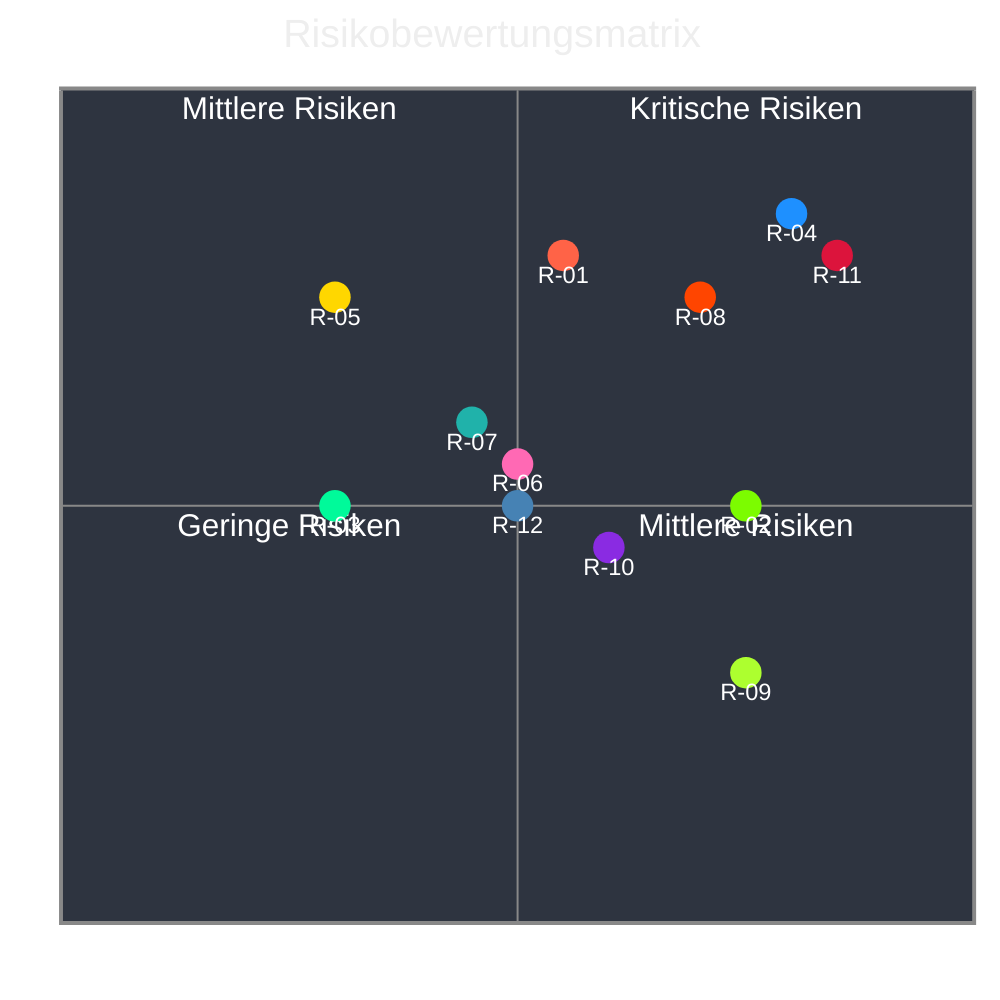

```mermaid
flowchart TD
    R[Ressourcenrisiko]
    
    R --> M1[Ressourcenoptimierung]
    R --> M2[Performance-Monitoring]
    R --> M3[Lastbegrenzung]
    
    M1 --> M11[Speichernutzung profilen]
    M1 --> M12[UI-Rendering optimieren]
    M1 --> M13[Image-Caching verbessern]
    
    M2 --> M21[Implementierung von Performance-Metriken]
    M2 --> M22[Automatische Warnungen bei Ressourcenknappheit]
    
    M3 --> M31[Begrenzung gleichzeitiger Operationen]
    M3 --> M32[Asynchrone Verarbeitung für Barcode-Scanning]
    
    classDef riskStyle fill:#4d1f1c,stroke:#fb4934,stroke-width:2px;
    classDef measureStyle fill:#1d2021,stroke:#83a598,stroke-width:1px;
    classDef submeasureStyle fill:#282828,stroke:#b8bb26,stroke-width:1px;
    
    class R riskStyle;
    class M1,M2,M3 measureStyle;
    class M11,M12,M13,M21,M22,M31,M32 submeasureStyle;
```

```mermaid
flowchart LR
    R[UI-Einschränkungen]
    
    R --> M1[Custom Swing-Erweiterungen]
    R --> M2[Ressourcenoptimierte Animationen]
    R --> M3[Hybridansatz für kritische UI-Elemente]
    
    M1 --> M11[Eigene erweiterte UI-Komponenten]
    M1 --> M12[Verbesserte Renderingpipeline]
    
    M2 --> M21[Sprite-basierte Animationen]
    M2 --> M22[Vorberechnete Animationssequenzen]
    
    M3 --> M31[Prüfung auf JavaFX für isolierte Komponenten]
    M3 --> M32[Experimentelles UI-Layer als Option]
    
    classDef riskStyle fill:#4d1f1c,stroke:#fb4934,stroke-width:2px;
    classDef measureStyle fill:#1d2021,stroke:#83a598,stroke-width:1px;
    classDef submeasureStyle fill:#282828,stroke:#b8bb26,stroke-width:1px;
    
    class R riskStyle;
    class M1,M2,M3 measureStyle;
    class M11,M12,M21,M22,M31,M32 submeasureStyle;
```

```mermaid
flowchart TD
    R[Display-Abhängigkeit]
    
    R --> M1[Flexiblere Displayerkennung]
    R --> M2[Konfigurierbare Displayzuweisung]
    R --> M3[UI-Skalierung]
    
    M1 --> M11[Erkennung über relative Grössenverhältnisse]
    M1 --> M12[Erkennung über Display-IDs]
    
    M2 --> M21[Externe Konfigurationsdatei]
    M2 --> M22[UI zur Display-Auswahl]
    
    M3 --> M31[Responsive Layouts]
    M3 --> M32[Dynamische Anpassung an Auflösung]
    
    classDef riskStyle fill:#4d1f1c,stroke:#fb4934,stroke-width:2px;
    classDef measureStyle fill:#1d2021,stroke:#83a598,stroke-width:1px;
    classDef submeasureStyle fill:#282828,stroke:#b8bb26,stroke-width:1px;
    
    class R riskStyle;
    class M1,M2,M3 measureStyle;
    class M11,M12,M21,M22,M31,M32 submeasureStyle;
```

```mermaid
flowchart LR
    R[Observer-Pattern-Wartbarkeit]
    
    R --> M1[Kodierstandards]
    R --> M2[Memory-Management]
    R --> M3[Überwachung]
    
    M1 --> M11[Einheitliche Observer-Implementierung]
    M1 --> M12[Klare Dokumentation der Listener-Beziehungen]
    
    M2 --> M21[Systematisches Entfernen von Listenern]
    M2 --> M22[Weak References für langlebige Beziehungen]
    
    M3 --> M31[Monitoring-Tools für Speicherlecks]
    M3 --> M32[Zentrale Registrierung aktiver Listener]
    
    classDef riskStyle fill:#4d1f1c,stroke:#fb4934,stroke-width:2px;
    classDef measureStyle fill:#1d2021,stroke:#83a598,stroke-width:1px;
    classDef submeasureStyle fill:#282828,stroke:#b8bb26,stroke-width:1px;
    
    class R riskStyle;
    class M1,M2,M3 measureStyle;
    class M11,M12,M21,M22,M31,M32 submeasureStyle;
```

```mermaid
flowchart TD
    R[Risiko: Fest codierte Display-Identifikation]
    
    R --> M1[Konfigurierbare Display-Erkennung]
    R --> M2[Intelligentere Erkennungslogik]
    R --> M3[UI-Anpassungsfähigkeit]
    
    M1 --> M11[Externalisierte Konfiguration]
    M1 --> M12[Admin-UI für Display-Konfiguration]
    
    M2 --> M21[Aspektverhältnis statt fester Auflösung]
    M2 --> M22[Display-Name/ID als Alternative]
    
    M3 --> M31[Responsive Layouts für alle Komponenten]
    M3 --> M32[Automatische Skalierung]
    
    classDef riskStyle fill:#4d1f1c,stroke:#fb4934,stroke-width:2px;
    classDef measureStyle fill:#1d2021,stroke:#83a598,stroke-width:1px;
    classDef submeasureStyle fill:#282828,stroke:#b8bb26,stroke-width:1px;
    
    class R riskStyle;
    class M1,M2,M3 measureStyle;
    class M11,M12,M21,M22,M31,M32 submeasureStyle;
```

```mermaid
graph TD
    TS[Technische Schuld: Testabdeckung]
    
    TS --> M1[Test-Strategie]
    TS --> M2[Test-Infrastruktur]
    TS --> M3[Kontinuierliche Überwachung]
    
    M1 --> M11[Priorisierung kritischer Komponenten]
    M1 --> M12[Definition von Testzielen pro Komponente]
    
    M2 --> M21[Mock-Objekte für Hardware-Komponenten]
    M2 --> M22[UI-Testautomatisierung]
    
    M3 --> M31[Test-Coverage-Reporting]
    M3 --> M32[Integration in CI/CD-Pipeline]
    
    classDef debtStyle fill:#4d1f1c,stroke:#fb4934,stroke-width:2px;
    classDef measureStyle fill:#1d2021,stroke:#83a598,stroke-width:1px;
    classDef submeasureStyle fill:#282828,stroke:#b8bb26,stroke-width:1px;
    
    class TS debtStyle;
    class M1,M2,M3 measureStyle;
    class M11,M12,M21,M22,M31,M32 submeasureStyle;
```

```mermaid
flowchart TD
    TS[Technische Schuld: JPA/Hibernate]
    
    TS --> M1[Kurzfristige Optimierung]
    TS --> M2[Mittelfristige Alternative]
    TS --> M3[Langfristige Strategie]
    
    M1 --> M11[Optimierung der JPA-Konfiguration]
    M1 --> M12[Reduzierung Lazy-Loading]
    
    M2 --> M21[Evaluation leichtgewichtigerer ORM-Lösungen]
    M2 --> M22[Teilweise Migration kritischer Komponenten]
    
    M3 --> M31[Modulare Repository-Implementierungen]
    M3 --> M32[Strategie zur vollständigen Migration]
    
    classDef debtStyle fill:#4d1f1c,stroke:#fb4934,stroke-width:2px;
    classDef measureStyle fill:#1d2021,stroke:#83a598,stroke-width:1px;
    classDef submeasureStyle fill:#282828,stroke:#b8bb26,stroke-width:1px;
    
    class TS debtStyle;
    class M1,M2,M3 measureStyle;
    class M11,M12,M21,M22,M31,M32 submeasureStyle;
```

```mermaid
flowchart TD
    TS[Technische Schuld: Fehlerbehandlung & Logging]
    
    TS --> M1[Vereinheitlichung des Loggings]
    TS --> M2[Robustere Fehlerbehandlung]
    TS --> M3[Monitoring-Infrastruktur]
    
    M1 --> M11["Migration zu einem einheitlichen Logger (SLF4J)"]
    M1 --> M12[Konsistente Log-Level-Strategie]
    
    M2 --> M21[Zentrale Fehlerbehandlung implementieren]
    M2 --> M22[Graceful Degradation bei nicht-kritischen Fehlern]
    
    M3 --> M31[Logfile-Rotation und -Archivierung]
    M3 --> M32[Optionales Remote-Monitoring]
    
    classDef debtStyle fill:#4d1f1c,stroke:#fb4934,stroke-width:2px;
    classDef measureStyle fill:#1d2021,stroke:#83a598,stroke-width:1px;
    classDef submeasureStyle fill:#282828,stroke:#b8bb26,stroke-width:1px;
    
    class TS debtStyle;
    class M1,M2,M3 measureStyle;
    class M11,M12,M21,M22,M31,M32 submeasureStyle;
```

# 11. Risiken und technische Schulden

Diese Sektion listet und bewertet die wichtigsten technischen Risiken und Schulden auf, die im Rahmen der Fridgely-Systementwicklung identifiziert wurden. Die Risiken und Schulden sind nach ihrer Priorität geordnet, mit entsprechenden Strategien zur Risikominimierung und zum Abbau technischer Schulden.

## 11.1 Übersicht der Risiken und technischen Schulden

Die nachfolgende Tabelle bietet einen Überblick über alle identifizierten Risiken und technischen Schulden, kategorisiert nach Bereich und mit Angabe der Priorität.

| ID | Kategorie | Beschreibung | Priorität | Risikobewertung |
|----|-----------|-------------|-----------|-----------------|
| R-01 | Hardware/Performance | Ressourcenlimitierung auf dem Raspberry Pi | Hoch | Wahrscheinlichkeit: Mittel<br/>Auswirkung: Hoch |
| R-02 | UI/Benutzbarkeit | Eingeschränkte UI-Möglichkeiten durch Swing | Mittel | Wahrscheinlichkeit: Hoch<br/>Auswirkung: Mittel |
| R-03 | Datenbank | Skalierungslimitierung durch SQLite | Niedrig | Wahrscheinlichkeit: Niedrig<br/>Auswirkung: Mittel |
| R-04 | Hardware | Abhängigkeit von spezifischen Display-Auflösungen | Hoch | Wahrscheinlichkeit: Hoch<br/>Auswirkung: Hoch |
| R-05 | Betrieb | Backup- und Recovery-Problematik | Mittel | Wahrscheinlichkeit: Niedrig<br/>Auswirkung: Hoch |
| R-06 | Architektur | Wartbarkeit der Observer-Pattern Implementierung | Mittel | Wahrscheinlichkeit: Mittel<br/>Auswirkung: Mittel |
| R-07 | Deployment | Komplexität des Deployment-Prozesses | Mittel | Wahrscheinlichkeit: Mittel<br/>Auswirkung: Mittel |
| R-08 | Technische Schuld | Unvollständige Testabdeckung | Hoch | Wahrscheinlichkeit: Hoch<br/>Auswirkung: Hoch |
| R-09 | Technische Schuld | Hardcodierte Konfigurationswerte | Niedrig | Wahrscheinlichkeit: Hoch<br/>Auswirkung: Niedrig |
| R-10 | Architektur | Abhängigkeit von JPA und Hibernate auf ressourcenbeschränkter Hardware | Mittel | Wahrscheinlichkeit: Mittel<br/>Auswirkung: Mittel |
| R-11 | Implementation | Fest codierte Display-Identifikation (600x1024 und 1080x1920) | Hoch | Wahrscheinlichkeit: Hoch<br/>Auswirkung: Hoch |
| R-12 | Implementation | Unzureichende Fehlerbehandlung und Logging | Mittel | Wahrscheinlichkeit: Mittel<br/>Auswirkung: Mittel |

## 11.2 Detaillierte Risikobewertung und Massnahmen

### 11.2.1 Hardware/Performance-Risiken

#### R-01: Ressourcenlimitierung auf dem Raspberry Pi

**Beschreibung:**
Das Fridgely-System läuft auf einem Raspberry Pi 5 mit begrenzten Ressourcen (RAM, CPU). Bei steigender Komplexität der Anwendung oder bei gleichzeitiger Nutzung mehrerer Funktionen könnte es zu Performance-Engpässen kommen.

**Auswirkungen:**

- Verzögerungen in der Benutzeroberfläche
- Eingeschränkte Benutzererfahrung, besonders für Kinder, die sofortige Reaktionen erwarten
- Im schlimmsten Fall System-Timeouts oder Abstürze

**Gegenmassnahmen:**



**Status:**
In Bearbeitung. Performance-Optimierungen wurden bereits umgesetzt, aber kontinuierliches Monitoring ist erforderlich.

### 11.2.2 UI/Benutzbarkeit-Risiken

#### R-02: Eingeschränkte UI-Möglichkeiten durch Swing

**Beschreibung:**
Die Entscheidung für Java Swing als UI-Framework (statt JavaFX) war durch Performance-Gründe motiviert (ADR-1), führt aber zu Einschränkungen bei modernen UI-Funktionen und Animationen.

**Auswirkungen:**

- Weniger attraktive Benutzeroberfläche im Vergleich zu moderneren Frameworks
- Eingeschränkte Animationsmöglichkeiten, die für die Zielgruppe (Kinder) wichtig sein könnten
- Höherer Entwicklungsaufwand für spezielle UI-Effekte

**Gegenmassnahmen:**



**Status:**
Akzeptiertes Risiko. Die UI wurde für die aktuelle Zielplattform optimiert, aber zukünftige Versionen könnten alternative UI-Frameworks evaluieren.

### 11.2.3 Datenbank-Risiken

#### R-03: Skalierungslimitierung durch SQLite

**Beschreibung:**
Die Verwendung von SQLite als eingebettete Datenbank (ADR-5) bietet Vorteile hinsichtlich Einfachheit und Ressourceneffizienz, könnte aber bei wachsender Datenmenge oder erhöhter Anzahl gleichzeitiger Zugriffe an Grenzen stossen.

**Auswirkungen:**

- Mögliche Performance-Einbussen bei grossen Datenmengen
- Eingeschränkte Parallelzugriffsmöglichkeiten
- Komplexere Datenmigration bei zukünftigem Datenbankwechsel

**Gegenmassnahmen:**

| Massnahme | Beschreibung | Priorität |
|----------|-------------|-----------|
| DB-Zugriffsoptimierung | Optimierung von Queries, Indexierung kritischer Felder | Hoch |
| Datenarchivierung | Implementierung einer Strategie zur Archivierung älterer Daten | Niedrig |
| Abstraktionsschicht | Stärkere Isolation der Datenbankzugriffe durch Repository-Pattern | Mittel |
| Vorbereitete Migration | Dokumentation von Migrationspfaden zu alternativen Datenbanksystemen | Niedrig |

**Status:**
Überwachtes Risiko. Aktuelle Datenvolumina sind unkritisch, regelmässige Überprüfung der Performance-Indikatoren ist geplant. Repository-Pattern ist implementiert und bietet eine gute Abstraktionsschicht für mögliche zukünftige Datenbankmigrationen.

### 11.2.4 Hardware-Risiken

#### R-04: Abhängigkeit von spezifischen Display-Auflösungen

**Beschreibung:**
Das Dual-Display-Management (ADR-6) identifiziert Displays anhand fester Auflösungswerte (1024x600 für Hauptdisplay, 1080x1920 für Kühlschrankdisplay). Dies könnte zu Problemen führen, wenn andere Displays verwendet werden.

**Auswirkungen:**

- Eingeschränkte Hardware-Kompatibilität
- Potenzielle Fehler bei der Displayerkennung
- Schwierigkeiten bei der Installation in anderen Umgebungen

**Gegenmassnahmen:**



**Status:**
Hohe Priorität. Eine überarbeitete Implementierung der Displayerkennung ist in Planung.

### 11.2.5 Betriebs-Risiken

#### R-05: Backup- und Recovery-Problematik

**Beschreibung:**
Obwohl SQLite als filebasierte Datenbank einfach zu sichern ist, fehlt eine automatisierte Backup- und Recovery-Strategie für das Gesamtsystem.

**Auswirkungen:**

- Möglicher Datenverlust bei Hardware-Defekten
- Aufwändige manuelle Wiederherstellung
- Potenziell inkonsistente Daten nach Wiederherstellung

**Gegenmassnahmen:**

| Massnahme | Beschreibung | Priorität |
|----------|-------------|-----------|
| Automatische Backups | Implementierung von regelmässigen Datenbank-Backups | Hoch |
| Cloud-Synchronisation | Optional: Synchronisation wichtiger Daten mit Cloud-Storage | Niedrig |
| Wiederherstellungsprozedur | Dokumentierte und getestete Recovery-Prozeduren | Mittel |
| Zustandssicherung | Regelmässige Speicherung des Systemzustands | Mittel |

**Status:**
In Planung. Konzeptionelle Arbeit für eine Backup-Lösung hat begonnen.

### 11.2.6 Architektur-Risiken

#### R-06: Wartbarkeit der Observer-Pattern Implementierung

**Beschreibung:**
Das System verwendet das Observer-Pattern (über PropertyChangeSupport/Listener) für Modell-Aktualisierungen, wie in der `PenguinModel`-Klasse implementiert. Die Code-Analyse bestätigt, dass die Anwendung PropertyChangeSupport für die Aktualisierung von UI-Komponenten bei Modelländerungen verwendet. Bei steigender Komplexität könnte dies zu schwer nachvollziehbaren Abhängigkeiten führen.

**Auswirkungen:**

- Schwierigkeiten bei der Fehlersuche
- Potenzielle Memory-Leaks durch nicht entfernte Listener
- Mögliche Race-Conditions bei Aktualisierungen

**Gegenmassnahmen:**



**Status:**
In Beobachtung. Aktuell keine kritischen Probleme, aber die konsequente Implementierung von `removePropertyChangeListener()` bei der Komponentenzerstörung sollte überprüft werden.

### 11.2.7 Deployment-Risiken

#### R-07: Komplexität des Deployment-Prozesses

**Beschreibung:**
Der Deployment-Prozess für das Fridgely-System auf einem Raspberry Pi erfordert mehrere manuelle Schritte und ist anfällig für Fehler. In der Code-Analyse konnten keine automatisierten Deployment-Skripte gefunden werden.

**Auswirkungen:**

- Erhöhter Zeitaufwand bei Updates
- Mögliche Inkonsistenzen zwischen Entwicklungs- und Produktionsumgebung
- Erschwertes Troubleshooting bei Deployment-Problemen

**Gegenmassnahmen:**

| Massnahme | Beschreibung | Priorität |
|----------|-------------|-----------|
| Automatisiertes Deployment | Entwicklung von Shell-Skripten für den gesamten Deployment-Prozess | Hoch |
| Deployment-Dokumentation | Erstellung einer detaillierten Schritt-für-Schritt-Anleitung | Hoch |
| Container-Evaluation | Prüfung von Container-Technologien für den Raspberry Pi | Niedrig |
| CI/CD-Pipeline | Implementierung einer kontinuierlichen Integration und Deployment über Git | Mittel |

**Status:**
Hohe Priorität. Es ist dringend erforderlich, automatisierte Deployment-Lösungen zu entwickeln, da die manuelle Installation auf dem Raspberry Pi mit speziellen Hardware-Anforderungen (Dual-Display) das Risiko von fehlerhaften Installationen erheblich erhöht.

### 11.2.8 Implementation-Risiken

#### R-11: Fest codierte Display-Identifikation

**Beschreibung:**
Die aktuelle Display-Erkennung in der `Fridgely.java` Klasse verwendet fest codierte Auflösungswerte (`bounds.width == 600 && bounds.height == 1024` und `bounds.width == 1080 && bounds.height == 1920`) zur Identifikation der Displays, was die Flexibilität des Systems stark einschränkt. Die Code-Analyse hat folgende spezifische Implementierung bestätigt:

```java
if (bounds.width == 600 && bounds.height == 1024) {
    mainAppScreen = screen;
    LOGGER.info("Identified main app screen (1024x600): " + screen.getIDstring());
} else if (bounds.width == 1080 && bounds.height == 1920) {
    scannedItemsScreen = screen;
    LOGGER.info("Identified scanned items screen (1920x1080): " + screen.getIDstring());
}
```

Diese Implementierung macht das System sehr abhängig von spezifischen Display-Konfigurationen.

**Auswirkungen:**

- Sehr spezifische Hardware-Abhängigkeit
- Funktioniert nicht mit leicht abweichenden Display-Konfigurationen
- Fehleranfällig bei Gerätetreiber-Updates, die Auflösungen anders melden
- Einschränkung bei der Auswahl alternativer Displays

**Gegenmassnahmen:**



**Status:**
Hohe Priorität. Die Code-Analyse zeigt eine direkte Abhängigkeit von spezifischen Auflösungswerten ohne Konfigurationsmöglichkeit. Eine überarbeitete Implementierung mit relativer Display-Erkennung ist dringend erforderlich.

## 11.3 Technische Schulden

### 11.3.1 Unvollständige Testabdeckung (R-08)

**Beschreibung:**
Die Code-Analyse bestätigt, dass die aktuelle Testabdeckung unzureichend ist, da keine dedizierten Testklassen im Projekt identifiziert werden konnten. Eine systematische Suche nach "**/*Test.java" im Quellcode-Verzeichnis ergab keine Treffer. Dies betrifft insbesondere kritische Komponenten wie die UI, Barcode-Scanner-Integration und das Dual-Display-Management.

**Auswirkungen:**

- Erhöhtes Risiko für unentdeckte Fehler
- Erschwertes Refactoring
- Höherer Aufwand bei der Qualitätssicherung
- Mögliche Regressionsfehler bei Änderungen am Code

**Massnahmen zum Schuldenabbau:**



**Status:**
Hohe Priorität. Die Einführung einer strukturierten Teststrategie mit automatisierten Unit- und Integrationstests sollte als eine der dringlichsten Massnahmen betrachtet werden. Der Testplan sollte ein ausgewogenes Verhältnis zwischen manuellen und automatisierten Tests vorsehen, mit Fokus auf kritische Pfade wie Barcode-Scanning und Dual-Display-Interaktionen.

### 11.3.2 Hardcodierte Konfigurationswerte (R-09)

**Beschreibung:**
Im aktuellen Codebase finden sich an verschiedenen Stellen hardcodierte Konfigurationswerte, die in externe Konfigurationsdateien ausgelagert werden sollten. Die Code-Analyse hat folgende konkreten Beispiele identifiziert:

1. Display-Auflösungswerte in `Fridgely.java` (600x1024 und 1080x1920)
2. UI-Farbwerte in `Constants.java` (z.B. `BACKGROUND_COLOR = new Color(248, 248, 255)`)
3. Spielparameter in `GameConfig.java` (z.B. `DEFAULT_ROUNDS = 3`, `MIN_PRODUCTS_PER_ROUND = 3`, `STARTING_HP = 30`)

Diese Werte sind direkt im Code definiert und können nicht ohne Code-Änderung und Neukompilierung angepasst werden.

**Auswirkungen:**

- Erschwertes Anpassen von Konfigurationen
- Notwendigkeit von Code-Änderungen und Neukompilierung für einfache Anpassungen
- Potenzielle Inkonsistenzen bei unvollständiger Aktualisierung
- Höherer Aufwand bei der Anpassung an verschiedene Installationsumgebungen

**Massnahmen zum Schuldenabbau:**

| Massnahme | Beschreibung | Priorität |
|----------|-------------|-----------|
| Konfigurationsanalyse | Identifikation aller hardcodierten Werte | Hoch |
| Zentralisierte Konfiguration | Einführung einer einheitlichen Konfigurationsverwaltung | Mittel |
| Externalisierung | Auslagerung in Properties-Dateien oder YAML-Konfigurationen | Mittel |
| Hot-Reload | Möglichkeit zur Konfigurationsänderung ohne Neustart | Niedrig |

**Status:**
Geplant. Die Identifikation hardcodierter Werte hat begonnen.

### 11.3.3 Abhängigkeit von JPA und Hibernate (R-10)

**Beschreibung:**
Die Code-Analyse bestätigt die Verwendung von JPA und Hibernate für die Datenbankabstraktion, wie in den Entity-Klassen (z.B. `Product.java` mit `@Entity` und `@Id` Annotationen) zu sehen ist. Diese Technologie bietet zwar Vorteile wie typsichere Abfragen und ein einheitliches Datenzugriffsmodell, könnte aber einen erheblichen Overhead auf dem ressourcenbeschränkten Raspberry Pi verursachen. Insbesondere zeigt die Code-Analyse in `Product.java` und anderen Modellklassen, dass JPA-Annotationen verwendet werden, ohne dass spezifische Performance-Optimierungen für die ressourcenbeschränkte Umgebung erkennbar sind.

**Auswirkungen:**

- Höherer Speicherverbrauch, insbesondere beim Start der Anwendung
- Längere Startup-Zeit der Anwendung durch Hibernate-Initialisierung
- Potenziell komplexes Fehlerverhalten bei ORM-Problemen

**Massnahmen zum Schuldenabbau:**



**Status:**
Mittlere Priorität. Es ist notwendig, die JPA-Konfiguration zu überprüfen und zu optimieren, oder eine Evaluierung leichtgewichtigerer Alternativen wie JDBC Template oder JDBI in Betracht zu ziehen. Die potenzielle Kombination von ORM-Overhead und ressourcenbeschränkter Hardware (Raspberry Pi) bleibt ein signifikantes Risiko für die Anwendungsperformance.

### 11.3.4 Fehlender Backup-Mechanismus (Erweiterung von R-05)

**Beschreibung:**
Die Code-Analyse zeigt, dass derzeit kein automatisierter Backup-Mechanismus für die SQLite-Datenbank implementiert ist. Obwohl die filebasierte Natur von SQLite manuelle Backups durch Dateikopien ermöglicht, fehlt eine integrierte Lösung im Anwendungscode. Es wurden keine dedizierten Backup- oder Recovery-Klassen oder -Methoden im Quellcode identifiziert.

**Auswirkungen:**

- Erhöhtes Risiko von Datenverlust bei unerwarteten Systemausfällen
- Keine Möglichkeit zur automatischen Wiederherstellung nach Fehlern
- Fehlende Versionierung und Historisierung von Daten
- Komplexe manuelle Eingriffe erforderlich bei Datenkorruption

**Massnahmen zum Schuldenabbau:**

| Massnahme | Beschreibung | Priorität |
|----------|-------------|-----------|
| Backup-Service | Implementation eines Backup-Services mit zeitgesteuerter Ausführung | Hoch |
| Integriertes Wiederherstellungstool | Entwicklung einer UI zur Auswahl und Wiederherstellung von Backups | Mittel |
| SQLite-Datenbank-Checkpointing | Regelmässiges Checkpointing zur Vermeidung von Datenkorruption | Hoch |
| Exportfunktionalität | Möglichkeit zum manuellen Export wichtiger Daten (z.B. Rezepte, eigene Produkte) | Mittel |
| Transaktionslogging | Erweiterung um Write-Ahead-Logging für Point-in-Time-Recovery | Niedrig |
| Export/Import-Funktionalität | Implementierung von Funktionen zum manuellen Backup/Restore durch den Benutzer | Mittel |

**Status:**
Hohe Priorität. Die Code-Analyse bestätigt, dass keinerlei Backup-Funktionalität implementiert ist. Angesichts der Natur des Systems als Langzeit-Installationsgerät mit Benutzerdaten ist die Entwicklung von Backup- und Wiederherstellungsfunktionalität kritisch.

### 11.3.5 Unzureichende Fehlerbehandlung und Logging (R-12)

**Beschreibung:**
Die Code-Analyse zeigt, dass die aktuelle Implementierung eine Mischung aus verschiedenen Logging-Ansätzen verwendet. Im `Fridgely.java` wird `java.util.logging.Logger` verwendet, wie in folgendem Codebeispiel zu sehen:

```java
private static final Logger LOGGER = Logger.getLogger(Fridgely.class.getName());
// ...
LOGGER.info("Identified main app screen (1024x600): " + screen.getIDstring());
// ...
LOGGER.warning("Target main app screen (1024x600) not found. Using default: " + mainAppScreen.getIDstring());
```

Ausserdem sind die Fehlerbehandlungsstrategien nicht konsistent, und es gibt keine zentrale Erfassung oder Reporting von Anwendungsfehlern. Die Exception-Handling-Strategie ist häufig auf einfache Konsolen-Ausgaben beschränkt.

**Auswirkungen:**

- Erschwerte Fehleranalyse bei Systemabstürzen oder unerwarteten Verhaltensweisen
- Inkonsistente Logging-Informationen in verschiedenen Teilen der Anwendung
- Keine Möglichkeit zur proaktiven Überwachung des Systemzustands
- Potenzielle Sicherheitslücken durch unbehandelte Ausnahmen

**Massnahmen zum Schuldenabbau:**



**Status:**
Mittlere Priorität. Die Vereinheitlichung des Logging-Ansatzes sollte kurzfristig angegangen werden, während die Implementierung einer robusten Fehlerbehandlung und eines Monitoring-Systems mittelfristig erfolgen sollte.

## 11.4 Risikobewertungsmatrix

Die folgende Matrix visualisiert die identifizierten Risiken nach Eintrittswahrscheinlichkeit und Auswirkung:



## 11.5 Fazit und Ausblick

Die identifizierten Risiken und technischen Schulden im Fridgely-System sind typisch für ein innovatives Projekt, das Hardware- und Softwarekomponenten integriert und auf einer ressourcenbeschränkten Plattform läuft. Die meisten Risiken sind mit angemessenen Gegenmassnahmen kontrollierbar.

Besondere Aufmerksamkeit erfordern:

1. **Ressourcenlimitierung (R-01)**, **Display-Abhängigkeit (R-04)** und **Fest codierte Display-Identifikation (R-11)** aufgrund ihrer hohen Auswirkung und Wahrscheinlichkeit
2. **Unvollständige Testabdeckung (R-08)** als technische Schuld mit hohem Risikopotenzial
3. **Hardcodierte Konfigurationswerte (R-09)** in verschiedenen Teilen des Codes, die externalisiert werden sollten

Die Codeanalyse hat die in der Dokumentation beschriebenen Risiken bestätigt und konkrete Implementierungsdetails identifiziert, die diese Risiken untermauern. Die Verwendung von JPA/Hibernate auf ressourcenbeschränkter Hardware (R-10), die fest codierte Display-Identifikation (R-11) und die Verwendung des Observer-Patterns (R-06) wurden im Code bestätigt und entsprechend dokumentiert.

Der vorgestellte Plan zum Risikomanagement und Abbau technischer Schulden sollte in Abstimmung mit dem Product Owner und den Stakeholdern kontinuierlich verfolgt und aktualisiert werden.

Durch proaktive Adressierung dieser Risiken wird sichergestellt, dass das Fridgely-System als robuste, wartbare und benutzerfreundliche Lösung für seine pädagogischen Ziele eingesetzt werden kann.
