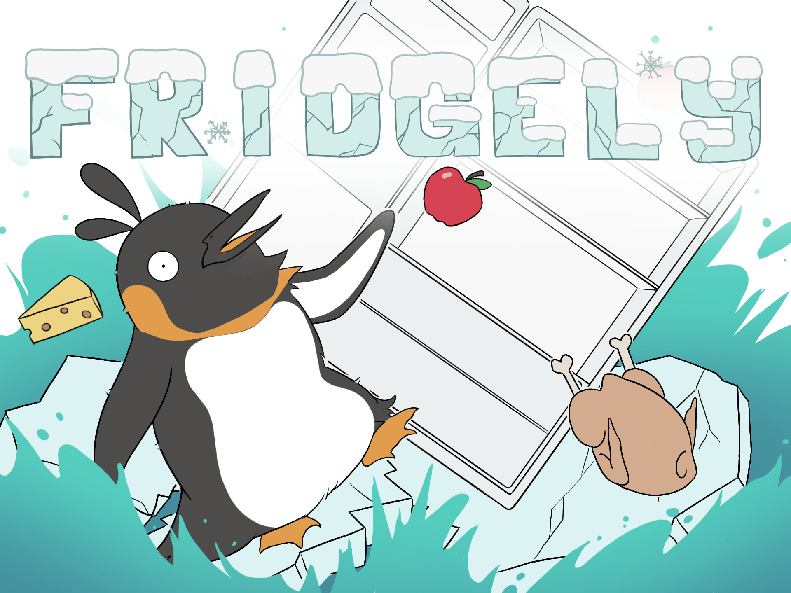

#  Start

> *"Spielerisch lernen, nachhaltig leben"*

    

    

        <h3>📱 Intuitive Benutzeroberfläche</h3>
        
Kindgerechtes Design mit spielerischer Interaktion

    

    

        <h3>🔄 Mehrsprachigkeit</h3>
        
Vollständige Unterstützung für DE, EN und FR

    

    

        <h3>🧩 Modulare Architektur</h3>
        
Leicht erweiterbar und anpassbar

    

## Architektur-Highlights

    

        <h3>MVC-Architektur</h3>
        
Klare Trennung von Modell, Ansicht und Controller für verbesserte Wartbarkeit und Testbarkeit.

        <h3>Repository-Pattern</h3>
        
Einheitliche Datenzugriffsschicht für konsistente Fehlerbehandlung und einfaches Testen.

    

    

        
    

## Qualitätsziele im Überblick

* **Usability:** Intuitive, kindgerechte Bedienung ohne ausführliche Erklärungen
* **Robustheit:** Stabile Funktion auch bei intensiver Nutzung durch Kinder
* **Wartbarkeit:** Einfache Erweiterung und Anpassung durch modulare Struktur
* **Performance:** Optimiert für Raspberry Pi mit begrenzten Ressourcen

## Über arc42

arc42, das Template zur Dokumentation von Software- und Systemarchitekturen.

Template Version 8.1 DE (basiert auf AsciiDoc Version), Mai 2022

Created, maintained and (C) by Dr. Peter Hruschka, Dr. Gernot Starke and contributors.
Siehe [https://arc42.org](https://arc42.org).

    Erik Steinacher • Entwickelt mit Obsidian/Git/VS Code/MKDocs

